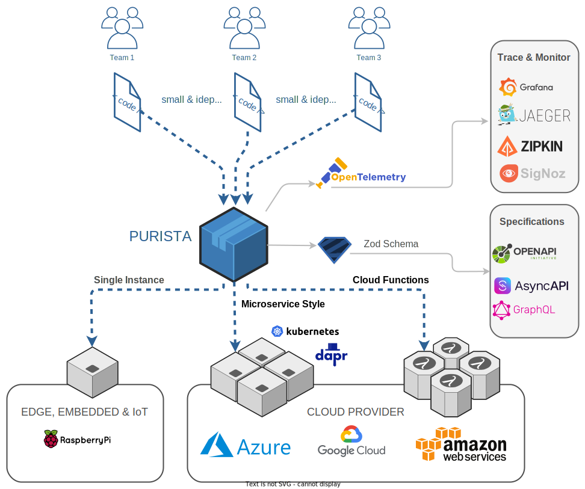

# PURISTA

**Let developers focus on pure business logic**


A backend framework for keeping professional software development fast, efficient, secure and maintainable!  
Build awesome products on one code base - ready to be deployed on edge/IoT, server or cloud.  
Run your application as a single instance, microservices or as cloud functions without touching your business logic.

Highly modular and easy to extend and to be customized for your needs.

**Visit [purista.dev](https://purista.dev)**

**Follow on Twitter [@purista_js](https://twitter.com/purista_js)**  
**Join the [Discord Chat](https://discord.gg/9feaUm3H2v)**

<a href="https://www.producthunt.com/posts/purista?utm_source=badge-featured&utm_medium=badge&utm_souce=badge-purista" target="_blank"></a>

---



This framework adapts and combines a wide range of different patters from domain driven design, cqrs, microservice, event sourcing and lambda functions.

It is built from the ground up in typescript and highly focuses on schema, and auto generation of types, input-output-validation, OpenApi documentation (swagger) and tracing via OpenTelemetry.

**The main goal is to let developers keep focusing on solving business requirements while building robust & maintainable software fast and efficient in professional business environments.**

**Visit [purista.dev](https://purista.dev)**

## Quick start

Create a new project folder and simply run:

```bash
npx @purista/cli init
```

The CLI tool will guide you through all the steps.

After successful init, simply start adding your business logic by adding your first service.

```bash
purista add service
```

As soon as you've created your first service, you can start adding commands and subscriptions to implement your business logic.  
To add a command to your service, use the CLI tool.

```bash
purista add command
```

## Security

Please help us to provide a secure software.  
See: [Security](./SECURITY.md)

## Contributors

Contributors are welcome!  

[](https://github.com/puristajs/purista)

[PURISTA handbook](website/doc/handbook/)
