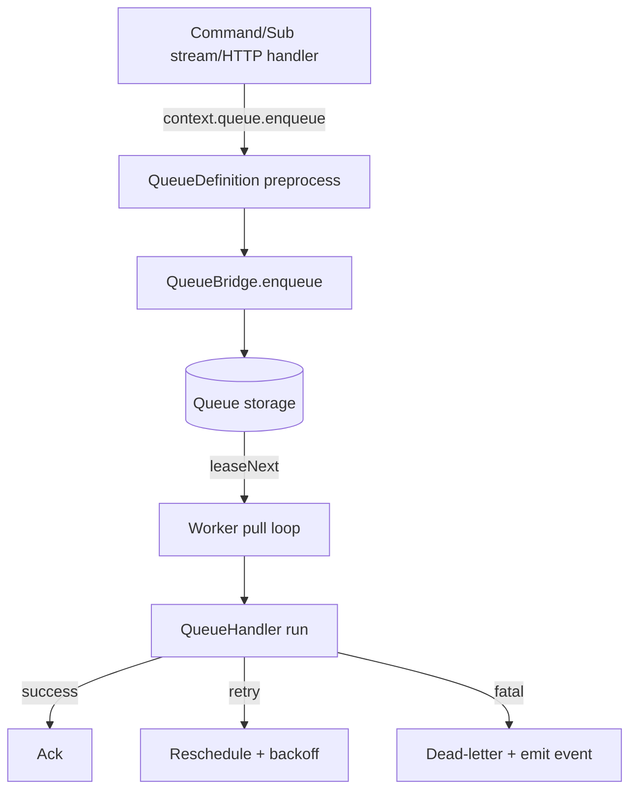

# Recommended Async Queue Design (v1)

## Core concepts

- **QueueDefinition**: declarative description of a logical queue (payload schema, parameter schema, preprocessing hooks, retry defaults, dedup rules).
- **QueueWorkerDefinition**: consumer configuration bound to a `QueueDefinition` (pull strategy, concurrency, leases, ack behavior, optional partition key extraction).
- **QueueBridge**: abstraction with enqueue/lease/ack APIs and capability introspection (delayed delivery, priority tiers, FIFO partitions, dead-letter hooks).
- **QueueJobEnvelope**: canonical envelope persisted to the bridge, containing payload, params, headers, tracing data, retry counters, lease timestamps, and optional aggregate metadata.
- **QueueLease**: temporary claim on a job, extended automatically while handler executes and released/aborted based on handler result.
- **QueueClient**: typed helper accessible within command/subscription/stream contexts to enqueue work without touching the bridge directly.

## Lifecycle overview

1. Any Purista handler calls `context.queue.enqueue('order.create', payload, options)`.
2. The queue definition validates payload/params, runs optional `transformEnqueue`, and enriches metadata (idempotency key, custom headers, TTL).
3. The `QueueBridge` persists the envelope and returns a `jobId` + `leaseTimeout`.
4. Each `QueueWorker` registers with the bridge. Depending on mode:
   - `continuous`: `leaseNext` is awaited; underlying provider pushes when ready.
   - `interval`: timer triggers `leaseNext` (batch or single) at configured cadence.
   - `sequential`: next pull only after current handler settles (ensures in-order processing per worker instance).
5. Worker receives a `QueueLeaseHandle` and executes the user-defined handler with `QueueJobContext` (payload, params, metadata, service invokers, emit, resources).
6. Handler reports outcome via return type or `context.job` helper:
   - `complete(result?, customHeaders?)` → ack + optional event emission.
   - `retry({ delay, reason })` → ack = false, message requeued.
   - `fail({ reason, fatal })` → ack + dead-letter on fatal, else treat as retry.

## Queue lifecycle state machine

- Default lifecycle states: `Enqueued → Leased → Processing → Completed | Retrying | DeadLettered`.
- Builder may optionally override via `.setLifecycleConfig({ retryWindowMs, visibilityTimeoutMs, autoHeartbeats })`; omitting this call keeps the robust core defaults (15m visibility timeout, 3 heartbeat extensions, exponential backoff starting at 1s). Teams can safely rely on the baseline config, or override a single knob when workloads demand it without redefining the state machine.
- Each transition is observable through telemetry events so operators can plug in custom automation.
- Runtime enforces invariants:
  - Missing ack before `visibilityTimeoutMs` → automatic transition back to `Enqueued` and `attempt++`.
  - Explicit `fail({ fatal: true })` → skip retries, transition to `DeadLettered` immediately.
  - `retry()` honors per-job delay but clamps to builder-configured min/max to prevent unbounded waits.
- State machine definition is part of `QueueDefinition` metadata so alternative policies (e.g., FIFO strict ordering with sequential retries) can be declared per queue without code changes.

### Default lifecycle configuration

| Setting                 | Default value                | Rationale / notes                                                                 |
|-------------------------|------------------------------|-----------------------------------------------------------------------------------|
| `visibilityTimeoutMs`   | `15 * 60 * 1000` (15 minutes) | Matches command timeout defaults and covers most long-running workflows.          |
| `heartbeatIntervalMs`   | `5 * 60 * 1000` (5 minutes)   | Low enough to detect stuck handlers quickly without overwhelming providers.       |
| `maxLeaseExtensions`    | `3`                           | Guarantees eventual requeue after ~30 minutes even if handler never finishes.     |
| `maxAttempts`           | `10`                          | Prevents poison messages from cycling forever; bridge still honors per-job overrides. |
| `retryStrategy`         | Exponential (1s -> 2m cap)    | Starts at 1s, doubles per attempt, capped at 2 minutes plus jitter.               |
| `retryWindowMs`         | `24 * 60 * 60 * 1000`         | Gives operators a full day to remediate before auto-dead-letter kicks in.         |

The defaults live under `packages/core/src/core/types/queue/defaultQueueLifecycleConfig.ts` so all builders, bridges, and CLI templates share a single source of truth. A builder can override a subset of knobs (e.g., just `visibilityTimeoutMs`) without losing the rest of the battle-tested defaults.

## Configuration pillars

- **Retry strategy**: builder sets defaults (`maxAttempts`, `initialInterval`, `backoffCoefficient`, `jitter`). Runtime override per enqueue call allowed (with schema enforcement), and the scheduler clamps explicit `delayMs` requests to the configured max.
- **Lease/visibility**: default from queue definition; worker may request extension via `context.job.extendLease(ms)` for long tasks.
- **Partitioning**: optional `partitionKey` extractor ensures ordering within a key (e.g., customer ID). Bridge capability determines enforcement (FIFO vs best-effort).
- **Dead-letter**: queue definition names another queue (or provider-native DLQ). Handler metadata + last error reason is forwarded. If no name is provided, core derives one via `<queueName>.dead-letter`, and active bridges may override with their opinionated defaults (e.g., Redis suffix, SQS DLQ ARN) so deployments align with infrastructure conventions without duplicating boilerplate.
- **Dead-letter handling**: queues can emit optional events or rely solely on metrics/telemetry. By default we only update OpenTelemetry spans/metrics; builders may opt in to emitting a custom event (name + payload) if they need automated remediation flows that feed back into EventBridge.
- **Pre-processing**: `beforeEnqueue` hook runs in the caller span; `beforeExecute` hook runs inside worker span for normalization, secrets injection, etc.
- **Observability**: spans: `queue.enqueue`, `queue.dequeue`, `queue.process`. Metrics: lag, throughput, retries, failures, lease extensions.
- **Lifecycle policy**: `.setLifecycleConfig(...)` controls retry caps, lease TTL, heartbeat interval, and default transitions. If omitted, the default config above applies, giving a robust baseline for the majority of queues.

## Interaction with existing primitives

- Commands/subscriptions/streams gain typed `context.queue.enqueue` + `context.queue.scheduleAt` (delayed) provided they declare `canEnqueue('queueName', schema)` in their builder.
- ServiceBuilder registers queue/worker definitions during `resolveDefinitions()`, similar to commands/subscriptions/streams.
- Existing EventBridge continues to handle synchronous messaging; QueueBridge is optional per service (if not configured, ServiceBuilder injects the default in-memory bridge for tests). Injection is independent, so teams can pair e.g. AMQP for commands with Redis for queues without writing adapter glue.
- Queue handlers inherit the full command/subscription context surface (`context.command.invoke`, `context.event.emit`, auth info) so they can emit events or invoke other commands as follow-up work without bespoke wiring.
- HTTP exposure (via `packages/httpserver` + `packages/hono-http-server`) uses a standard contract:
  - `POST /queue-endpoint` validates payload, enqueues work, and returns `202 Accepted` with body `{ jobId, queue: string }`.
  - `Location` header (and optional `Retry-After`) can point to a status endpoint if the service exposes one, enabling clients to poll or subscribe consistently.
  - Validation errors return `400/422`, auth errors `401/403`, throttling/back-pressure surfaces as `429`, unexpected failures return `500`, and bridge outages map to `503`, mirroring command semantics so clients know how to react.
  - Canonical responses:

    | Scenario                       | Status code | Body shape                                                     |
    |-------------------------------|-------------|----------------------------------------------------------------|
    | Accepted for async processing | `202`       | `{ jobId: string, queue: string }` plus optional `Location`.   |
    | Validation/transform failure  | `422`       | `{ error: 'ValidationError', details: [...] }`.                |
    | Authz/authn failure           | `401/403`   | Shared command error envelope.                                 |
    | Rate limit/back pressure      | `429`       | Includes `retryAfter` hint or `QueueLag` metadata.             |
    | Bridge unavailable            | `503`       | `{ error: 'QueueBridgeUnavailable', bridge: string }`.         |

  - OpenAPI definitions document this pattern automatically so downstream teams get machine-readable contracts.

## Security & access control

- `.canEnqueue(...)` entries behave like `.canInvoke(...)` on commands: builders define which queues a handler may call, with compile-time typing, runtime guard rails, and mirrored stubs in test helpers so unit tests can assert enqueue behavior.
- HTTP exposure inherits the same auth hooks used by commands (JWT scopes, API keys, mTLS), so queue-backed endpoints automatically enforce existing policies.
- Queue workers re-use command guard hooks (`beforeGuard`, `afterGuard`) to verify resource access before processing a job; secrets/config access stays within the usual context boundaries.

## Provider abstraction & selection

- Provider capability detection is strict: only transports that natively support pull-based consumption, leases/visibility timeouts, manual acknowledgement, and durable dead-letter semantics (native or implemented by us without hacks) are eligible for QueueBridge packages. We do **not** try to shim push-only brokers into this model, nor do we attempt to bend Redis Streams into queues when Redis lists/BRPOPLPUSH provide the direct pull behavior we need.
- `DefaultQueueBridge` (in-memory) ships inside `packages/core`, mirroring `DefaultEventBridge`. It is used automatically when a service defines queues but no custom bridge is injected, keeping dev/test DX simple while documenting its non-production nature.
- For every existing EventBridge provider that already satisfies the queue requirements (Redis core lists, NATS JetStream pull consumers, AWS SQS/SQS FIFO, Azure Storage Queues) we create a sibling `*-queue-bridge` package in the same repo structure so projects can opt into consistent vendor modules.
- Bridges share resilience helpers (lease renewal loop, exponential backoff) shipped in `packages/core/src/core/QueueBridge` to reduce duplication but must fail fast if the provider is misconfigured or lacks a requested capability—there are no silent fallbacks or emulation layers.

## Compatibility & migration

- Queue features are additive; commands/subscriptions keep working.
- CLI scaffolding creates V3 service definitions with optional queue blocks to avoid drift.
- Specs align with Muldar layering by isolating enqueue surfaces (write) and worker surfaces (processing) while ensuring telemetry + error handling remain consistent.
- **Pull-first scheduling**: design explicitly targets workloads such as pools of AI agents or batch workers where each consumer pulls one job at a time and processes sequentially. Push-only transports are out of scope for QueueBridge.
