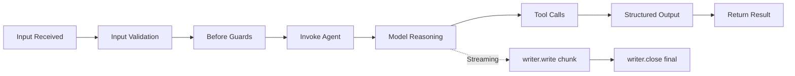

An **agent** is an AI-powered participant in your PURISTA system. Unlike a command (deterministic code) or a subscription (fire-and-forget handler), an agent uses a language model to reason about inputs, choose tools, and produce structured outputs.

Agents require the `@purista/ai-harness` package. Install it alongside `@purista/core` to get `getAgentBuilder` on `ServiceBuilder` and the AI harness infrastructure.

  
Requires @purista/ai-harness

  
Agent support is provided by <code>@purista/ai-harness</code>, a separate package from <code>@purista/core</code>. Install it with <code>npm install @purista/ai-harness</code> and import it to unlock <code>getAgentBuilder</code> on your service builders.

  
AI on top of core

  
Agents reuse the same service and event bridge infrastructure as the rest of PURISTA. They are not a separate runtime — they are handlers that happen to use AI models.

## In this section

  <a href="/handbook/blocks/agent-pattern/what-is-agent/" class="block p-4 rounded-lg border border-[var(--color-line)] bg-[var(--color-bg-elev)] hover:border-[var(--color-found)] transition-colors">
    
What is an Agent?

    
Understand agent types, model capabilities, session policies, and runtime requirements.

  </a>
  <a href="/handbook/blocks/agent-pattern/agent-builder/" class="block p-4 rounded-lg border border-[var(--color-line)] bg-[var(--color-bg-elev)] hover:border-[var(--color-found)] transition-colors">
    
The Agent Builder

    
Define typed agents with models, tools, skills, execution policies, and streaming modes.

  </a>
  <a href="/handbook/blocks/agent-pattern/agent-workflows/" class="block p-4 rounded-lg border border-[var(--color-line)] bg-[var(--color-bg-elev)] hover:border-[var(--color-found)] transition-colors">
    
Agent Workflows

    
Chain agents, orchestrate multi-step reasoning, and manage state across agent boundaries.

  </a>
  <a href="/handbook/blocks/agent-pattern/agent-testing/" class="block p-4 rounded-lg border border-[var(--color-line)] bg-[var(--color-bg-elev)] hover:border-[var(--color-found)] transition-colors">
    
Testing

    
Test agents with harnesses, scripted models, and deterministic tool responses.

  </a>

## Quick reference

### Agent lifecycle

### Key principles

- Agents are commands/streams that use **AI models** for reasoning.
- Agents require `@purista/ai-harness` in addition to `@purista/core`.
- Use `getAgentBuilder(agentName, description)` to define an agent.
- Schema methods: `addPayloadSchema`, `addParameterSchema`, `addOutputSchema`.
- Set the agent logic with `setAgentFunction(async (ctx, payload) => { ... })`.
- Model capabilities gate which methods are available on `context.harness.models`.
- Tools: `canInvoke` for command tools, `canInvokeAgent` for child agents.
- Skills: `useSkills(names)`, `useBuiltInTools(names|false)`.
- Session: `setSessionPolicy({ mode: 'ephemeral'|'conversation', payloadPath? })`.
- Runtime requires `queueBridge` and `ai.models` in service instance options.
- `canEmit` and `canConsumeStream` are **not implemented** on AgentQueueBuilder.
- Context: `context.invoke.tools['serviceName.version.command'].call(payload, parameter?)`.
- Context: `context.invoke.agents['agentName.version'].run(payload, parameter?)`.
