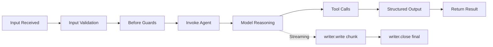

An **agent** is an AI-powered participant in your PURISTA system. Unlike a command (deterministic code) or a subscription (fire-and-forget handler), an agent uses a language model to reason about inputs, choose tools, and produce structured outputs.

Agent support is part of `@purista/core` via `ServiceBuilder.getAgentQueueBuilder(...)`. Concrete model backends come from provider packages such as `@purista/harness-openai`.

For standalone runtime setup, tools, skills, guardrails, tests, evaluations,
and operations, use the [AI Harness Guide](/handbook/harness/guide/). This
section remains deliberately focused on the PURISTA service, command, queue,
and stream boundary.

  
AI on normal PURISTA rails

  
Agents reuse the same service, queue, command, stream, event bridge, and HTTP infrastructure as the rest of PURISTA. They are not a separate application lane.

## In this section

  <a href="/handbook/blocks/agent-pattern/harness-integration/" class="block p-4 rounded-lg border border-[var(--color-line)] bg-[var(--color-bg-elev)] hover:border-[var(--color-found)] transition-colors">
    
Harness Integration

    
Place service contracts, delivery, authorization, and runtime ownership on the correct side of the boundary.

  </a>
  <a href="/handbook/blocks/agent-pattern/what-is-agent/" class="block p-4 rounded-lg border border-[var(--color-line)] bg-[var(--color-bg-elev)] hover:border-[var(--color-found)] transition-colors">
    
What is an Agent?

    
Understand agent types, model capabilities, session policies, and runtime requirements.

  </a>
  <a href="/handbook/blocks/agent-pattern/agent-builder/" class="block p-4 rounded-lg border border-[var(--color-line)] bg-[var(--color-bg-elev)] hover:border-[var(--color-found)] transition-colors">
    
The Agent Builder

    
Define typed agents with models, tools, skills, execution policies, and streaming modes.

  </a>
  <a href="/handbook/blocks/agent-pattern/agent-workflows/" class="block p-4 rounded-lg border border-[var(--color-line)] bg-[var(--color-bg-elev)] hover:border-[var(--color-found)] transition-colors">
    
Agent Workflows

    
Chain agents, orchestrate multi-step reasoning, and manage state across agent boundaries.

  </a>
  <a href="/handbook/blocks/agent-pattern/http-exposure/" class="block p-4 rounded-lg border border-[var(--color-line)] bg-[var(--color-bg-elev)] hover:border-[var(--color-found)] transition-colors">
    
HTTP Exposure

    
Expose agents as REST endpoints with aggregate or accepted response contracts.

  </a>
  <a href="/handbook/blocks/agent-pattern/guardrails/" class="block p-4 rounded-lg border border-[var(--color-line)] bg-[var(--color-bg-elev)] hover:border-[var(--color-found)] transition-colors">
    
Guardrails in PURISTA

    
Combine Harness content controls with framework authorization and durable delivery boundaries.

  </a>
  <a href="/handbook/blocks/agent-pattern/agent-testing/" class="block p-4 rounded-lg border border-[var(--color-line)] bg-[var(--color-bg-elev)] hover:border-[var(--color-found)] transition-colors">
    
Testing

    
Test agents with harnesses, scripted models, and deterministic tool responses.

  </a>

## Quick reference

### Agent lifecycle

### Key principles

- Agents generate a queue, worker, command, and stream that use **AI models** for reasoning.
- Agent builders are available from `@purista/core`.
- Use `getAgentQueueBuilder(agentName, description)` to define an agent.
- Schema methods: `addPayloadSchema`, `addParameterSchema`, `addOutputSchema`.
- Set the agent logic with `setRunFunction(async context => { ... })`.
- Model capabilities gate which methods are available on `context.harness.models`.
- Tools: `canInvoke` for command tools, `canInvokeAgent` for child agents.
- Skills: `useSkills(names)`, `useBuiltInTools(names|false)`.
- Session: `setSessionPolicy({ mode: 'ephemeral'|'conversation', payloadPath? })`.
- Runtime requires `queueBridge` and `ai.models` in service instance options.
- HTTP exposure: `exposeAsHttpEndpoint(method, path, options)` registers either a JSON response endpoint or an SSE stream endpoint.
- `canEmit` and `canConsumeStream` are **not implemented** on AgentQueueBuilder.
- Context: `context.invoke.tools['serviceName.version.command'].call(payload, parameter?)`.
- Context: `context.invoke.agents['agentName.version'].run(payload, parameter?)`.
