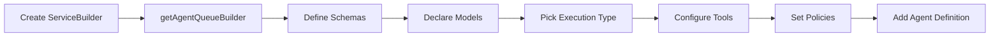

`AgentQueueBuilder` is available directly from `ServiceBuilder` in `@purista/core` via `getAgentQueueBuilder(...)`. An attached agent expands into normal PURISTA artifacts: a queue, queue worker, aggregate command, and stream.

## Builder workflow



## Create the agent builder

```typescript [supportAgentBuilder.ts]
import { z } from 'zod'
import { supportV1ServiceBuilder } from '../supportV1ServiceBuilder.js'

export const supportAgentBuilder = supportV1ServiceBuilder
  .getAgentQueueBuilder('supportAgent', 'Answers support questions')
```

## Define schemas

```typescript [supportAgentBuilder.ts]
supportAgentBuilder
  .addPayloadSchema(z.object({
    query: z.string().min(1),
    conversationId: z.string().optional(),
  }))
  .addParameterSchema(z.object({
    priority: z.enum(['low', 'normal', 'high']).default('normal'),
  }))
  .addOutputSchema(z.object({
    answer: z.string(),
    confidence: z.number().min(0).max(1),
    sources: z.array(z.string()),
  }))
```

## Declare a model alias

```typescript [supportAgentBuilder.ts]
supportAgentBuilder.addModel('primary', {
  model: 'gpt-4.1-mini',
  capabilities: ['object', 'text'],
  defaults: {
    temperature: 0.2,
  },
})
```

The concrete provider is supplied when the service starts. The handler uses the alias through `context.harness.models.primary`.

## Pick one execution type

Choose exactly one execution definition:

| Method | Use when |
|---|---|
| `setRunFunction(...)` | Normal PURISTA application code with typed resources, model calls, command tools, and child agents. |
| `setHarnessAgent(...)` | You already have a reusable `@purista/harness` agent definition. |
| `setHarnessWorkflow(...)` | You already have a reusable `@purista/harness` workflow definition. |

Most application agents should start with `setRunFunction(...)`:

```typescript [supportAgentBuilder.ts]
supportAgentBuilder.setRunFunction(async context => {
  const result = await context.harness.models.primary.object(
    {
      messages: [
        {
          role: 'user',
          content: `Answer this customer query: ${context.payload.query}`,
        },
      ],
      schema: {
        type: 'object',
        properties: {
          answer: { type: 'string' },
          confidence: { type: 'number' },
          sources: { type: 'array', items: { type: 'string' } },
        },
        required: ['answer', 'confidence', 'sources'],
      },
    },
    context.signal,
  )

  return result.object
})
```

## Configure tools and policies

```typescript [supportAgentBuilder.ts]
supportAgentBuilder
  .canInvoke('UserService', '1', 'getUser')
  .canInvoke('OrderService', '1', 'getOrderHistory')
  .canInvokeAgent('escalationAgent', '1')
  .useSkills(['customer-support'])
  .useBuiltInTools(false)
  .setSessionPolicy({
    mode: 'conversation',
    payloadPath: ['conversationId'],
  })
  .setExecutionPolicy({
    maxAttempts: 3,
    maxParallelHandlers: 1,
  })
```

## HTTP response shape

```typescript [supportAgentBuilder.ts]
supportAgentBuilder.exposeAsHttpEndpoint('POST', 'agents/support', {
  streamingMode: 'aggregate', // one JSON response
})
```

Use `streamingMode: 'stream'` for an SSE response. Use `setResponseMode('accepted', ...)` when a long-running agent should return a queue handle instead of holding the HTTP request open.

## Add to the service

```typescript [supportV1Service.ts]
supportV1ServiceBuilder.addAgentDefinition(await supportAgentBuilder.getDefinition())
```

At runtime, services with attached agents need a `queueBridge` and `ai.models` bindings:

```typescript [index.ts]
const supportService = await supportV1ServiceBuilder.getInstance(eventBridge, {
  queueBridge,
  ai: {
    models: {
      primary: {
        provider,
        model: 'gpt-4.1-mini',
        capabilities: ['object', 'text'],
      },
    },
  },
})
```

## Important constraints

- `canEmit` is not implemented on `AgentQueueBuilder`.
- `canConsumeStream` is not implemented on `AgentQueueBuilder`.
- Execution types are mutually exclusive; pick exactly one.
- Model capabilities must match the handler calls and runtime provider binding.
