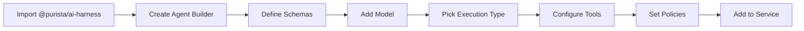

`AgentBuilder` (available via `getAgentBuilder` on `ServiceBuilder` after importing `@purista/ai-harness`) lets you define AI-powered agents. It extends the core service builder with AI-specific configuration for models, tools, and agent execution.

## Builder workflow



## Step 1 — Import from @purista/ai-harness

```typescript [aiService.ts]
import { ServiceBuilder } from '@purista/core'
import '@purista/ai-harness' // registers getAgentBuilder on ServiceBuilder
```

`getAgentBuilder` becomes available on every `ServiceBuilder` instance after importing `@purista/ai-harness`.

## Step 2 — Create the agent builder

```typescript [supportAgentBuilder.ts]
import { aiV1ServiceBuilder } from './aiV1ServiceBuilder.js'

const supportAgentBuilder = aiV1ServiceBuilder
  .getAgentBuilder('SupportAgent', 'AI customer support agent')
```

`getAgentBuilder` is available on every `ServiceBuilder` instance after importing `@purista/ai-harness`.

## Step 3 — Define schemas

```typescript [supportAgentBuilder.ts]
import { z } from 'zod'

supportAgentBuilder
  .addPayloadSchema(z.object({
    query: z.string().min(1),
    conversationId: z.string().optional(),
  }))
  .addParameterSchema(z.object({
    priority: z.enum(['low', 'normal', 'high']).default('normal'),
  }))
  .addOutputSchema(z.object({
    answer: z.string(),
    confidence: z.number().min(0).max(1),
    sources: z.array(z.string()),
  }))
```

## Step 4 — Add a model

```typescript [supportAgentBuilder.ts]
supportAgentBuilder.addModel('gpt4', {
  model: 'openai/gpt-4',
  capabilities: ['object', 'text'],
  defaults: {
    temperature: 0.7,
    maxTokens: 2000,
  },
})
```

Capabilities determine which methods are available:

| Capability | Method |
|---|---|
| `object` | `context.harness.models.gpt4.object(prompt, schema)` |
| `text` | `context.harness.models.gpt4.text(prompt)` |
| `embed` | `context.harness.models.gpt4.embed(texts)` |
| `rerank` | `context.harness.models.gpt4.rerank(query, documents)` |

## Step 5 — Pick execution type

Choose exactly one:

### Agent function (custom logic)

```typescript [supportAgentBuilder.ts]
supportAgentBuilder.setAgentFunction(async function (context, payload, parameter) {
  const model = context.harness.models.gpt4

  const result = await model.object(
    `Answer this customer query: ${payload.query}`,
    z.object({ answer: z.string(), confidence: z.number() })
  )

  return {
    answer: result.answer,
    confidence: result.confidence,
    sources: [],
  }
})
```

### Harness agent (model-driven with tools)

```typescript [supportAgentBuilder.ts]
supportAgentBuilder.setHarnessAgent({
  systemPrompt: 'You are a helpful customer support agent.',
  maxToolCalls: 10,
  toolChoice: 'auto',
})
```

### Harness workflow (multi-step orchestration)

```typescript [supportAgentBuilder.ts]
supportAgentBuilder.setHarnessWorkflow({
  steps: [
    { id: 'classify', type: 'model', prompt: 'Classify the query intent' },
    { id: 'search', type: 'tool', tool: 'searchKnowledgeBase' },
    { id: 'respond', type: 'model', prompt: 'Generate response based on search results' },
  ],
})
```

## Step 6 — Configure tools

```typescript [supportAgentBuilder.ts]
supportAgentBuilder
  .canInvoke('UserService', '1', 'getUser')
  .canInvoke('OrderService', '1', 'getOrderHistory')
  .canInvokeAgent('EscalationAgent', '1')
  .useSkills(['customer-support', 'billing'])
  .useBuiltInTools(['search', 'calculator'])
```

Tools are exposed to the model as callable functions. The model decides which to use.

## Step 7 — Set policies

### Session policy

```typescript [supportAgentBuilder.ts]
supportAgentBuilder.setSessionPolicy({
  mode: 'conversation',
  payloadPath: ['conversationId'],
})
```

### Sandbox policy

```typescript [supportAgentBuilder.ts]
supportAgentBuilder.setSandboxPolicy({
  enabled: true,
  adapter: 'isolated-vm',
})
```

### Response mode

```typescript [supportAgentBuilder.ts]
supportAgentBuilder.setResponseMode('stream', {
  eventName: 'supportResponseChunk',
})
```

### Streaming mode

```typescript [supportAgentBuilder.ts]
supportAgentBuilder.setStreamingMode('stream') // or 'aggregate'
```

### Execution policy

```typescript [supportAgentBuilder.ts]
supportAgentBuilder.setExecutionPolicy({
  leaseTtlMs: 60_000,
  heartbeatIntervalMs: 15_000,
  maxAttempts: 2,
  maxParallelHandlers: 1,
  timeoutMs: 300_000,
})
```

### Execution profile

```typescript [supportAgentBuilder.ts]
supportAgentBuilder.setExecutionProfile('longRunning', {
  maxRuntimeMs: 600_000,
  strict: false,
})
```

## Step 8 — Add to the service

```typescript [index.ts]
import { aiV1ServiceBuilder } from './aiV1ServiceBuilder.js'
import { supportAgentBuilder } from './supportAgentBuilder.js'

aiV1ServiceBuilder.addAgentDefinition(await supportAgentBuilder.getDefinition())

const aiService = await aiV1ServiceBuilder.getInstance(eventBridge, {
  queueBridge,
  ai: {
    models: {
      gpt4: { /* model config */ },
    },
  },
})
await aiService.start()
```

## Full example

```typescript [aiV1ServiceBuilder.ts]
import { ServiceBuilder } from '@purista/core'
import '@purista/ai-harness'

export const aiV1ServiceBuilder = new ServiceBuilder({
  serviceName: 'AiService',
  serviceVersion: '1',
  serviceDescription: 'AI-powered customer support',
})
```

```typescript [supportAgentBuilder.ts]
import { z } from 'zod'
import { aiV1ServiceBuilder } from './aiV1ServiceBuilder.js'

export const supportAgentBuilder = aiV1ServiceBuilder
  .getAgentBuilder('SupportAgent', 'AI customer support agent')
  .addPayloadSchema(z.object({
    query: z.string().min(1),
    conversationId: z.string().optional(),
  }))
  .addOutputSchema(z.object({
    answer: z.string(),
    confidence: z.number().min(0).max(1),
    sources: z.array(z.string()),
  }))
  .addModel('gpt4', {
    model: 'openai/gpt-4',
    capabilities: ['object', 'text'],
    defaults: { temperature: 0.7 },
  })
  .setHarnessAgent({
    systemPrompt: 'You are a helpful customer support agent.',
    maxToolCalls: 10,
    toolChoice: 'auto',
  })
  .canInvoke('UserService', '1', 'getUser')
  .canInvoke('OrderService', '1', 'getOrderHistory')
  .useSkills(['customer-support'])
  .setSessionPolicy({
    mode: 'conversation',
    payloadPath: 'conversationId',
  })
  .setResponseMode('stream', {
    eventName: 'supportResponseChunk',
  })
  .setExecutionPolicy({
    leaseTtlMs: 60_000,
    timeoutMs: 300_000,
  })
```

```typescript [index.ts]
import { aiV1ServiceBuilder } from './aiV1ServiceBuilder.js'
import { supportAgentBuilder } from './supportAgentBuilder.js'

aiV1ServiceBuilder.addAgentDefinition(await supportAgentBuilder.getDefinition())

const aiService = await aiV1ServiceBuilder.getInstance(eventBridge, {
  queueBridge,
  ai: {
    models: {
      gpt4: { provider, model: 'gpt-4.1', capabilities: ['object', 'text'] },
    },
  },
})
await aiService.start()
```

## Important limitations

- `canEmit` is **not implemented** on `AgentBuilder`
- `canConsumeStream` is **not implemented** on `AgentBuilder`
- Execution types (`setAgentFunction`, `setHarnessAgent`, `setHarnessWorkflow`) are **mutually exclusive** — pick exactly one
- Model capabilities gate which `context.harness.models` methods are available at compile and runtime
