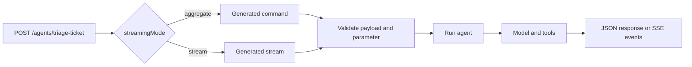

Agents can be exposed through HTTP with `exposeAsHttpEndpoint`. Choose the response shape with `streamingMode`:

- `aggregate` returns one JSON response after the agent finishes.
- `stream` returns an SSE response while the agent is running.

Use this when a client should start an agent from an HTTP request instead of invoking it from another service or agent.

## JSON response

```typescript [triageTicketAgentBuilder.ts]
export const triageTicketAgentBuilder = supportV1ServiceBuilder
  .getAgentQueueBuilder('triageTicket', 'Classifies support tickets by urgency')
  .addPayloadSchema(triageTicketInputSchema)
  .addOutputSchema(triageTicketOutputSchema)
  .addModel('primary', {
    model: 'gpt-4.1-mini',
    capabilities: ['object'],
    defaults: { temperature: 0 },
  })
  .exposeAsHttpEndpoint('POST', 'agents/triage-ticket', {
    streamingMode: 'aggregate',
  })
  .setRunFunction(async context => {
    const result = await context.harness.models.primary.object(
      {
        messages: [
          {
            role: 'user',
            content: `Classify ticket: ${context.payload.text}`,
          },
        ],
        schema: triageTicketJsonSchema,
      },
      context.signal,
    )

    return triageTicketOutputSchema.parse(result.object)
  })
```

In aggregate mode, the agent builder projects an internal command. The Hono HTTP server exposes that command as a normal REST endpoint with the agent payload, parameter, and output schemas.

## Streamed response

```typescript [supportAgentBuilder.ts]
export const supportAgentBuilder = supportV1ServiceBuilder
  .getAgentQueueBuilder('supportAgent', 'Answers support questions')
  .addPayloadSchema(supportAgentInputSchema)
  .addOutputSchema(supportAgentOutputSchema)
  .addModel('primary', {
    model: 'gpt-4.1-mini',
    capabilities: ['text'],
  })
  .exposeAsHttpEndpoint('POST', 'agents/support', {
    streamingMode: 'stream',
  })
  .setRunFunction(async context => {
    return context.harness.models.primary.text(
      {
        messages: [
          {
            role: 'user',
            content: context.payload.prompt,
          },
        ],
      },
      context.signal,
    )
  })
```

In stream mode, the agent builder projects an internal stream. The Hono HTTP server exposes that stream as `text/event-stream` on the configured path.

## Response contracts

`exposeAsHttpEndpoint` accepts:

| Option | Purpose |
|---|---|
| `streamingMode` | `aggregate` returns JSON. `stream` returns an SSE response. |
| `requestContentType` | Override the request content type. |
| `responseContentType` | Override the response content type. |
| `public` | Mark the endpoint as public. You can also call `makeEndpointPublic()`. |

For simple request/response agents, use aggregate mode:

```typescript
.exposeAsHttpEndpoint('POST', 'agents/support', {
  streamingMode: 'aggregate',
})
```

For token-by-token or progress-style responses, use stream mode:

```typescript
.exposeAsHttpEndpoint('POST', 'agents/support', {
  streamingMode: 'stream',
})
```

For long-running agents where the caller should not hold the HTTP connection open, combine aggregate HTTP exposure with an accepted response mode. The HTTP command returns a queue handle instead of blocking until the model work finishes:

```typescript
.setResponseMode('accepted', {
  resultPolicy: 'state-and-event',
  statusUrl: '/agents/support/runs/:jobId',
})
.exposeAsHttpEndpoint('POST', 'agents/support', {
  streamingMode: 'aggregate',
})
```

The accepted response includes the queue job identity and an agent run identity:

```json
{
  "jobId": "job_123",
  "runId": "run:job_123",
  "status": "queued",
  "statusUrl": "/agents/support/runs/job_123"
}
```

## Public endpoints

Endpoints are protected by default. Make an endpoint public only when the agent is safe to call without the default HTTP security checks:

```typescript
export const publicTriageAgentBuilder = supportV1ServiceBuilder
  .getAgentQueueBuilder('triageTicket', 'Classifies public support tickets')
  .addPayloadSchema(triageTicketInputSchema)
  .addOutputSchema(triageTicketOutputSchema)
  .exposeAsHttpEndpoint('POST', 'agents/public-triage', {
    streamingMode: 'aggregate',
  })
  .makeEndpointPublic()
```

## Request flow



## When not to use it

Do not expose every agent over HTTP by default. Prefer internal invocation when the agent is only a tool for another service or parent agent:

```typescript
context.invoke.agents['triageTicket.1'].run(payload, parameter)
```

Expose an HTTP endpoint when the agent is part of the external API surface, needs OpenAPI documentation, or must be triggered by a web client, gateway, cron job, or integration platform.
