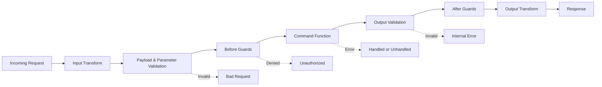

A **command** is the foundational building block of PURISTA. It is a synchronous request-response function inside a service that receives a request, performs work, and returns a result. Commands are how you expose business logic to the outside world — whether through HTTP, cross-service calls, or programmatic APIs.

Commands live inside services. A service groups related commands (and [subscriptions](/handbook/blocks/subscription-pattern/) and [streams](/handbook/blocks/stream-pattern/)) around a single domain boundary like "User Management" or "Billing." The service builder collects command definitions, and the event bridge routes incoming requests to the right handler.

  
Request/response semantics

  
A command always returns a result or an error. If you need fire-and-forget behavior, use a <a href="/handbook/blocks/subscription-pattern/">subscription</a> instead. If you need continuous data flow, use a <a href="/handbook/blocks/stream-pattern/">stream</a>. If you need background work with retries, use a <a href="/handbook/blocks/queue-pattern/">queue</a>.

## In this section

  <a href="/handbook/blocks/command-pattern/what-is-command/" class="block p-4 rounded-lg border border-[var(--color-line)] bg-[var(--color-bg-elev)] hover:border-[var(--color-found)] transition-colors">
    
What is a Command?

    
Understand the command lifecycle, context, and when to use commands.

  </a>
  <a href="/handbook/blocks/command-pattern/command-builder/" class="block p-4 rounded-lg border border-[var(--color-line)] bg-[var(--color-bg-elev)] hover:border-[var(--color-found)] transition-colors">
    
The Command Builder

    
Define schemas, transforms, guards, events, and the business function with full type inference.

  </a>
  <a href="/handbook/blocks/command-pattern/cross-service/" class="block p-4 rounded-lg border border-[var(--color-line)] bg-[var(--color-bg-elev)] hover:border-[var(--color-found)] transition-colors">
    
Cross-Service Calls

    
Call commands across services through the event bridge with full type safety.

  </a>
  <a href="/handbook/blocks/command-pattern/http-exposure/" class="block p-4 rounded-lg border border-[var(--color-line)] bg-[var(--color-bg-elev)] hover:border-[var(--color-found)] transition-colors">
    
HTTP Exposure

    
Expose commands as REST endpoints with path parameters, query strings, and OpenAPI docs.

  </a>
  <a href="/handbook/blocks/command-pattern/testing/" class="block p-4 rounded-lg border border-[var(--color-line)] bg-[var(--color-bg-elev)] hover:border-[var(--color-found)] transition-colors">
    
Testing

    
Unit test handlers in isolation or validate the full runtime path with typed mocks.

  </a>

## Quick reference

### Command lifecycle

### Key principles

- Commands are **request/response** — they always return a result or error.
- Schemas drive **TypeScript inference** throughout the pipeline.
- Use **`async function`**, not arrow functions, to preserve `this` context.
- Keep **auth logic in guards**, not inside the command function.
- Choose the right handler: commands for sync work, [queues](/handbook/blocks/queue-pattern/) for background work, [subscriptions](/handbook/blocks/subscription-pattern/) for events, [streams](/handbook/blocks/stream-pattern/) for data flow.
