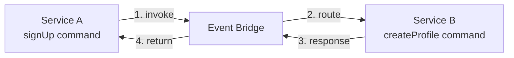

One of PURISTA's defining features is that commands can invoke other commands across service boundaries. The caller does not need to know where the target service runs, what event bridge it uses, or even if it is running in the same process. It only needs to know the service name, version, and command name.

## How it works



1. Service A's `signUp` command calls `ctx.invoke({ serviceName, serviceVersion, serviceTarget }, payload)`.
2. The event bridge receives the invocation request and routes it to Service B.
3. Service B executes its `createProfile` command and returns a response.
4. The event bridge routes the response back to Service A, which resumes execution.

The invocation is fully typed when you declare the remote command's schemas with `canInvoke`. TypeScript enforces that your payload and return shapes match at compile time.

## Declaring cross-service capabilities

Use `canInvoke` on the command builder to declare which remote commands you intend to call. Then use `ctx.invoke` at runtime to make the call:

```typescript [signUpCommand.ts]
import { z } from 'zod'

const signUpCommandBuilder = userServiceV1ServiceBuilder
  .getCommandBuilder('signUp', 'Register a new user')
  .addPayloadSchema(z.object({ email: z.string().email(), password: z.string().min(8) }))
  .addOutputSchema(z.object({ userId: z.string() }))
  .canInvoke('ProfileService', '1', 'createProfile', {
    outputSchema: z.object({ profileId: z.string() }),
    payloadSchema: z.object({ userId: z.string() }),
    parameterSchema: z.object({}),
  })
  .setCommandFunction(async function (context, payload, parameter) {
    const user = await context.resources.db.insert('users', payload)

    const profile = await context.invoke(
      { serviceName: 'ProfileService', serviceVersion: '1', serviceTarget: 'createProfile' },
      { userId: user.id },
    )

    return { userId: user.id, profileId: profile.profileId }
  })
```

The `canInvoke` method takes:

| Argument | Purpose |
|---|---|
| `serviceName` | The target service name |
| `serviceVersion` | The target service version |
| `serviceTarget` | The target command name |
| `outputSchema` | (optional) The expected return shape for type inference |
| `payloadSchema` | (optional) The payload shape for type inference |
| `parameterSchema` | (optional) The parameter shape for type inference |

If you omit the schemas, the proxy is still typed but with `unknown` shapes. Providing schemas gives you full compile-time safety.

## The invoke API

Use `context.invoke` to call a command in another service. Pass a target address object and the payload:

```typescript
const result = await context.invoke(
  { serviceName: 'BillingService', serviceVersion: '1', serviceTarget: 'chargeCustomer' },
  { amount: 100, currency: 'USD' },
)
```

The return type is inferred from the `outputSchema` you declared in `canInvoke`.

## Consuming streams from commands

Commands can also consume stream endpoints from other services. Declare the capability with `canConsumeStream`. Refer to the [stream documentation](/handbook/blocks/stream-pattern/) for the full streaming API.

## Error handling

Cross-service invocations can fail just like local calls. PURISTA propagates errors transparently:

```typescript [signUpCommand.ts]
.setCommandFunction(async function (context, payload, parameter) {
  const user = await context.resources.db.insert('users', payload)
  try {
    const profile = await context.invoke(
      { serviceName: 'ProfileService', serviceVersion: '1', serviceTarget: 'createProfile' },
      { userId: user.id },
    )
  } catch (error) {
    if (error instanceof HandledError) {
      // The remote service returned a known error
      context.logger.warn({ error }, 'Profile creation failed')
      throw new HandledError(StatusCode.ServiceUnavailable, 'Could not create profile')
    }
    // Re-throw unhandled errors
    throw error
  }
})
```

## Runtime validation

At runtime, PURISTA validates cross-service calls against the schemas you declared in `canInvoke`. If the payload or parameter does not match, the call fails before leaving the service. If the response does not match the declared `outputSchema`, the call fails on return.

This means your `canInvoke` declarations serve as runtime contracts as well as compile-time types.
