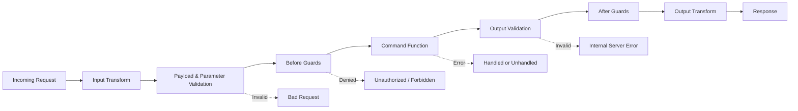

A **command** is a synchronous request-response function inside a service. It is the primary way to expose business logic to the outside world — whether through an HTTP endpoint, a direct invocation from another service, or a programmatic API call.

Think of a command as a strongly-typed remote procedure call. You define what it receives (payload and parameters), what it returns (output), and what business rules guard its execution. PURISTA handles routing, validation, serialization, and error propagation automatically.

<div class="callout callout--info">
  <div class="callout__title">Request/response semantics</div>
  <p>A command always returns a result or an error. If you need fire-and-forget behavior, use a <a href="/handbook/blocks/subscription-pattern/">subscription</a>. If you need continuous data flow, use a <a href="/handbook/blocks/stream-pattern/">stream</a>. If you need background work with retries, use a <a href="/handbook/blocks/queue-pattern/">queue</a>.</p>
</div>

## Anatomy of a command

A command has three contracts:

| Contract | Method | Purpose |
|---|---|---|
| **Payload** | `addPayloadSchema()` | The main input body — validated after any input transform |
| **Parameter** | `addParameterSchema()` | Query/path params and metadata — must be a `z.object()` |
| **Output** | `addOutputSchema()` | The return shape — validated after the command function runs |

```typescript [signUpCommand.ts]
import { z } from 'zod'
import { userServiceV1ServiceBuilder } from './userService.js'

const signUpInputPayloadSchema = z.object({
  email: z.string().email(),
  password: z.string().min(8),
})

const signUpInputParameterSchema = z.object({
  referralCode: z.string().optional(),
})

const signUpOutputSchema = z.object({
  userId: z.string(),
})

export const signUpCommandBuilder = userServiceV1ServiceBuilder
  .getCommandBuilder('signUp', 'Register a new user')
  .addPayloadSchema(signUpInputPayloadSchema)
  .addParameterSchema(signUpInputParameterSchema)
  .addOutputSchema(signUpOutputSchema)
  .setCommandFunction(async function (context, payload, parameter) {
    // payload is typed as { email: string; password: string }
    // parameter is typed as { referralCode?: string }
    const user = await context.resources.db.insert('users', payload)
    return { userId: user.id }
    // return value is validated against signUpOutputSchema
  })
```

<div class="callout callout--warning">
  <div class="callout__title">Use the function keyword</div>
  <p>Always use <code>async function</code> for command functions — not arrow functions. The builder binds <code>this</code> to the service instance, giving you access to config, resources, and stores via <code>this.config</code>, <code>this.resources</code>, etc. Arrow functions break this binding.</p>
</div>

<div class="callout callout--info">
  <div class="callout__title">Parameters must be objects</div>
  <p>The parameter schema must always be a <code>z.object()</code> — never a primitive. This is required because HTTP path parameters, query strings, and metadata are all passed as keyed objects.</p>
</div>

## Command lifecycle

Every command execution follows a strict pipeline. Each stage has typed inputs, automatic validation, and clear error semantics:



1. **Input transform** — optional conversion of raw input (e.g., XML → JSON, decryption, field renaming).
2. **Validation** — payload and parameter schemas are validated. Failures return `Bad Request`.
3. **Before guards** — auth, authorization, and business preconditions run in **parallel**. Failures return the guard's status code.
4. **Command function** — your business logic executes with typed `context`, `payload`, and `parameter`.
5. **Output validation** — the return value is checked against the output schema.
6. **After guards** — post-execution checks (audit logging, side effects) run in parallel.
7. **Output transform** — optional conversion of the result (e.g., JSON → XML, encryption).

## The command function context

The command function receives three arguments: `context`, `payload`, and `parameter`. The `context` object is the gateway to everything PURISTA provides:

```typescript [signUpCommand.ts]
.setCommandFunction(async function (context, payload, parameter) {
  // context.message — the original EB message with principalId, tenantId, trace info
  context.logger.info({ email: payload.email }, 'Processing sign-up')

  // context.resources — typed dependencies declared on the service builder
  const user = await context.resources.db.insert('users', payload)

  // context.secrets / context.configs / context.states — store access
  await context.secrets.setSecret(`pwd:${user.id}`, payload.password)

  // context.emit — emit custom events consumable by subscriptions
  await context.emit('userSignedUp', { userId: user.id })

  // context.invoke — cross-service command invocation
  const profile = await context.invoke(
    { serviceName: 'ProfileService', serviceVersion: '1', serviceTarget: 'createProfile' },
    { userId: user.id },
  )

  return { userId: user.id }
})
```

| Context member | Purpose |
|---|---|
| `context.message` | The original event bridge message with `principalId`, `tenantId`, trace info |
| `context.logger` | Scoped logger with trace correlation |
| `context.resources` | Typed dependencies declared on the [service builder](/handbook/service/service-builder/) |
| `context.secrets` / `context.configs` / `context.states` | Secret, config, and state store access |
| `context.emit` | Emit custom events consumable by [subscriptions](/handbook/blocks/subscription-pattern/) |
| `context.invoke` | Call a command in another service by target address |
| `context.principalId` | The principal (user/caller) identity from the message |
| `context.tenantId` | The tenant identity from the message |
| `context.startActiveSpan` | OpenTelemetry span helper |

## When to use commands

- You need request/response behavior.
- A caller expects success/error result semantics.
- You want strict validation on input/output contracts.
- The operation completes within a reasonable time frame.

## When NOT to use commands

- The operation is long-running and the caller should not block. Use a [queue worker](/handbook/blocks/queue-pattern/) instead.
- You need to react to events without returning a result. Use a [subscription](/handbook/blocks/subscription-pattern/).
- You need continuous bidirectional data flow. Use a [stream](/handbook/blocks/stream-pattern/).

## Common pitfalls

- **Mixing long-running workflows into a single command.** Commands are request/response. If the caller blocks for too long, use a queue worker or event-driven flow instead.
- **Using broad payload schemas.** `z.any()` removes type safety and makes testing harder. Be explicit.
- **Forgetting the output schema.** Without it, TypeScript cannot infer the return type and runtime validation is skipped.
- **Using arrow functions for command handlers.** You lose `this` context for config, resources, and stores access.
- **Putting auth logic inside the command function.** Use before guards to keep business logic clean.

## Checklist

- [ ] Payload, parameter, and output schemas are defined and explicit.
- [ ] Command function uses `async function`, not an arrow function.
- [ ] Before guards handle auth/authz; after guards handle audit/logging.
- [ ] Event names are in past tense if emitting success events.
- [ ] HTTP exposure is intentional — either exposed with method/path or deliberately internal.
- [ ] Handler tests cover success and failure branches.
- [ ] Runtime tests verify validation, guards, and wiring.
