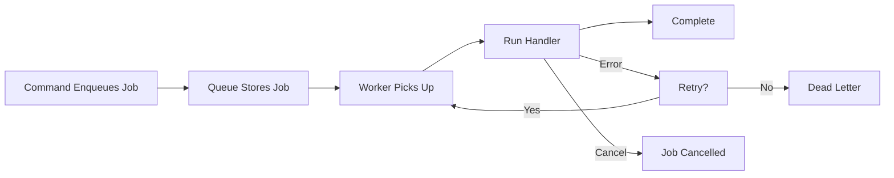

A **queue** is a background task system for deferred, durable execution. Use queues for anything that should not block the caller — image processing, report generation, data imports, email batching, or long-running workflows.

Queues have two sides:
- **Queue definition** — what work to do, declared on a service
- **Queue worker** — how to execute that work, also declared on a service

The queue itself is a named, typed contract. Commands and streams enqueue jobs, and workers pick them up. The event bridge stores the jobs durably.

  
Deferred execution with workers

  
Unlike <a href="/handbook/blocks/subscription-pattern/">subscriptions</a> which react to events immediately, queues defer work and process it with dedicated workers. Unlike <a href="/handbook/blocks/command-pattern/">commands</a>, callers do not wait for completion.

## In this section

  <a href="/handbook/blocks/queue-pattern/what-is-queue/" class="block p-4 rounded-lg border border-[var(--color-line)] bg-[var(--color-bg-elev)] hover:border-[var(--color-found)] transition-colors">
    
What is a Queue?

    
Understand queue definitions, worker lifecycle, scheduling, and result policies.

  </a>
  <a href="/handbook/blocks/queue-pattern/queue-builder/" class="block p-4 rounded-lg border border-[var(--color-line)] bg-[var(--color-bg-elev)] hover:border-[var(--color-found)] transition-colors">
    
The Queue Builder

    
Define typed queue contracts with lifecycle config, execution profiles, and result policies.

  </a>
  <a href="/handbook/blocks/queue-pattern/queue-worker/" class="block p-4 rounded-lg border border-[var(--color-line)] bg-[var(--color-bg-elev)] hover:border-[var(--color-found)] transition-colors">
    
Queue Worker

    
Configure worker modes, intervals, parallel handlers, and poison message policies.

  </a>
  <a href="/handbook/blocks/queue-pattern/queue-http-exposure/" class="block p-4 rounded-lg border border-[var(--color-line)] bg-[var(--color-bg-elev)] hover:border-[var(--color-found)] transition-colors">
    
HTTP Exposure

    
Expose queue endpoints over REST with async acceptance and status tracking.

  </a>
  <a href="/handbook/blocks/queue-pattern/queue-testing/" class="block p-4 rounded-lg border border-[var(--color-line)] bg-[var(--color-bg-elev)] hover:border-[var(--color-found)] transition-colors">
    
Testing

    
Test queue handlers and workers with mocks, harnesses, and manual scheduling.

  </a>

## Quick reference

### Queue lifecycle

### Key principles

- Queues are **defined** with `serviceBuilder.getQueueBuilder('name', 'description')`.
- Workers are **defined** with `serviceBuilder.getQueueWorkerBuilder('workerName', 'description').forQueue('name')`.
- Register both on the service builder: `.addQueueDefinition(emailQueueBuilder)` and `.addQueueWorkerDefinition(emailWorkerBuilder)`.
- Commands and streams **enqueue** jobs via `canEnqueue('queueName', payloadSchema?)`.
- Workers support three modes: `continuous` (default), `interval`, `sequential`.
- `context.job.complete(output?, headers?)`, `.retry(request?)`, `.fail(reason, fatal?)`, `.moveToDeadLetter(reason?)`, `.extendLease(durationMs)`, `.cancelRequested()` control job lifecycle.
- **Poison messages** — repeated failures can pause workers after a threshold configured via `setLifecycleConfig`.

### EventBridge subscriptions vs QueueBridge workers

These two patterns look similar but serve different roles:

| | [Subscription](/handbook/blocks/subscription-pattern/) | Queue worker |
|---|---|---|
| **Transport** | EventBridge (pub/sub) | QueueBridge (work queue) |
| **Competing consumers** | Every subscription instance receives each event | Only one worker picks up each job |
| **Job state** | No job tracking | Full lifecycle: pending → active → complete/retry/dead-letter |
| **Retries** | Bridge-dependent | Explicit: `maxAttempts`, backoff, poison-message threshold |
| **Use when** | Reacting to events (fan-out, side effects) | Processing background work reliably (deduplication, retry, ordering) |
