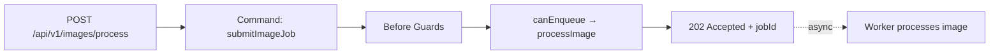

`QueueDefinitionBuilder` does not have an `exposeAsHttpEndpoint` method — queues are not HTTP endpoints themselves. To accept queue jobs over HTTP, expose a **command** that validates the request, applies any guards, and then enqueues the job via `canEnqueue`.

This pattern is the right choice for HTTP-triggered background work:
- The HTTP response is `202 Accepted` (or a job reference), returned immediately.
- The actual processing happens later when the worker picks up the job.
- You get full type safety, OpenAPI documentation, and guard support from the command builder.

## Pattern: command accepts → queue processes



## Step 1 — Define the queue

```typescript [imageQueue.ts]
import { z } from 'zod'
import { imageV1ServiceBuilder } from '../imageV1ServiceBuilder.js'

export const imageQueue = imageV1ServiceBuilder
  .getQueueBuilder(
    'processImage',
    'Process uploaded images in the background',
  )
  .addPayloadSchema(z.object({
    imageUrl: z.string().url(),
    format: z.enum(['jpeg', 'png', 'webp']).default('jpeg'),
  }))
  .setLifecycleConfig({
    maxAttempts: 4,          // 1 initial + 3 retries
    visibilityTimeoutMs: 30_000,
    retryWindowMs: 3_600_000,
  })
```

## Step 2 — Expose a command that enqueues

```typescript [submitImageJobCommandBuilder.ts]
import { z } from 'zod'
import { StatusCode, HandledError } from '@purista/core'
import { imageV1ServiceBuilder } from '../imageV1ServiceBuilder.js'

export const submitImageJobCommandBuilder = imageV1ServiceBuilder
  .getCommandBuilder('submitImageJob', 'Accept an image processing request over HTTP')
  .addPayloadSchema(z.object({
    imageUrl: z.string().url(),
    format: z.enum(['jpeg', 'png', 'webp']).default('jpeg'),
  }))
  .addParameterSchema(z.object({
    priority: z.enum(['low', 'normal', 'high']).default('normal'),
  }))
  .addOutputSchema(z.object({
    jobId: z.string(),
    status: z.literal('accepted'),
    queueName: z.literal('processImage'),
  }))
  .canEnqueue('processImage', z.object({
    imageUrl: z.string().url(),
    format: z.enum(['jpeg', 'png', 'webp']),
  }))
  .setBeforeGuardHooks({
    validateUrl: async function (context, payload, parameter) {
      try {
        new URL(payload.imageUrl)
      } catch {
        throw new HandledError(StatusCode.BadRequest, 'Invalid image URL')
      }
    },
  })
  .exposeAsHttpEndpoint('POST', '/api/v1/images/process')
  .addOpenApiTags('Images')
  .addOpenApiErrorStatusCodes(StatusCode.BadRequest, StatusCode.Unauthorized)
  .setCommandFunction(async function (context, payload, parameter) {
    await context.queue.enqueue.processImage({
      imageUrl: payload.imageUrl.trim(),
      format: payload.format,
    })

    return {
      jobId: context.message.id,
      status: 'accepted' as const,
      queueName: 'processImage' as const,
    }
  })
```

## Client integration

```typescript [client.ts]
// Enqueue a job
const response = await fetch('/api/v1/images/process', {
  method: 'POST',
  headers: { 'Content-Type': 'application/json' },
  body: JSON.stringify({ imageUrl: 'https://example.com/photo.jpg', format: 'webp' }),
})

const { jobId } = await response.json()
// status 200 with jobId — processing continues in the background

// Poll for status or listen for the 'imageProcessed' event
```

## Why wrap in a command?

Using a command to accept the job gives you:

- **Guards** — auth, rate limiting, and validation before any work is enqueued
- **OpenAPI docs** — the command's schemas generate the full API spec
- **Type safety** — `canEnqueue` ensures the payload matches the queue's definition at compile time
- **Transforms** — optional input transforms before validation
- **Tracing** — the command's span covers the whole acceptance flow

If you want the HTTP endpoint to return `202 Accepted` explicitly, set the output schema to reflect that and document it in OpenAPI with `addOpenApiErrorStatusCodes(StatusCode.Accepted)`.

## Async vs sync exposure

If you also need a sync version (wait for result), expose a second command that enqueues the job and polls for completion. In most cases, the simpler approach is:
- **Async** (recommended): command accepts, returns job ID, worker processes in background.
- **Sync**: only for short jobs where the caller must block — use a regular [command](/handbook/blocks/command-pattern/) instead.
