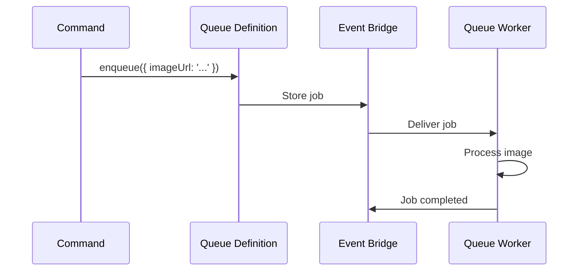

A queue is a **deferred execution system**. When you need work done in the background — not immediately, not as a response to a request — you put it in a queue. A worker picks it up later, processes it, and reports the result.

Use queues for:
- **Background processing** — image resizing, video transcoding, PDF generation
- **Batch operations** — nightly data exports, report compilation
- **Reliable retries** — a task fails? Retry with backoff automatically
- **Rate limiting** — process jobs at a controlled pace
- **Scheduled tasks** — run something at a specific time in the future

<div class="callout callout--warning">
  <div class="callout__title">Not for immediate response</div>
  <p>If the caller needs a result right now, use a <a href="/handbook/blocks/command-pattern/">command</a>. Queues are fire-and-forget from the caller's perspective.</p>
</div>

## Two sides: definition and worker

A queue has two parts:

| Part | Builder | Responsibility |
|---|---|---|
| **Queue definition** | `serviceBuilder.getQueueBuilder(name, description)` | What work is available, how it is typed, lifecycle rules |
| **Queue worker** | `serviceBuilder.getQueueWorkerBuilder(name, description).forQueue(name)` | How to execute the work, worker mode, error handling |

A command or stream **enqueues** a job. The queue definition describes what that job looks like. The worker picks up the job and processes it.



## Job lifecycle

Once a job is in the queue, it goes through these states:

1. **Pending** — job is stored, waiting for a worker
2. **Active** — worker picked it up and is processing
3. **Completed** — worker finished successfully (`context.job.complete()`)
4. **Retry scheduled** — worker failed, queue retries based on lifecycle config
5. **Dead letter** — too many failures, sent to dead-letter queue (per lifecycle config)
6. **Cancelled** — worker detected cancellation via `context.job.cancelRequested()`

## Scheduling jobs

You can enqueue a job to run immediately or at a specific time:

```typescript
// Immediate
await context.queue.enqueue.processImage({ imageUrl: '...' })

// Scheduled for later
await context.queue.scheduleAt.processImage(
  new Date(Date.now() + 3600_000), // 1 hour from now
  { imageUrl: '...' }
)
```

## Result policies

Control what happens when a job finishes:

| Mode | Behavior |
|---|---|
| `event` | Emit a custom event on completion |
| `state` | Store the result for later retrieval |
| `state-and-event` | Both emit and store |
| `none` (default) | Nothing special — just complete |

```typescript
imageV1ServiceBuilder
  .getQueueBuilder('processImage', 'Process uploaded images')
  .setResultPolicy({ mode: 'event', successEventName: 'imageProcessed' })
  // ...
```

## Lifecycle configuration

Fine-tune how the queue behaves:

```typescript
imageV1ServiceBuilder
  .getQueueBuilder('processImage', 'Process uploaded images')
  .setLifecycleConfig({
    maxAttempts: 4,              // 1 initial + 3 retries
    visibilityTimeoutMs: 30_000, // lock expires after 30s if worker goes silent
    retryWindowMs: 86_400_000,   // retry window: 24 hours
  })
```

## Execution profiles

For long-running jobs, use the long-running profile:

```typescript
imageV1ServiceBuilder
  .getQueueBuilder('generateReport', 'Generate monthly reports')
  .setExecutionProfile('longRunning', {
    maxRuntimeMs: 300_000, // 5 minutes
    strict: false, // allow slightly over if needed
  })
```

## Enqueuing from commands and streams

Use `canEnqueue` on commands and streams to get typed queue access:

```typescript [imageProcessor.ts]
// Typically, use serviceBuilder.getCommandBuilder() instead of direct construction.
// Direct construction shown here for brevity:
import { CommandDefinitionBuilder } from '@purista/core'

const uploadImageCommand = new CommandDefinitionBuilder(
  'uploadImage',
  'Upload an image for processing',
)
  .addPayloadSchema(z.object({ imageUrl: z.string() }))
  .canEnqueue('processImage', z.object({ imageUrl: z.string() }))
  .setCommandFunction(async function (context, payload, parameter) {
    await context.queue.enqueue.processImage({ imageUrl: payload.imageUrl })
    return { accepted: true, jobId: context.message.id }
  })
```

<div class="callout callout--info">
  <div class="callout__title">Subscriptions cannot enqueue</div>
  <p><code>canEnqueue</code> exists on <code>CommandDefinitionBuilder</code> and <code>StreamDefinitionBuilder</code>, but <strong>not</strong> on <code>SubscriptionDefinitionBuilder</code>. Subscriptions fire-and-forget; they do not queue additional work.</p>
</div>

## Service-level queue control

Services expose methods to pause and resume workers:

```typescript
// Pause a queue worker (synchronous — no await)
service.pauseQueueWorkers('processImage', 'Maintenance window')

// Resume it
service.resumeQueueWorkers('processImage')

// Check pause state
const state = service.getQueueWorkerPauseState('processImage')
```
