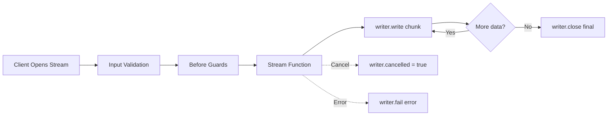

A **stream** is a long-running request/response handler that emits multiple frames (`start`, `chunk`, `complete`, `error`, `cancel`) instead of a single payload. Use streams for incremental delivery, token-by-token AI responses, progress feeds, or any flow that maps well to Server-Sent Events (SSE).

Streams live inside services alongside [commands](/handbook/blocks/command-pattern/) and [subscriptions](/handbook/blocks/subscription-pattern/). The service builder collects stream definitions, and the event bridge routes incoming stream requests to the right handler.

<div class="callout callout--info">
  <div class="callout__title">Request/response with multiple frames</div>
  <p>Unlike a command which returns a single response, a stream emits a sequence of frames. If you need fire-and-forget behavior, use a <a href="/handbook/blocks/subscription-pattern/">subscription</a> instead.</p>
</div>

## In this section

<div class="grid grid-cols-1 md:grid-cols-2 gap-4 mt-6">
  <a href="/handbook/blocks/stream-pattern/what-is-stream/" class="block p-4 rounded-lg border border-[var(--color-line)] bg-[var(--color-bg-elev)] hover:border-[var(--color-found)] transition-colors">
    <div class="font-semibold text-[var(--color-fg)] mb-1">What is a Stream?</div>
    <div class="text-sm text-[var(--color-fg-muted)]">Understand the stream lifecycle, frame types, writer API, and when to use streams.</div>
  </a>
  <a href="/handbook/blocks/stream-pattern/stream-builder/" class="block p-4 rounded-lg border border-[var(--color-line)] bg-[var(--color-bg-elev)] hover:border-[var(--color-found)] transition-colors">
    <div class="font-semibold text-[var(--color-fg)] mb-1">The Stream Builder</div>
    <div class="text-sm text-[var(--color-fg-muted)]">Define typed chunk/final schemas, guards, SSE endpoints, and stream consumers.</div>
  </a>
  <a href="/handbook/blocks/stream-pattern/stream-testing/" class="block p-4 rounded-lg border border-[var(--color-line)] bg-[var(--color-bg-elev)] hover:border-[var(--color-found)] transition-colors">
    <div class="font-semibold text-[var(--color-fg)] mb-1">Testing</div>
    <div class="text-sm text-[var(--color-fg-muted)]">Unit test handlers with context mocks or validate runtime frame delivery with harnesses.</div>
  </a>
</div>

## Quick reference

### Stream lifecycle



### Scaffold a new stream

```bash [CLI]
purista add stream
```

### Key principles

- Streams are for **long-running, stateful flows** that emit incremental results rather than one final response.
- Streams are **request/response with multiple frames** — they emit `start`, `chunk`, `complete`, `error`, or `cancel`.
- The connection is **held open** for the duration of the stream — the client waits for the terminal frame.
- Schemas drive **TypeScript inference** for input, chunk, and final payloads.
- Use **`async function`**, not arrow functions, to preserve `this` context.
- **Always emit a terminal frame** (`writer.close()`, `writer.fail()`, or handle cancellation).
- Expose via REST with `.exposeAsHttpStreamEndpoint()` which sets `text/event-stream`.
- Check `writer.cancelled` in loops to handle client disconnects gracefully.
- If the caller should disconnect but work should continue, use a [queue](/handbook/blocks/queue-pattern/) instead.
