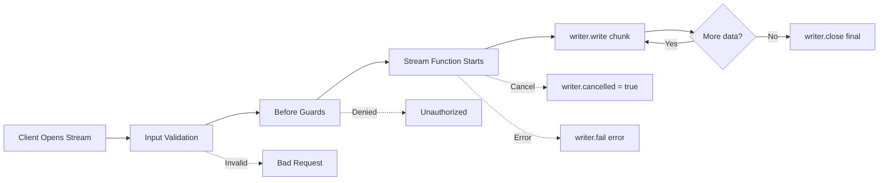

A **stream** is a long-running request/response handler that emits multiple frames (`start`, `chunk`, `complete`, `error`, `cancel`) instead of a single payload. Use streams for incremental delivery, token-by-token AI responses, progress feeds, or any flow that maps well to Server-Sent Events (SSE).

Think of a stream as a command that returns a sequence of partial results rather than one final result. The client connects, receives chunks as they become available, and the connection closes when the stream emits a terminal frame.

<div class="callout callout--info">
  <div class="callout__title">Request/response with multiple frames</div>
  <p>Unlike a <a href="/handbook/blocks/command-pattern/">command</a> which returns a single response, a stream emits a sequence of frames. If you need fire-and-forget behavior, use a <a href="/handbook/blocks/subscription-pattern/">subscription</a> instead.</p>
</div>

## Anatomy of a stream

A stream has four contracts:

| Contract | Method | Purpose |
|---|---|---|
| **Payload** | `addPayloadSchema()` | The main input body |
| **Parameter** | `addParameterSchema()` | Query/path params and metadata |
| **Chunk** | `addChunkSchema()` | The shape of each intermediate frame |
| **Final** | `addFinalSchema()` | The shape of the terminal frame |

```typescript [liveMetricsStream.ts]
import { z } from 'zod'
import { pingV1ServiceBuilder } from './pingService.js'

const liveMetricsStreamBuilder = pingV1ServiceBuilder
  .getStreamBuilder('liveMetrics', 'Stream live system metrics')
  .addPayloadSchema(z.object({ metricType: z.enum(['cpu', 'memory', 'disk']) }))
  .addParameterSchema(z.object({ intervalMs: z.number().default(1000) }))
  .addChunkSchema(z.object({ timestamp: z.number(), value: z.number() }))
  .addFinalSchema(z.object({ dataPoints: z.number(), average: z.number() }))
  .setStreamFunction(async function (context, payload, parameter, writer) {
    const collector = context.resources.metricsCollector
    const readings = []

    writer.onCancel((reason) => {
      context.logger.info({ reason }, 'Stream cancelled by client')
    })

    for (let i = 0; i < 60; i++) {
      if (writer.cancelled) break

      const reading = await collector.read(payload.metricType)
      readings.push(reading)

      await writer.write({ timestamp: Date.now(), value: reading })
      await new Promise(r => setTimeout(r, parameter.intervalMs))
    }

    const average = readings.reduce((a, b) => a + b, 0) / readings.length
    await writer.close({ dataPoints: readings.length, average })
  })
```

<div class="callout callout--warning">
  <div class="callout__title">Always emit a terminal frame</div>
  <p>Every stream must end with <code>writer.close(final)</code>, <code>writer.fail(error)</code>, or be cancelled. Clients wait for the terminal frame to know the stream is complete. Forgetting to close a stream leaves clients hanging.</p>
</div>

## Stream lifecycle



1. **Client opens stream** — via HTTP SSE, cross-service call, or direct invocation.
2. **Input validation** — payload and parameter schemas are validated.
3. **Before guards** — auth and preconditions run in parallel.
4. **Stream function executes** — your handler receives `context`, `payload`, `parameter`, and `writer`.
5. **Chunks are emitted** — call `writer.write(chunk)` for each partial result.
6. **Terminal frame** — call `writer.close(final)` when done, `writer.fail(error)` on error, or handle cancellation.

## The stream writer

The `writer` is your interface to the stream consumer:

| Method | Purpose |
|---|---|
| `writer.write(chunk)` | Emit a chunk frame |
| `writer.close(final?)` | Emit a complete frame and close the stream |
| `writer.fail(error)` | Emit an error frame and close the stream |
| `writer.onCancel(cb)` | Register a callback for when the client cancels |
| `writer.cancelled` | Boolean — true if the client has cancelled |

```typescript [aiResponseStream.ts]
.setStreamFunction(async function (context, payload, parameter, writer) {
  const upstream = await context.stream.AiService['1'].generateTokens(payload, parameter)

  writer.onCancel((reason) => {
    context.logger.info({ reason }, 'Client cancelled the stream')
  })

  for await (const frame of upstream) {
    if (writer.cancelled) {
      context.logger.info('Stopping early due to cancellation')
      break
    }

    if (frame.payload.frameType === 'chunk' && frame.payload.chunk) {
      await writer.write(frame.payload.chunk)
    }

    if (frame.payload.frameType === 'complete') {
      await writer.close(frame.payload.final)
      return
    }

    if (frame.payload.frameType === 'error') {
      await writer.fail(new Error(frame.payload.error?.message || 'Upstream error'))
      return
    }
  }
})
```

## Frame types

PURISTA streams use these frame types:

| Frame | Meaning |
|---|---|
| `open` | Internal control frame for stream initialization |
| `start` | Stream has started, initial metadata may be included |
| `chunk` | Partial data payload |
| `complete` | Stream finished successfully, may include final payload |
| `error` | An error occurred |
| `cancel` | Client or server cancelled the stream |
| `heartbeat` | Keep-alive frame to prevent timeouts |

## The stream function context

The stream context is identical to the command context — it includes `message`, `logger`, `resources`, `secrets`, `configs`, `states`, `emit`, `service`, `stream`, and `queue`:

```typescript [liveMetricsStream.ts]
.setStreamFunction(async function (context, payload, parameter, writer) {
  // context.message — the StreamOpenRequest with trace info
  context.logger.info({ metricType: payload.metricType }, 'Starting metrics stream')

  // context.resources — service resources
  const collector = context.resources.metricsCollector

  // context.service — invoke commands in other services
  const config = await context.service.ConfigService['1'].getMetricConfig({ type: payload.metricType }, {})

  // context.stream — consume other streams
  // context.emit — emit events
  // context.queue — enqueue jobs
})
```

## Scaffold a new stream

Use the CLI to generate boilerplate:

```bash [CLI]
npm run add:stream
```

This creates:
- `schema.ts` — payload, parameter, chunk, and final schemas
- `index.ts` — the stream builder with function implementation
- `index.test.ts` — Vitest specs

## When to use streams

- You need incremental progress/results instead of one response body.
- Clients expect long-lived connections (SSE) with keep-alive frames.
- You are streaming AI tokens, telemetry updates, or chunked file conversions.

## When NOT to use streams

- The operation is short and returns a single result. Use a [command](/handbook/blocks/command-pattern/) instead.
- The work should continue even if the caller disconnects. Use a [queue](/handbook/blocks/queue-pattern/) instead.
- You need to react to events without returning a result. Use a [subscription](/handbook/blocks/subscription-pattern/).

## Common pitfalls

- **Forgetting to emit a terminal frame.** Handlers must call `writer.close()`, `writer.fail()`, or handle cancellation.
- **Mixing queue-style async work into streams.** Use queues when consumers pull jobs.
- **Exposing streams via REST without `text/event-stream`.** Use `.exposeAsHttpStreamEndpoint()` which sets the correct content type.
- **Not checking `writer.cancelled` in loops.** Clients disconnect; your handler should stop producing data.

## Checklist

- [ ] Input, chunk, and final schemas are defined.
- [ ] Stream function handles `writer.cancelled` and `writer.onCancel`.
- [ ] Every code path calls `writer.close()`, `writer.fail()`, or breaks on cancellation.
- [ ] SSE exposure uses `.exposeAsHttpStreamEndpoint()`.
- [ ] Unit tests verify chunk generation and terminal frame delivery.
- [ ] Integration tests simulate client disconnects.
