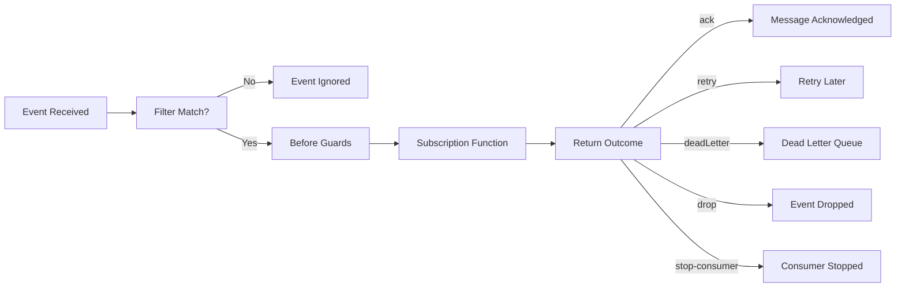

A **subscription** is a fire-and-forget handler that listens to events and reacts without blocking the emitter. Use subscriptions for cross-service communication, event-driven workflows, async side effects, or any flow where the caller does not need an immediate response.

Subscriptions live inside services alongside [commands](/handbook/blocks/command-pattern/) and [streams](/handbook/blocks/stream-pattern/). The service builder collects subscription definitions, and the event bridge routes matching events to the right handler.

  
Fire-and-forget event listeners

  
Subscriptions do not return a response to the caller. They either acknowledge the event (<code>ack</code>), schedule a retry, send it to a dead-letter queue, or drop it. If you need request/response, use a <a href="/handbook/blocks/command-pattern/">command</a> instead.

## In this section

  <a href="/handbook/blocks/subscription-pattern/what-is-subscription/" class="block p-4 rounded-lg border border-[var(--color-line)] bg-[var(--color-bg-elev)] hover:border-[var(--color-found)] transition-colors">
    
What is a Subscription?

    
Understand the subscription lifecycle, explicit outcomes, filtering, and bridge advice.

  </a>
  <a href="/handbook/blocks/subscription-pattern/subscription-builder/" class="block p-4 rounded-lg border border-[var(--color-line)] bg-[var(--color-bg-elev)] hover:border-[var(--color-found)] transition-colors">
    
The Subscription Builder

    
Define typed event subscriptions, filters, before guards, and explicit handler outcomes.

  </a>
  <a href="/handbook/blocks/subscription-pattern/subscription-testing/" class="block p-4 rounded-lg border border-[var(--color-line)] bg-[var(--color-bg-elev)] hover:border-[var(--color-found)] transition-colors">
    
Testing

    
Test handlers in isolation with mocks or validate bridge routing with runtime harnesses.

  </a>

## Quick reference

### Subscription lifecycle

### Key principles

- Subscriptions are **fire-and-forget** — they do not return a response to the caller.
- Handler functions must return an **explicit outcome**: `{ status: 'ack' | 'retry' | 'deadLetter' | 'drop' | 'stop-consumer' }`.
- Use **`async function`**, not arrow functions, to preserve `this` context.
- **Before guards run in parallel** — any guard that throws cancels the handler.
- **After guards are handled by the Service runtime** — you define them on the builder but the service orchestrates them.
- Filter which events to process with `subscribeToEvent()`, `filterSentFrom()`, `filterReceivedBy()`, etc.
- Bridge advice (`adviceDurable`, `adviceAutoacknowledgeMessage`, etc.) hints at infrastructure behavior but the bridge decides.
