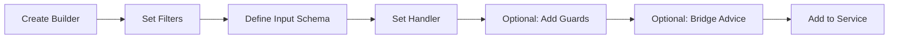

The subscription builder — obtained via `serviceBuilder.getSubscriptionBuilder(name, description)` — is a step-by-step API for declaring how your service reacts to events. Every method call returns a new builder instance with narrowed types, so TypeScript tracks what you've configured and what remains.

## Builder workflow



## Step 1 — Create the builder

```typescript [orderNotifications.ts]
import { notificationV1ServiceBuilder } from './notificationV1ServiceBuilder.js'

const orderNotificationSubscription = notificationV1ServiceBuilder
  .getSubscriptionBuilder('sendOrderNotification', 'Send a notification when an order is created')
```

## Step 2 — Filter which events to receive

```typescript [orderNotifications.ts]
orderNotificationSubscription
  // Listen to a specific event from a specific service
  .subscribeToEvent('OrderService', '1', 'orderCreated')
  // Listen to ALL events from a service
  .subscribeToEvent('OrderService', '1', '*')
  // Only accept events from this service version
  .filterSentFrom('OrderService', '1')
  // Only accept events targeted at this service
  .filterReceivedBy('NotificationService', '1')
  // Filter by message type
  .filterForMessageType('event')
```

Filters are combined with AND logic. An event must match all specified filters to be delivered.

## Step 3 — Define the payload schema

```typescript [orderNotifications.ts]
import { z } from 'zod'

const orderSchema = z.object({
  orderId: z.string(),
  customerId: z.string(),
  items: z.array(z.object({ productId: z.string(), qty: z.number() })),
})

orderNotificationSubscription.addPayloadSchema(orderSchema)
```

The payload schema drives TypeScript inference in the handler and is used for runtime validation.

## Step 4 — Set the handler function

```typescript [orderNotifications.ts]
orderNotificationSubscription.setSubscriptionFunction(async function (context, payload, parameter) {
  // payload is typed from the input schema
  const { orderId, customerId } = payload

  await sendPushNotification(customerId, `Order ${orderId} confirmed`)

  return { status: 'ack' }
})
```

Use `async function` so `this` is bound to the service instance. Arrow functions lose `this` context.

## Step 5 — Add before guards

Before guards run in **parallel** (all guards execute simultaneously with `Promise.all`):

```typescript [orderNotifications.ts]
import { HandledError, StatusCode } from '@purista/core'

orderNotificationSubscription.setBeforeGuardHooks({
  requireAuth: async function (context, payload, parameter) {
    if (!context.message.principalId) {
      throw new HandledError(StatusCode.Unauthorized, 'Authentication required')
    }
  },
  validatePayload: async function (context, payload, parameter) {
    // The payload is already validated by the input schema
    // Use this for business logic validation
    if (payload.items.length === 0) {
      throw new HandledError(StatusCode.BadRequest, 'Order must have at least one item')
    }
  },
})
```

Since guards run in parallel, they should not depend on each other. Any guard that throws cancels the handler.

## Step 6 — Bridge advice

```typescript [orderNotifications.ts]
orderNotificationSubscription
  // Subscription survives consumer restarts
  .adviceDurable(true)
  // Auto-acknowledge after handler success
  .adviceAutoacknowledgeMessage(true)
  // Best-effort handling (vs strict default)
  .adviceConsumerFailureHandling({ mode: 'best-effort' })
  // Every instance receives the message (broadcast)
  .receiveMessageOnEveryInstance(true)
```

## Step 7 — Can invoke commands

```typescript [orderNotifications.ts]
orderNotificationSubscription
  .canInvoke('CustomerService', '1', 'getCustomer', {
    payloadSchema: z.object({ customerId: z.string() }),
    outputSchema: z.object({ id: z.string(), name: z.string() }),
  })
  .setSubscriptionFunction(async function (context, payload, parameter) {
    const customer = await context.invoke('CustomerService', '1', 'getCustomer', {
      customerId: payload.customerId,
    })

    await sendPushNotification(customer.id, `Order ${payload.orderId} confirmed`)

    return { status: 'ack' }
  })
```

## Step 8 — Add to the service

Because the subscription builder is obtained from `notificationV1ServiceBuilder.getSubscriptionBuilder(...)`, it is already associated with that service. Register the finished definition back on the service builder:

```typescript [notificationV1ServiceBuilder.ts]
import { ServiceBuilder } from '@purista/core'

export const notificationV1ServiceBuilder = new ServiceBuilder({
  serviceName: 'NotificationService',
  serviceVersion: '1',
  serviceDescription: 'Handles notifications',
})
```

```typescript [subscriptions/orderNotifications.ts]
// orderNotificationSubscription is built using notificationV1ServiceBuilder.getSubscriptionBuilder(...)
// and must be imported so the definition is registered before getInstance() is called.
import { orderNotificationSubscription } from './subscriptions/orderNotifications.js'
```

```typescript [index.ts]
import { notificationV1ServiceBuilder } from './notificationV1ServiceBuilder.js'
import './subscriptions/orderNotifications.js' // ensure the definition is registered

const notificationService = await notificationV1ServiceBuilder.getInstance(eventBridge)
await notificationService.start()
```

## Full example

```typescript [orderNotifications.ts]
import { z } from 'zod'
import { HandledError, StatusCode } from '@purista/core'
import { notificationV1ServiceBuilder } from './notificationV1ServiceBuilder.js'

const orderSchema = z.object({
  orderId: z.string(),
  customerId: z.string(),
  items: z.array(z.object({ productId: z.string(), qty: z.number() })),
})

export const orderNotificationSubscription = notificationV1ServiceBuilder
  .getSubscriptionBuilder('sendOrderNotification', 'Send a notification when an order is created')
  .subscribeToEvent('OrderService', '1', 'orderCreated')
  .addPayloadSchema(orderSchema)
  .canInvoke('CustomerService', '1', 'getCustomer', {
    payloadSchema: z.object({ customerId: z.string() }),
    outputSchema: z.object({ id: z.string(), name: z.string() }),
  })
  .setBeforeGuardHooks({
    requireAuth: async function (context, payload, parameter) {
      if (!context.message.principalId) {
        throw new HandledError(StatusCode.Unauthorized, 'Authentication required')
      }
    },
  })
  .setSubscriptionFunction(async function (context, payload, parameter) {
    const customer = await context.invoke('CustomerService', '1', 'getCustomer', {
      customerId: payload.customerId,
    })

    await sendPushNotification(customer.id, `Order ${payload.orderId} confirmed`)
    return { status: 'ack' }
  })
```
