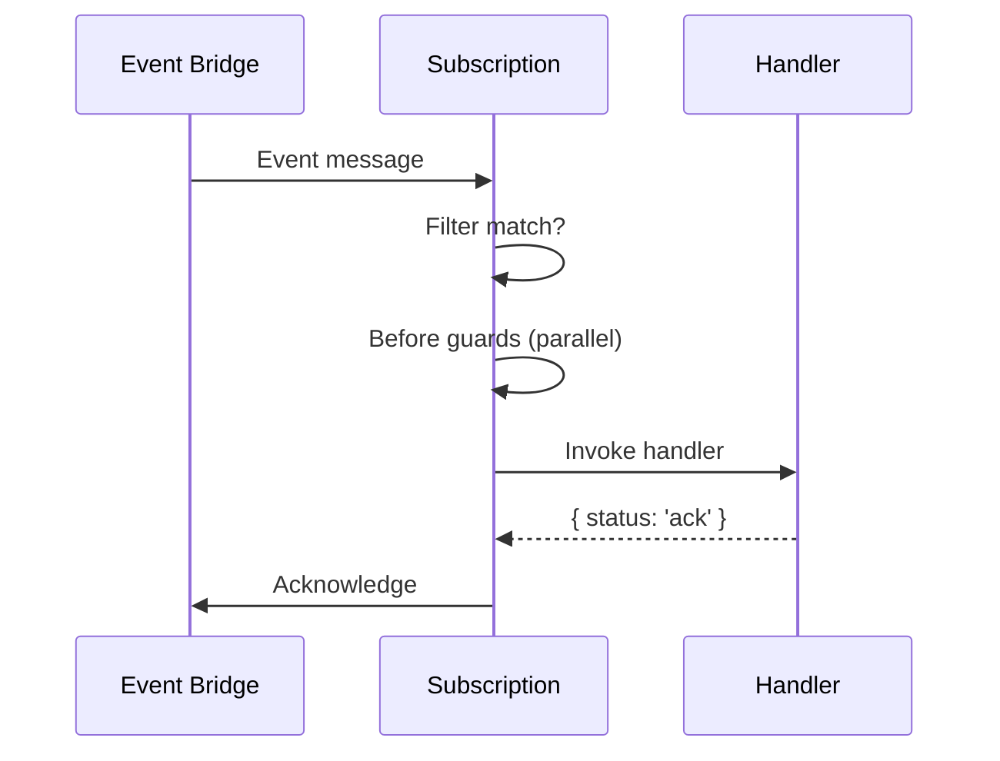

A subscription is a **fire-and-forget event listener**. When a message flows through the event bridge, subscriptions filter it, run guards, invoke a handler, and decide what to do with the event. The original sender does not wait for the subscription to finish — they have already moved on.

This makes subscriptions ideal for:
- **Cross-service reactions** — when Service A emits an event, Service B reacts
- **Side effects** — send an email, update a cache, log analytics
- **Event-driven workflows** — trigger follow-up commands when an order is placed
- **Async processing** — handle long-running tasks without blocking the caller

<div class="callout callout--warning">
  <div class="callout__title">Not for request/response</div>
  <p>If the caller needs a response, use a <a href="/handbook/blocks/command-pattern/">command</a>. Subscriptions can invoke commands, but they never return data to the original sender.</p>
</div>

## Subscription lifecycle



1. **Event arrives** — the event bridge delivers a message
2. **Filter check** — PURISTA checks if the subscription's filters match
3. **Before guards** — all before guards run in parallel; any failure cancels the handler
4. **Handler execution** — the subscription function runs
5. **Outcome** — the handler returns an explicit outcome dictating what happens to the message

## Explicit outcomes

The handler **must** return an explicit outcome:

| Status | Meaning |
|---|---|
| `ack` | Message acknowledged — remove from queue |
| `retry` | Schedule a retry — message stays in queue |
| `deadLetter` | Send to dead-letter queue |
| `drop` | Silently drop the message |
| `stop-consumer` | Stop the consumer (use with caution) |

```typescript
// Return an outcome object
return { status: 'ack' }

// Throw a control error
throw new SubscriptionConsumerControlError('Temporary failure', { status: 'retry' })
```

<div class="callout callout--warning">
  <div class="callout__title">Always return an outcome</div>
  <p>Failing to return an outcome or throw a control error leads to undefined behavior. The bridge may redeliver, drop, or dead-letter depending on its configuration.</p>
</div>

## Filtering

You decide which events the subscription receives:

```typescript
import { z } from 'zod'
import { analyticsV1ServiceBuilder } from './analyticsService.js'

const orderCreatedSubscription = analyticsV1ServiceBuilder
  .getSubscriptionBuilder('onOrderCreated', 'When an order is created, update analytics')
  // Listen to a specific event name from a specific service
  .subscribeToEvent('OrderService', '1', 'orderCreated')
  // Filter by sender
  .filterSentFrom('OrderService', '1')
  // Filter by receiver
  .filterReceivedBy('AnalyticsService', '1')
  // Filter by message type
  .filterForMessageType('event')
  // Filter by principal
  .filterPrincipalId('user-123')
  // Filter by tenant
  .filterTenantId('tenant-456')
  .addPayloadSchema(z.object({ orderId: z.string() }))
  .setSubscriptionFunction(async function (context, payload, parameter) {
    // ...
    return { status: 'ack' }
  })
```

Filters are additive — all specified filters must match for the event to be delivered.

## Bridge advice

The builder lets you give the event bridge hints about how to handle this subscription:

```typescript
analyticsV1ServiceBuilder
  .getSubscriptionBuilder('onOrderCreated', 'When an order is created, update analytics')
  .subscribeToEvent('OrderService', '1', 'orderCreated')
  // Durable subscription survives consumer restarts
  .adviceDurable(true)
  // Automatically acknowledge after handler success
  .adviceAutoacknowledgeMessage(true)
  // Failure handling: 'strict' (default) vs 'best-effort'
  .adviceConsumerFailureHandling({ mode: 'best-effort' })
  // Every instance receives the message (broadcast)
  .receiveMessageOnEveryInstance(true)
```

<div class="callout callout--info">
  <div class="callout__title">Advice, not commands</div>
  <p>Bridge advice is a hint. The actual behavior depends on the event bridge implementation. For example, <code>.adviceDurable(true)</code> works with NATS but may be ignored by an in-memory bridge.</p>
</div>

## Can invoke commands

Subscribers can call commands using `canInvoke`:

```typescript
import { z } from 'zod'
import { notificationV1ServiceBuilder } from './notificationService.js'

const subscription = notificationV1ServiceBuilder
  .getSubscriptionBuilder('onOrderCreated', 'When an order is created, notify shipping')
  .subscribeToEvent('OrderService', '1', 'orderCreated')
  .addPayloadSchema(z.object({ orderId: z.string() }))
  .canInvoke('ShippingService', '1', 'createShipment', {
    payloadSchema: z.object({ orderId: z.string() }),
  })
  .setSubscriptionFunction(async function (context, payload, parameter) {
    await context.invoke(
      { serviceName: 'ShippingService', serviceVersion: '1', serviceTarget: 'createShipment' },
      { orderId: payload.orderId },
    )
    return { status: 'ack' }
  })
```

## Before guards run in parallel

Subscription before guards run in **parallel** with `Promise.all`, the same as command guards. Any guard that throws cancels the handler.

## No `afterGuards` on subscriptions

After guards on subscriptions are **handled by the Service runtime**. You define them on the builder, but the service is responsible for orchestrating them after the handler completes.
