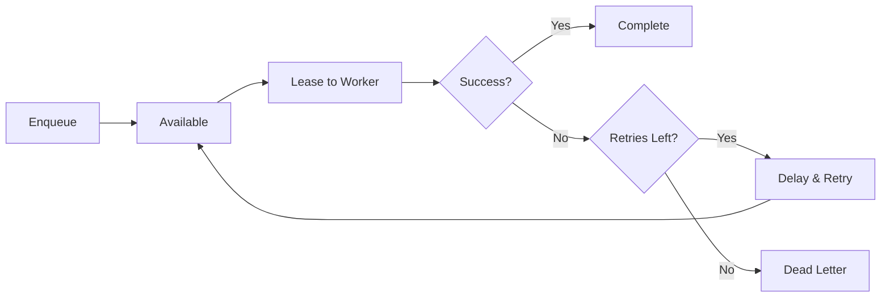

While [event bridges](/handbook/bridges/event-bridges/) handle push-based messaging (commands, subscriptions, events), **queue bridges** handle pull-based background work. They provide job queues with explicit leases, heartbeats, retries, and dead-letter routing — essential for reliable asynchronous processing.

## Why queue bridges exist

Event bridge subscriptions are fire-and-forget push deliveries: the broker pushes the message to the handler and, if the handler crashes mid-execution, the message may be lost. For most real-time service-to-service traffic that is acceptable.

Queue bridges solve a different problem. They use a **lease model**: a worker claims a job for a fixed window (`visibilityTimeoutMs`). If the worker does not heartbeat or acknowledge within that window, the job becomes visible again and another worker can claim it. This guarantees **at-least-once delivery** even if a pod is killed mid-job.

The key differences at a glance:

| | Event bridge subscription | Queue bridge |
|---|---|---|
| **Delivery model** | Push (broker pushes to handler) | Pull (worker claims from queue) |
| **Job persistence** | No (lost if broker restarts without durability) | Yes (Redis or NATS JetStream) |
| **Lease / visibility timeout** | No | Yes |
| **Heartbeat extension** | No | Yes |
| **Dead-letter queue** | Bridge-dependent | Yes |
| **Backlog visibility** | No | Yes |
| **Message replay** | No | NATS JetStream only |

Use a queue bridge when job loss on failure is unacceptable, when jobs run longer than a message timeout, or when you need operator-visible backlogs and retry counts.

Queue bridges are independent of your event bridge choice. A service can use `NatsBridge` for event traffic and `RedisQueueBridge` for worker queues at the same time. See the [Event Bridges](/handbook/bridges/event-bridges/#companion-queue-bridges) page for a pairing guide.

## Available queue bridges

| Bridge | Package | Backend | Best for |
|---|---|---|---|
| **DefaultQueueBridge** | `@purista/core` | In-memory | Local development, testing |
| **RedisQueueBridge** | `@purista/redis-queue-bridge` | Redis | Production pull-based workloads |
| **NatsQueueBridge** | `@purista/nats-queue-bridge` | NATS JetStream | NATS-first platforms |

## The DefaultQueueBridge

For local development and testing:

```typescript [local.ts]
import { DefaultQueueBridge } from '@purista/core'

const queueBridge = new DefaultQueueBridge()
```

Jobs are stored in-memory and lost on restart. Use only for development.

## Redis Queue Bridge

For production workloads:

```typescript [redis.ts]
import { RedisQueueBridge } from '@purista/redis-queue-bridge'

const queueBridge = new RedisQueueBridge({
  url: process.env.REDIS_URL,
})
```

Redis provides:

- Persistent job storage
- Visibility timeouts (leases)
- Heartbeat support
- Dead-letter routing
- Backlog metrics

## NATS JetStream Queue Bridge

For NATS-first platforms:

```typescript [nats.ts]
import { NatsQueueBridge } from '@purista/nats-queue-bridge'

const queueBridge = new NatsQueueBridge({
  url: process.env.NATS_URL,
})
```

NATS JetStream provides:

- Durable streams
- Consumer groups
- Message replay
- At-least-once delivery

## Service integration

Pass the queue bridge when creating service instances:

```typescript [service.ts]
const userService = await userServiceV1Service.getInstance(eventBridge, {
  queueBridge,
  resources,
})
```

If you skip `queueBridge`, PURISTA injects the in-memory default automatically — convenient for tests, but not for production.

## Queue lifecycle



1. **Enqueue** — a command or subscription adds a job
2. **Available** — job is visible to workers
3. **Lease** — worker claims the job for `visibilityTimeoutMs`
4. **Process** — worker executes the handler
5. **Heartbeat** — worker extends lease for long-running jobs
6. **Complete / Retry / Dead-letter** — based on success or failure

## Comparing queue bridges

| Feature | Default | Redis | NATS JetStream |
|---|---|---|---|
| Persistence | ❌ (in-memory) | ✅ | ✅ |
| Leases | ✅ | ✅ | ✅ |
| Heartbeats | ✅ | ✅ | ✅ |
| Dead-letter | ✅ | ✅ | ✅ |
| Delayed jobs | ✅ | ✅ | ✅ |
| Backlog metrics | ❌ | ✅ | ✅ |
| Message replay | ❌ | ❌ | ✅ |

## When to use queue bridges

- Background jobs that outlive the request that created them
- Scheduled/delayed work (cron-like tasks)
- Long-running operations with progress tracking
- Work that needs operator visibility (backlogs, retries)
- Batch processing with controlled concurrency

## When NOT to use queue bridges

- Real-time request/response — use event bridges with commands
- Fire-and-forget events — use subscriptions
- Simple in-process async work — use Node.js promises

## Common pitfalls

- **Using DefaultQueueBridge in production.** Jobs are lost on restart.
- **Not configuring heartbeat intervals.** Long jobs fail when leases expire.
- **Ignoring dead-letter queues.** Failed jobs accumulate silently.
- **Mixing queue and event bridge semantics.** Queues are pull-based with leases; subscriptions are push-based.

## Checklist

- [ ] Production uses a persistent queue bridge (Redis or NATS)
- [ ] Lease timeout matches expected job duration
- [ ] Heartbeat interval is configured for long-running jobs
- [ ] Dead-letter queue is monitored
- [ ] Backlog metrics are visible to operators
- [ ] Retry policies are tested against the actual bridge
