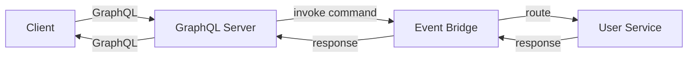

PURISTA does not enforce a dedicated GraphQL package. The recommended approach is to keep GraphQL as an adapter layer and invoke commands from resolvers. This keeps business logic independent from GraphQL-specific concerns while enabling REST and GraphQL to coexist over the same command set.

## Why this architecture works

- Commands already define runtime-validated contracts via Zod schemas
- Business logic remains independent from GraphQL-specific concerns
- REST and GraphQL can run side-by-side over the same commands
- Type information flows from command schemas to GraphQL types

## Architecture



1. The client sends a GraphQL query or mutation
2. The GraphQL resolver maps the request to a PURISTA command
3. The command executes through the event bridge
4. The response maps back to GraphQL types

## Resolver example

```typescript [resolvers.ts]
const resolvers = {
  Query: {
    async user(_: unknown, args: { id: string }, ctx: { userId: string }) {
      return commandClient.UserService['1'].getUser(
        { userId: args.id },
        { requestedBy: ctx.userId },
      )
    },
  },
  Mutation: {
    async createUser(_: unknown, args: { input: { email: string } }, ctx: { userId: string }) {
      return commandClient.UserService['1'].createUser(
        { email: args.input.email },
        { requestedBy: ctx.userId },
      )
    },
  },
}
```

`commandClient` can be:
- An **embedded client** (in-process, for monoliths)
- A **REST API client** (HTTP, for distributed setups)
- An **event bridge client** (messages, for same-fabric services)

## Building the GraphQL schema

Map command schemas to GraphQL types:

```typescript [schema.ts]
const typeDefs = gql`
  type User {
    id: ID!
    email: String!
    createdAt: String!
  }

  input CreateUserInput {
    email: String!
  }

  type Query {
    user(id: ID!): User
  }

  type Mutation {
    createUser(input: CreateUserInput!): User
  }
`
```

Schema mapping from Zod to GraphQL types is handled manually or via your preferred schema library. Write GraphQL type definitions directly (as shown in the `typeDefs` block above) and keep them aligned with your Zod command schemas by convention or code review.

## Context propagation

Propagate security and trace context explicitly:

```typescript [context.ts]
const server = new ApolloServer({
  typeDefs,
  resolvers,
  context: ({ req }) => ({
    userId: req.headers['x-user-id'],
    tenantId: req.headers['x-tenant-id'],
    traceId: req.headers['x-trace-id'],
  }),
})

// In resolvers:
async user(_, args, ctx) {
  return commandClient.UserService['1'].getUser(
    { userId: args.id },
    { requestedBy: ctx.userId, tenantId: ctx.tenantId },
  )
}
```

## Best practices

- **Keep GraphQL schema focused on consumer needs** — keep command contracts focused on domain needs
- **Validate/normalize GraphQL input before invoking commands** — never pass raw GraphQL args directly
- **Propagate principal/tenant context explicitly** — into command parameters or message fields
- **Prefer small, composable commands** — over large GraphQL-specific orchestration logic
- **Use DataLoader for N+1 prevention** — batch command invocations

## When to use GraphQL

- Frontend needs flexible data fetching (select fields, nested queries)
- Mobile apps want to reduce over-fetching
- Public API with diverse consumer needs
- You already have a GraphQL infrastructure

## When NOT to use GraphQL

- Simple CRUD with predictable consumers — REST is simpler
- Internal service-to-service communication — use direct command messages
- High-throughput, low-latency paths — REST has less overhead
- When type safety across the boundary is more important than query flexibility

## Common pitfalls

- **Letting GraphQL types drift from Zod schemas.** Keep type definitions aligned with command schemas by convention or automated checks.
- **Large resolver orchestration.** Keep resolvers thin; put business logic in commands.
- **N+1 queries.** Use DataLoader or batch command invocations.
- **Ignoring command validation.** GraphQL validation is separate from command schema validation. Both matter.

## Checklist

- [ ] GraphQL types are kept aligned with command Zod schemas
- [ ] Resolvers are thin — business logic lives in commands
- [ ] Principal and tenant context propagate to commands
- [ ] N+1 issues are addressed with DataLoader or batching
- [ ] Both GraphQL and REST validation layers are tested
- [ ] Error handling maps command errors to GraphQL errors
