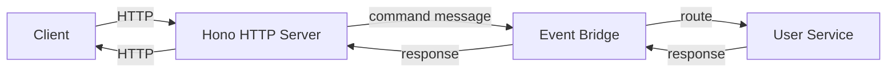

PURISTA's approach to REST APIs is unique: **commands define HTTP exposure, but the HTTP server is a separate service.** This means your business logic never imports an HTTP framework, and the server can be scaled independently from the services it exposes.

## The architecture



1. The client sends an HTTP request
2. The Hono HTTP server converts it to a command message
3. The event bridge routes the message to the correct service
4. The service executes the command and returns a response
5. The response flows back through the bridge and Hono to the client

The service that contains the command **does not run an HTTP server.** The HTTP server is a separate, generic service that can expose commands from any service.

## Expose a command as HTTP

Add `.exposeAsHttpEndpoint()` to any command builder:

```typescript [command.ts]
export const signUpCommandBuilder = userServiceV1ServiceBuilder
  .getCommandBuilder('signUp', 'Register a new user')
  .addPayloadSchema(signUpInputPayloadSchema)
  .addOutputSchema(signUpOutputSchema)
  .exposeAsHttpEndpoint('POST', 'users')
  .setCommandFunction(async function (context, payload) {
    // Business logic
  })
```

Calling `.exposeAsHttpEndpoint('POST', 'users')` stores HTTP metadata on the command definition — it does not import Hono or register any route. The `@purista/hono-http-server` package reads those declarations at service startup and registers the corresponding Hono routes automatically.

This means the command file has no HTTP framework dependency. You can run the same command over the event bridge, as a serverless function, or through the HTTP adapter — all from the same definition.

The HTTP server automatically:

- Maps the URL path and method to the command
- Validates the request body against the payload schema
- Validates query/path params against the parameter schema
- Returns the command response with the correct status code
- Generates OpenAPI documentation

## HTTP server setup

Install and start the Hono HTTP server:

```typescript [server.ts]
import { honoV1Service } from '@purista/hono-http-server'

const honoService = await honoV1Service.getInstance(eventBridge)
await honoService.start()

// Node.js specific
import { serve } from '@hono/node-server'
const serverInstance = serve({
  fetch: honoService.app.fetch,
  port: 3000,
})
```

### Monolith mode: provide services directly

When all services run in the same process:

```typescript [monolith.ts]
const honoService = await honoV1Service.getInstance(eventBridge, {
  serviceConfig: {
    services: [userServiceInstance, emailServiceInstance],
  },
})
```

### Microservice mode: dynamic registration

When services are distributed:

```typescript [microservice.ts]
const honoService = await honoV1Service.getInstance(eventBridge, {
  serviceConfig: {
    enableDynamicRoutes: true,
  },
})
```

Services automatically register their HTTP-exposed commands when they start.

## OpenAPI documentation

By default, the HTTP server generates an OpenAPI schema at `/api/openapi.json` (the mount path is configurable via `apiMountPath`). Add a UI:

```typescript [openapi.ts]
import { apiReference } from '@scalar/hono-api-reference'

honoService.app.get('/api', apiReference({
  pageTitle: 'My API Reference',
  spec: { url: '/api/openapi.json' },
}))
```

## Securing endpoints

By default, exposed commands are protected. Make them public:

```typescript [public.ts]
.exposeAsHttpEndpoint('GET', 'health')
.makeEndpointPublic()
```

Implement authentication with a protect handler:

```typescript [auth.ts]
import { HandledError, StatusCode } from '@purista/core'

honoService.setProtectMiddleware(async function (c, next) {
  const header = c.req.header('authorization')
  if (!header) {
    const err = new HandledError(StatusCode.Unauthorized, 'Not logged in')
    return c.json(err.getErrorResponse(), 401)
  }

  const token = header.split(' ')[1]
  const { payload, error } = await tokenValidator(token)

  if (error) {
    const err = new HandledError(StatusCode.InvalidToken, 'Invalid token')
    return c.json(err.getErrorResponse(), 401)
  }

  c.set('principalId', payload.id)
  return next()
})
```

## Passing data to commands

Use Hono middleware to pass additional data:

```typescript [middleware.ts]
honoService.app.use(async (c, next) => {
  c.set('additionalParameter', {
    requestId: crypto.randomUUID(),
  })
  await next()
})
```

Access in the command:

```typescript [command.ts]
.addParameterSchema(z.object({
  requestId: z.string(),
}))
.setCommandFunction(async function (context, payload, parameter) {
  console.log(parameter.requestId)
})
```

## Health checks

```typescript [health.ts]
honoService.setHealthFunction(async function () {
  if (!isDatabaseHealthy()) {
    throw new Error('Database unreachable')
  }
})
```

## Graceful shutdown

```typescript [shutdown.ts]
import { gracefulShutdown } from '@purista/core'

const services = [userService, emailService]

gracefulShutdown(logger, [
  honoService.prepareDestroy(), // Stop accepting new HTTP requests
  eventBridge,                  // Drain in-flight messages
  ...services,                  // Shut down services
  {
    name: 'close-http-socket',
    destroy: async () => await serverInstance.stop(),
  },
  honoService,                  // Shut down HTTP server
])
```

## When to expose commands as HTTP

- Frontend applications need to call your services
- Mobile apps consume your API
- Third-party services integrate via webhooks
- You need OpenAPI documentation for external consumers

## Common pitfalls

- **Exposing every command.** Not all commands should be public APIs. Only expose what external consumers need.
- **Forgetting to validate parameters.** URL and query parameters must match the parameter schema.
- **Not handling auth in the HTTP layer.** Authentication belongs in the HTTP server, not in command business logic.
- **Missing graceful shutdown.** Without proper shutdown, in-flight requests are dropped.

## Checklist

- [ ] Only necessary commands are exposed as HTTP endpoints
- [ ] Authentication is implemented in the HTTP server protect handler
- [ ] OpenAPI documentation is generated and accessible
- [ ] Health checks verify all critical dependencies
- [ ] Graceful shutdown handles in-flight requests
- [ ] Parameter schema includes all HTTP-derived fields (query, path, headers)
- [ ] CORS and security headers are configured for production
