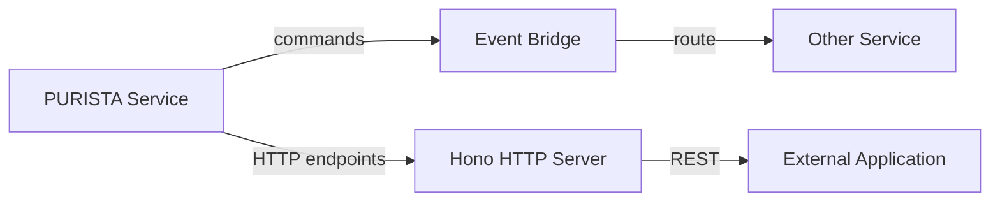

In PURISTA, services expose their commands through the event bridge. Other services in the same message fabric can call them directly using the typed service proxy. External clients (frontends, mobile apps, third-party systems) reach commands through HTTP endpoints exposed via the Hono integration.



## Service-to-service calls

Services in the same process or connected via the same event bridge use the typed service proxy. No HTTP, no serialization overhead:

```typescript [command.ts]
.setCommandFunction(async function (context, payload, parameter) {
  // Call another service command directly through the event bridge
  const user = await context.service.UserService['1'].getUser(
    { userId: payload.userId },
    { requestedBy: this.info.serviceName },
  )
  return { email: user.email }
})
```

The pattern is `context.service.ServiceName['version'].commandName(payload, parameter)`.

TypeScript infers the correct payload and return types from the command builder definitions.

## Exposing commands as HTTP endpoints

To expose a command to external clients, use `exposeAsHttpEndpoint` on the command builder:

```typescript [signUpCommand.ts]
const signUpCommandBuilder = userServiceV1ServiceBuilder
  .getCommandBuilder('signUp', 'Register a new user')
  .addPayloadSchema(z.object({ email: z.string().email(), password: z.string().min(8) }))
  .addOutputSchema(z.object({ userId: z.string() }))
  .exposeAsHttpEndpoint('POST', 'users')
  .setCommandFunction(async function (context, payload) {
    const user = await context.resources.db.insert('users', payload)
    return { userId: user.id }
  })
```

The Hono HTTP server adapter reads the `exposeAsHttpEndpoint` declarations and registers routes automatically. See the HTTP Exposure handbook card for full details.

## Versioning

Service versions are part of the command address. Multiple versions can run in parallel:

```typescript [versioning.ts]
// UserService v1
const userServiceV1 = new ServiceBuilder({
  serviceName: 'UserService',
  serviceVersion: '1',
})

// UserService v2 (breaking changes)
const userServiceV2 = new ServiceBuilder({
  serviceName: 'UserService',
  serviceVersion: '2',
})

// Callers pin to specific versions
context.service.UserService['1'].userSignUp(...) // v1 API
context.service.UserService['2'].userSignUp(...) // v2 API
```

## When to expose commands

- **Service-to-service:** use `context.service.ServiceName['version'].commandName()` — no extra setup needed
- **HTTP for external consumers:** add `exposeAsHttpEndpoint` and mount the Hono adapter
- **Event-driven consumers:** publish events in command output and let subscriptions react

## Common pitfalls

- **Calling commands via HTTP between internal services.** Use the event bridge proxy instead — it is typed, traceable, and faster.
- **Breaking changes without version bumps.** Always increment service version for breaking schema changes.
- **Exposing internal commands publicly.** Only add `exposeAsHttpEndpoint` to commands that are part of your public API.
- **Ignoring subscription definitions.** Subscriptions are part of the contract too — document event names and schemas.

## Checklist

- [ ] Service-to-service calls use `context.service.ServiceName['version'].commandName()`
- [ ] External HTTP endpoints use `exposeAsHttpEndpoint` on the command builder
- [ ] Service versions are incremented for breaking changes
- [ ] Only public commands are exposed as HTTP endpoints
- [ ] Event names and schemas are documented for subscribers
