## Prerequisites

Complete [Tools & Skills](/handbook/harness/tools-and-skills/) first.
Use an Agent Plugin only when a reviewed, already-installed package should
contribute selected skills or MCP tools. Use normal TypeScript modules for
trusted application behavior that you own and ship with the application.

`@purista/harness-agent-plugins` is an optional, first-party loader for
**data-only Agent Plugins v1**. It is not an executable plugin host: it does
not import package code, install dependencies, fetch a registry, accept
credentials, or let a package add agents, workflows, model providers, hooks,
or sandbox authority.

## The review boundary

Treat a plugin directory like other third-party supply-chain input. The safe
path is deliberately explicit:

```mermaid
flowchart LR
  package[Installed plugin directory] --> inspect[Inspect locally]
  inspect --> report[Safe diagnostics + SHA-256 digest]
  report --> review[Application review and lockfile]
  review --> load[Load exact reviewed digest]
  load --> select[Select named skills and MCP tools]
  select --> harness[Normal Harness builder]
  harness --> allowlist[Agent allowlist + sandbox + governance]

  classDef boundary fill:#dbeafe,stroke:#2563eb,color:#172554
  classDef application fill:#dcfce7,stroke:#16a34a,color:#14532d
  class inspect,load,select boundary
  class review,harness,allowlist application
```



Inspection validates the local root, manifest, immediate child skills, and
supported MCP declarations. It realpath-checks discovered paths and reports
malformed entries without running package code. Your application stores the
reviewed digest in version-controlled or otherwise auditable configuration.
Loading requires that exact digest and an explicit trust decision.

## Install and inspect a package

```sh
npm install @purista/harness-agent-plugins
```

Inspect before you decide whether a package is acceptable. Diagnostics are
designed for an operator or CI check; log only their stable code and location,
not package content that may be sensitive.

```ts
import { inspectAgentPlugin } from '@purista/harness-agent-plugins'

const source = { root: './plugins/claims-knowledge' } as const
const inspection = await inspectAgentPlugin(source)

if (!inspection.valid || !inspection.digest) {
	throw new Error('Agent Plugin inspection failed; review its safe diagnostics before proceeding.')
}

// Put this value in an application-owned reviewed lockfile. Do not accept a
// digest from the package itself and do not automatically promote a new digest.
const reviewedDigest = inspection.digest
```

The digest identifies the reviewed package state. A digest change is a new
review, even when the directory path and package name are unchanged.

## Load only the reviewed package and select components

`loadAgentPlugins` does not expose everything it found. The application maps
each selected component to a local Harness ID, then grants those local IDs to
the intended agent in the normal way.

```ts
import { defineHarness, inMemorySandbox } from '@purista/harness'
import { loadAgentPlugins } from '@purista/harness-agent-plugins'

const [plugin] = await loadAgentPlugins({
	plugins: [
		{
			root: './plugins/claims-knowledge',
			trust: 'trusted',
			expectedDigest: reviewedDigest,
		},
	],
})

if (!plugin) {
	throw new Error('The reviewed Agent Plugin is unavailable, changed, or not trusted.')
}

const bindings = plugin.bindings({
	skills: { claims_playbook: 'claims-playbook' },
	tools: {
		search_claims_knowledge: {
			server: 'knowledge',
			tool: 'search',
			description: 'Search the reviewed claims knowledge service.',
			headers: { 'x-application': 'claims' },
		},
	},
})

if (bindings.diagnostics.some(item => item.level === 'error')) {
	throw new Error('The selected Agent Plugin components cannot be bound safely.')
}

const harness = defineHarness({ name: 'claims' })
	.sandbox(inMemorySandbox())
	.skills(bindings.skills)
	.tools(bindings.tools)
	.agent('reviewer', {
		model: 'assistant',
		skills: ['claims_playbook'],
		tools: ['search_claims_knowledge'],
		builtinTools: ['read'],
		instructions: 'Use the claims playbook and the selected search tool when needed.',
	})
	.build()
```

The package-declared HTTP headers are never forwarded automatically. The
application may add reviewed, non-secret static headers in the binding, as in
the example. The remote MCP server must still authenticate and authorize every
request independently.

## Choose the right MCP boundary

| Plugin MCP type | Use it when | Required application control | Do not assume |
| --- | --- | --- | --- |
| Streamable HTTP | A reviewed remote MCP service already exists | Application-selected endpoint security, non-secret static headers, remote authorization | Package headers, redirects, or a package credential are accepted automatically |
| Stdio | A reviewed local MCP server must run beside the agent | Application-owned `dataDirectory` outside the plugin root and a sandbox that supports spawning **and immutable package mounts** | `inMemorySandbox()` and the local host-directory sandbox cannot enforce an immutable mount |

For a selected stdio server, attach an application-owned data directory when
loading. The loader stages the reviewed package immutably and serializes its
staging/synchronization. The built-in local host-directory sandbox intentionally
does not claim immutable mounts, because its process owner can change file
permissions. Use an isolating container, microVM, or equivalent custom sandbox
adapter in production.

```ts
const [plugin] = await loadAgentPlugins({
	plugins: [
		{
			root: './plugins/claims-knowledge',
			trust: 'trusted',
			expectedDigest: reviewedDigest,
			dataDirectory: '/srv/claims-plugin-data',
		},
	],
})
```

See [Sandboxing & MCP](/handbook/harness/sandboxing-and-mcp/) before
binding any stdio component.

## What remains outside the plugin boundary

- Authentication, tenant isolation, authorization, idempotency, and business
  side effects remain application responsibilities.
- Model aliases, credentials, agents, workflows, guardrails, governance, and
  sandbox policy are declared by your Harness composition root, never a plugin.
- The agent sees only selected local aliases. A valid plugin does not grant an
  agent access to every discovered skill or tool.
- Legacy stateful MCP and HTTP+SSE are rejected. Modern stateless Streamable
  HTTP and reviewed stdio servers are the supported transports.

## Test the review path

Keep plugin acceptance deterministic. Unit tests should use a small data-only
fixture and assert the result of inspection and binding rather than connecting
to a live MCP server.

```ts
import { expect, it } from 'vitest'
import { inspectAgentPlugin, loadAgentPlugins } from '@purista/harness-agent-plugins'

it('loads only a reviewed digest and selected aliases', async () => {
	const source = { root: './test/fixtures/knowledge-plugin' } as const
	const inspection = await inspectAgentPlugin(source)
	expect(inspection.valid).toBe(true)

	const [plugin] = await loadAgentPlugins({
		plugins: [{ ...source, trust: 'trusted', expectedDigest: inspection.digest! }],
	})
	const bindings = plugin!.bindings({ skills: { playbook: 'playbook' }, tools: {} })

	expect(bindings.diagnostics).toEqual([])
	expect(Object.keys(bindings.skills)).toEqual(['playbook'])
})
```

Add negative tests for a changed digest, an untrusted source, a malformed
manifest, and a stdio binding without the required sandbox capabilities. Do
not put a real plugin, credentials, or request payloads in test snapshots.

## Next

Continue with [Sandboxing & MCP](/handbook/harness/sandboxing-and-mcp/)
to choose and verify the execution boundary for selected MCP tools.
