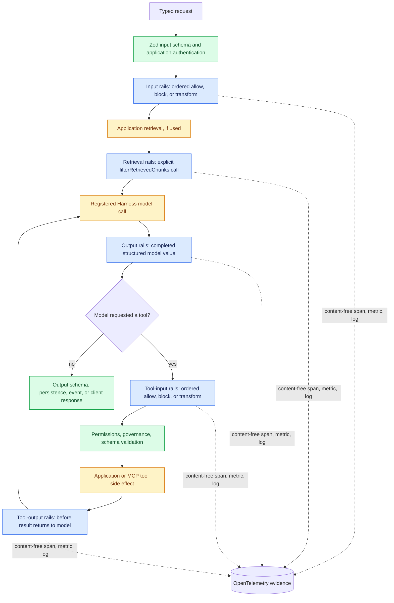

This guide builds one realistic claims-support assistant. Customers can ask
about a claim, the agent can read approved policy material, and it can submit a
settlement request. The assistant must never expose a customer identifier,
accept a prompt-injection instruction from retrieved material, or submit a
settlement without the application's approval decision.

Guardrails are an optional `@purista/harness-guardrails` addon for **default-loop
agents**. They are provider-neutral: they do not create a provider, read
credentials, call a cloud endpoint, or own retrieval. The application supplies
those pieces at the composition root.

## What belongs where

Use the narrowest control that can enforce the requirement. A rail is not an
authorization system and it does not make an unsafe tool safe by itself.

| Requirement in the claims assistant | Control | Where it runs |
| --- | --- | --- |
| A request has a valid `claimId` and a text question | Zod input schema | Before agent execution |
| An agent may use `submit_settlement` | Agent tool allowlist and tool permissions | Harness agent definition |
| A settlement is permitted for this claim and caller | Application authorization and governance | Before the side effect |
| Customer email or phone number must be masked | Sensitive-data guardrail | Input, output, retrieval, or an explicitly selected tool field |
| An unsafe or evasive request must stop | Custom or model-check rail | Input or tool-input phase |
| The model response must not expose an internal note | Custom output rail | Before persistence or client output |

The application remains responsible for authentication, tenant isolation,
business approvals, rate limits, persistence, and the final HTTP/queue error
mapping. Guardrails add content and execution controls to those existing
boundaries.

## Guardrails lifecycle and coverage

The diagram shows one complete **default-loop agent** run. Solid arrows are
ordered execution. The tool path may repeat until the model produces a final
object. The retrieval path is optional and explicitly invoked by application
code; it is not an implicit vector-store integration.



### What is automatic, explicit, and outside the boundary

| Path or situation | Coverage | What the application must know |
| --- | --- | --- |
| Input to an attached default-loop agent | Automatic | Rails run after the agent input schema and before dynamic instructions, transcript use, or a model call. |
| Completed structured model result | Automatic | Output rails run after each model result and before tool dispatch, output validation, persistence, or delivery. They evaluate the completed object, not arbitrary partial stream chunks. |
| TypeScript, built-in, and MCP tool calls | Automatic | Tool-input rails run before permissions, governance, schema validation, and side effects. Tool-output rails run before the result returns to the model. Authorization and approval still remain application controls. |
| Workflow that delegates to a guarded agent | Automatic for that agent invocation | The workflow and rail spans share the normal run context. Guardrails do not turn the whole workflow into a policy engine. |
| Application retrieval | Explicit | Call `filterRetrievedChunks(...)` before chunks are added to an agent input. Skipping that call skips retrieval rails. |
| Skill files | Indirect through the `read` tool | A rail can govern a skill read call; it does not scan every mounted skill file at startup. |
| Direct `ctx.models.*` call or custom-handler agent | Not automatic | The caller owns model and tool lifecycle. `rails.attach(...)` rejects custom-handler agents instead of promising incomplete coverage. |
| Structured JSON fields for sensitive-data inspection | Explicit codec required | The PII addon never recursively scans arbitrary tool JSON; select and reconstruct reviewed fields with a `SensitiveDataValueCodec`. |

### Ordering, concurrency, and failure behavior

- Rails listed within one phase always execute **sequentially** in YAML order.
  A transform becomes the value seen by the next rail. There is no `parallel`
  mode because ordering changes the result.
- A workflow may concurrently prepare independent application work, such as a
  search request and a deterministic lookup, but it must apply the relevant
  input/retrieval rails before that data reaches the model. Guardrails do not
  schedule or synchronize application concurrency.
- `block` stops the protected path without calling the next model, tool, or
  delivery boundary. Missing actions, invalid outcomes, detector/codec faults,
  cancellation-protocol faults, and action timeouts fail closed.
- A guardrail is a content and execution control, not an identity, tenancy,
  rate-limit, or business-authorization system. Keep those controls in schemas,
  trusted context, permissions, governance, and application code.

Every evaluation creates a content-free OpenInference `GUARDRAIL` child span,
a decision counter, and a duration metric. When a `modelCheckRail` invokes a
registered model, its nested LLM span carries the provider, model, and reported
token usage when available; this attributes safety-model cost without putting
content or invented prices on the guardrail span.

## 1. Install the optional addon

Install the core Harness, your selected model adapter, and Guardrails. A
privacy detector is selected separately in the next guide; do not install a
detector merely to use custom actions or model checks.

```sh
npm install @purista/harness @purista/harness-guardrails
```

The addon attaches to a normal Harness default-loop agent. It deliberately
rejects a custom-handler agent because that handler owns its own model and tool
lifecycle, so automatic interception would be incomplete.

## 2. Create a portable policy file

Create `guardrails/config.yml`. It uses a strict, portable subset of the NeMo
Guardrails vocabulary. The flow names are application-owned identifiers: YAML
selects and orders them, while TypeScript implements their behavior.

### Supported NeMo-shaped configuration: exact v1 surface

The parser rejects unknown fields at every accepted mapping. This is a compact
interoperability format, not a general NeMo runtime. The following is the full
YAML surface accepted by the current package.

| YAML location | Accepted fields | Runtime meaning in Harness |
| --- | --- | --- |
| Root | `models`, `instructions`, `prompts`, `custom_data`, `rails` | Only these root keys are accepted. |
| `models[]` | required `type`; optional `engine`, `model`, `parameters` (JSON-compatible) | Preserved inventory metadata. It never creates a provider; `modelAliases` in TypeScript maps a model `type` to an existing Harness alias for a model-check action. |
| `instructions` | array of non-empty strings | Preserved migration metadata; it does **not** inject an agent system prompt. Use the typed agent `instructions` field. |
| `prompts`, `custom_data` | any JSON-compatible value | Preserved migration metadata only. The Harness does not render templates or execute values from them. |
| `rails.input`, `rails.output`, `rails.tool_input`, `rails.tool_output`, `rails.retrieval` | `flows`: ordered array of non-empty flow IDs | Each ID must have an application-owned TypeScript action. Actions run sequentially; no parallel mode exists because transforms have observable order. |
| `rails.config` | `sensitive_data_detection` only | Contains the strict input/output/retrieval PII policies described below. |

The supported phase semantics are deliberately direct:

| Phase | What the action sees | Required transform target | How it is invoked |
| --- | --- | --- | --- |
| `input` | Parsed agent input | `user_message` | Automatic default-loop interceptor before transcript/model work |
| `output` | Model object/result value | `bot_message` | Automatic default-loop interceptor before output validation, events, or persistence |
| `tool_input` | Parsed JSON-compatible tool input | `tool_input` | Automatic interceptor before permissions, governance, schema validation, and side effect |
| `tool_output` | Validated JSON-compatible tool result | `tool_output` | Automatic interceptor before the model receives the result |
| `retrieval` | Application-provided JSON-compatible chunk array | `relevant_chunks` | Explicit `rails.filterRetrievedChunks(chunks, context)` call in an application workflow |

Every action returns exactly `allow`, `block`, or a phase-appropriate
`transform`. A missing action, invalid target/outcome, action exception, or
timeout fails closed. The six reserved sensitive-data IDs are
`detect`/`mask sensitive data on input`, `detect`/`mask sensitive data on
output`, and `detect`/`mask sensitive data on retrieval`; they must be created
with `createSensitiveDataActions`, not a hand-written action.

### Not supported — and the Harness-native alternative

The package rejects `.co` and `.py` files anywhere below the config directory,
`prompts.yml`/`prompts.yaml`, and NeMo `actions` or `kb` directories. It also
rejects `rails.dialog`, `rails.execution`, every other rail category,
`parallel`, NeMo action/server settings, provider endpoints/keys, implicit
knowledge bases/vector stores, and NeMo prompt-template execution.

This is intentional. Colang dialog execution would require a second workflow
and dialogue-state runtime with different cancellation, persistence, tool, and
security semantics. Python files and NeMo server/provider construction would
break the TypeScript, provider-neutral, application-owned composition boundary.
Implicit RAG would hide authorization and data residency. Use typed Harness
workflows and state for dialogue/process control, TypeScript rail actions and
tools for checks/side effects, Harness provider adapters/model aliases for
models, and application-owned retrieval for vectors and access control.

We should not promise full NeMo compatibility without a separate approved
runtime and migration contract. It would be a different product surface, not a
parser extension, and would weaken the Harness's static typing, predictable
lifecycle, and security model. The portable subset is intentionally designed
to share policy vocabulary while making every executable behavior explicit.

```yaml
models:
  - type: main
    engine: harness
    model: claims-assistant
  - type: safety
    engine: harness
    model: claims-safety

instructions:
  - Answer only from approved claim policy and the submitted claim context.

rails:
  input:
    flows:
      - normalize claim question
      - deny prompt override
      - review claim request
      - mask sensitive data on input
  output:
    flows:
      - remove internal note
      - mask sensitive data on output
  tool_input:
    flows:
      - require settlement approval
      - mask settlement memo
  tool_output:
    flows:
      - remove settlement evidence
  retrieval:
    flows:
      - deny untrusted retrieval
      - mask sensitive data on retrieval
  config:
    sensitive_data_detection:
      input:
        entities: [EMAIL_ADDRESS, PHONE_NUMBER]
        mask_token: '<REDACTED>'
        score_threshold: 0.8
      output:
        entities: [EMAIL_ADDRESS, PHONE_NUMBER]
        mask_token: '<REDACTED>'
        score_threshold: 0.8
      retrieval:
        entities: [EMAIL_ADDRESS]
        mask_token: '<REDACTED>'
        score_threshold: 0.8
```

The `models` entries are portable policy metadata. `engine: harness` and the
`model` value do **not** construct a provider or select credentials. Map the
portable `type` names to aliases already registered with Harness in TypeScript.

Only `input`, `output`, `tool_input`, `tool_output`, and `retrieval` rails are
supported. `.co` and `.py` files anywhere below the configuration directory,
`prompts.yml`/`prompts.yaml`, and NeMo `actions` or `kb` directories are
rejected, as are dialog rails, execution rails, implicit vector stores, and
server configuration. The config directory must contain exactly one
`config.yml` or `config.yaml`.

### Sensitive-data policy fields

| Field | Meaning | Validation |
| --- | --- | --- |
| `entities` | Portable categories to inspect | Non-empty, unique uppercase identifiers |
| `mask_token` | Full replacement for each detected match | A string up to 128 UTF-16 code units; an empty string removes a match |
| `score_threshold` | Minimum detector confidence | Finite number from `0` to `1` |

The reserved sensitive-data flow names must match their phase and policy. For
example, `mask sensitive data on output` requires an `output` policy. The
portable file never contains detector endpoints, authentication headers,
provider names, recognizer configuration, local paths, or fallback behavior.

## 3. Implement the claims controls in TypeScript

The following actions demonstrate all three outcomes:

- `allow` continues to the next rail.
- `block` ends the run before the protected boundary; use a stable,
  deployment-controlled snake-case `reasonCode`.
- `transform` replaces the current value and passes it to the next rail. Its
  target must exactly match the phase.

```ts
import { z } from 'zod'
import {
  createSensitiveDataActions,
  defineGuardrails,
  loadGuardrailsConfig,
  modelCheckRail,
  type GuardrailAction,
} from '@purista/harness-guardrails'
import { createNativePrivacyDetector } from '@purista/harness-guardrails-native-privacy'

const detector = createNativePrivacyDetector({ id: 'claims-local-pii' })

const normalizeClaimQuestion: GuardrailAction = {
  evaluate: ({ value }) => {
    if (typeof value !== 'string') return { decision: 'block', reasonCode: 'invalid_claim_question' }
    return {
      decision: 'transform',
      target: 'user_message',
      value: value.trim(),
      reasonCode: 'claim_question_normalized',
    }
  },
}

const denyPromptOverride: GuardrailAction = {
  mayTransform: false,
  evaluate: ({ value }) =>
    typeof value === 'string' && /ignore (all |the )?(previous|prior) instructions/i.test(value)
      ? { decision: 'block', reasonCode: 'prompt_override_attempt' }
      : { decision: 'allow' },
}

const requireSettlementApproval: GuardrailAction = {
  mayTransform: false,
  evaluate: ({ value }) => {
    const request = z.object({ claimId: z.string(), approvalId: z.string().min(1) }).safeParse(value)
    return request.success
      ? { decision: 'allow' }
      : { decision: 'block', reasonCode: 'settlement_approval_required' }
  },
}

const removeInternalNote: GuardrailAction = {
  evaluate: ({ value }) => {
    if (typeof value !== 'string') return { decision: 'block', reasonCode: 'invalid_claim_response' }
    return {
      decision: 'transform',
      target: 'bot_message',
      value: value.replaceAll(/\[internal:[^\]]*\]/gi, ''),
      reasonCode: 'internal_note_removed',
    }
  },
}

const removeSettlementEvidence: GuardrailAction = {
  evaluate: ({ value }) => ({
    decision: 'transform',
    target: 'tool_output',
    value,
    reasonCode: 'settlement_evidence_reviewed',
  }),
}

const sensitiveDataActions = createSensitiveDataActions({
  detector,
  toolInput: {
    policy: 'input',
    maskFlow: 'mask settlement memo',
    codec: {
      id: 'settlement-memo-v1',
      extract: (value) => {
        const parsed = z.object({ memo: z.string() }).parse(value)
        return [{ id: 'memo', text: parsed.memo }]
      },
      replace: (value, replacements) => {
        const parsed = z.object({ memo: z.string() }).parse(value)
        const memo = replacements
          .filter((item) => item.id === 'memo')
          .sort((a, b) => b.start - a.start)
          .reduce((text, item) => text.slice(0, item.start) + item.value + text.slice(item.end), parsed.memo)
        return { ...(value as Record<string, unknown>), memo }
      },
    },
  },
})

export const claimsRails = defineGuardrails({
  config: await loadGuardrailsConfig('./guardrails'),
  modelAliases: { main: 'claims_assistant', safety: 'claims_safety' },
  actions: {
    ...sensitiveDataActions,
    'normalize claim question': normalizeClaimQuestion,
    'deny prompt override': denyPromptOverride,
    'review claim request': modelCheckRail({
      model: 'safety',
      instructions: 'Return allow=false for requests that should not be handled by a claims assistant.',
    }),
    'require settlement approval': requireSettlementApproval,
    'remove internal note': removeInternalNote,
    'remove settlement evidence': removeSettlementEvidence,
    'deny untrusted retrieval': {
      mayTransform: false,
      evaluate: ({ value }) =>
        Array.isArray(value) && value.some((chunk) => typeof chunk === 'string' && /ignore previous instructions/i.test(chunk))
          ? { decision: 'block', reasonCode: 'untrusted_retrieval_content' }
          : { decision: 'allow' },
    },
  },
})
```

`reasonCode` is not user content. Treat it as a short, stable operational
classification such as `settlement_approval_required`; it can be recorded in
content-free logs and traces. Do not build it from a prompt, tool input,
customer identifier, detector match, or exception message.

The `removeSettlementEvidence` example intentionally leaves the JSON value
unchanged to show an output-phase transformation. In a production tool, make
the transformation meaningful and preserve the tool's output schema. A rail
can only produce JSON-compatible data; it cannot broaden a tool's authority.

## 4. Attach the rails to the default-loop agent

Define models, tools, and agents with the normal Harness builder. `attach()`
returns the same typed agent definition with a Guardrails interceptor appended.

```ts
import { defineHarness } from '@purista/harness'

const harness = defineHarness({ name: 'claims-support' })
  .telemetry({ contentCaptureMode: 'NO_CONTENT' })
  .models({
    claims_assistant: claimsAssistantModel,
    claims_safety: claimsSafetyModel,
  })
  .tools({
    submit_settlement: submitSettlementTool,
  })
  .agents(({ agent }) => ({
    claims_support: claimsRails.attach(agent({
      model: 'claims_assistant',
      input: z.string().min(1),
      output: z.string(),
      builtinTools: false,
      tools: ['submit_settlement'],
      instructions: 'Assist with claims using only approved policy and tools.',
    })),
  }))
  .build()
```

The automatic interception order is precise:

1. **Input:** after the agent input schema parses, before dynamic instructions,
   transcript use, or a model call.
2. **Output:** after a provider result, before output validation, persistence,
   client-facing model events, or tool dispatch.
3. **Tool input:** before permissions, governance, the tool input schema, and
   any side effect.
4. **Tool output:** before the result returns to the model.

Normal tool permissions and governance remain authoritative after a transform.
For the settlement flow, the application should additionally verify that
`approvalId` belongs to the authenticated caller and exact claim. A blocked
rail means there is no tool call and no side effect; a transformed tool input
is what the later permission, governance, Zod schema, and handler receive.

Skills remain mounted files opened through the normal `read` built-in tool.
Rails do not scan every skill file at startup, but a tool rail can govern the
`read` call and its result when your policy requires it. See
[Tools & Skills](/handbook/harness/guide/tools-and-skills/) for the skill
allowlist and sandbox requirements.

## 5. Filter retrieval explicitly in a workflow

Retrieval remains application-owned: Guardrails never build a vector store or
infer which documents a caller may access. Filter JSON-compatible text chunks
before they become part of the agent's input.

```ts
const answerClaim = workflow({
  input: z.object({ claimId: z.string(), question: z.string() }),
  output: z.string(),
  delegation: { agents: ['claims_support'] },
  handler: async (ctx) => {
    const chunks = await searchApprovedClaimPolicy(ctx.input.claimId, ctx.input.question)
    const safeChunks = await claimsRails.filterRetrievedChunks(chunks, {
      workflowId: ctx.workflowId,
      runId: ctx.runId,
      sessionId: ctx.sessionId,
      models: ctx.models,
      signal: ctx.signal,
      logger: ctx.log,
    })

    return ctx.agents.claims_support(`${ctx.input.question}\n\nApproved policy:\n${safeChunks.join('\n')}`)
  },
})
```

Pass the workflow run context so standalone retrieval checks are correlated
with the existing trace and structured logs. If retrieval runs outside a
Harness session, pass `observability: { telemetry, logger }` to
`defineGuardrails()` for a content-free process-level fallback.

## 6. Use model checks deliberately

`modelCheckRail()` is a small provider-neutral action. It calls an already
registered Harness model handle with a fixed `{ allow: boolean }` schema. The
portable `model: safety` value in the example resolves through
`modelAliases.safety` to `claims_safety`; it never reads provider credentials
from YAML and cannot construct an SDK.

Use a model check for judgement that cannot be expressed as a deterministic
rule, such as detecting a disguised request to disclose claim data. Keep
deterministic requirements—claim ownership, monetary limits, approval state,
and destination account ownership—in application authorization or governance.
Set a clear model capability and evaluate the safety model independently before
using it as a control.

Each action has a 10-second timeout by default. Override the global value with
`actionTimeoutMs` or one action with `timeoutMs`. A timeout, thrown action,
invalid outcome, detector fault, malformed detector result, or codec fault
fails closed.

## 7. Return safe errors at the transport boundary

Treat a block as an expected product decision and an evaluation failure as an
unavailable safety dependency. Neither error should reveal customer text,
retrieval chunks, tool values, detector offsets, model output, credentials, or
filesystem paths.

```ts
import {
  GuardrailBlockedError,
  GuardrailEvaluationError,
} from '@purista/harness-guardrails'

export async function answerClaimRequest(question: string) {
  const session = await harness.getSession('claims:user-42')
  try {
    return await session.agents.claims_support.prompt(question)
  } catch (error) {
    if (error instanceof GuardrailBlockedError) {
      return { status: 422, body: { code: 'request_not_accepted' } }
    }
    if (error instanceof GuardrailEvaluationError) {
      return { status: 503, body: { code: 'safety_check_unavailable' } }
    }
    throw error
  } finally {
    await session.release()
  }
}
```

Log only stable fields at this boundary: the run correlation already provided
by Harness, the error code, rail id, phase, and stable reason code or failure
kind. A blocked request is not automatically retryable. Operations should
investigate a safety dependency failure before allowing retries.

## 8. Observe decisions and safety-model cost

With `telemetry({ contentCaptureMode: 'NO_CONTENT' })`, every rail evaluation
creates a nested `evaluate_guardrail {rail.id}` span with
`openinference.span.kind=GUARDRAIL`. It includes the rail id, phase, and outcome
(`allow`, `block`, `transform`, or `error`), plus a stable reason code when one
was supplied. The addon emits:

- `harness.guardrail.evaluations`
- `harness.guardrail.duration`
- content-free warning logs for blocks, info logs for transforms, and error
  logs for fail-closed evaluation failures

Sensitive-data actions add nested `harness.sensitive_data.inspect` guardrail
spans and the `harness.sensitive_data.inspections` and
`harness.sensitive_data.duration` metrics. They contain detector id, execution
mode, operation, outcome, configured categories, a bounded finding count, and
a stable failure kind on failure—not inspected text or offsets.

A model-check rail nests the standard LLM span inside its guardrail span. When
the provider reports them, that LLM span carries the configured provider/model,
`gen_ai.usage.*`, and `llm.token_count.*` attributes and emits normal
`gen_ai.client.token.usage`. This is the authoritative safety-model token and
cost-attribution evidence. Detector rails are not LLM calls and do not invent
model, token, or cost attributes.

## Next steps

- Select, configure, warm up, and test a detector in
  [Privacy detectors](/handbook/harness/guide/privacy-detectors/).
- Add deterministic allow, block, transform, and fault tests in
  [Testing & Evaluations](/handbook/harness/guide/testing-and-evaluations/).
- Configure exporter, log correlation, and production alerts in
  [Observability & Operations](/handbook/harness/guide/observability-operations/).
