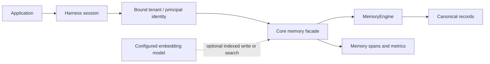

## What Memory is for

Harness memory is a separate concern from `HarnessStorage`. Storage owns the
conversation, run lifecycle, durable checkpoints, and external waits. Memory
owns application facts and recall that an agent, workflow, tool, or skill may
read or update during a run.

The default is dependency-free, process-local memory. It is useful for local
development, deterministic tests, and one-process applications. Choose a
durable engine only when the data must survive a restart or be shared between
instances.



The application chooses an engine at the Harness composition root. The engine
never receives model credentials, session storage, or a bypass around core
scope validation, telemetry, content-capture policy, and error normalization.

## Start with the default

No memory setup is required. Harness creates an in-memory engine when
`.memory(...)` is omitted.

```ts
import { defineHarness, inMemorySandbox } from '@purista/harness'

const harness = defineHarness({ name: 'claims-review' })
	.sandbox(inMemorySandbox())
		.models({
			reviewer: { provider, model: 'reviewer-v1', capabilities: ['object'] },
		})
		.build()

const session = await harness.getSession('claim:42')
await session.memory.write('locale', 'de-DE', { ttlMs: 60 * 60 * 1_000 })

const locale = await session.memory.read<string>('locale')
```

`write`, `read`, `delete`, and `list` only accept JSON-serializable values.
Memory keys are non-empty, portable identifiers of up to 256 characters. A
TTL requires an engine with `memory.ttl`; the built-in engine supports it.

## Bind identity before work starts

Pass the optional identity when opening the session. Harness stores the exact
presence and value of each dimension on first use. Every reopen compares the
same shape before it opens a sandbox, model, memory engine, or run.

```ts
const session = await harness.getSession('claim:42', {
	tenantId: 'acme-insurance',
	principalId: 'adjuster:ada',
})
```

There are no synthetic defaults. The following are all valid and distinct:

| Tenant | Principal | Typical use |
| --- | --- | --- |
| absent | absent | local or single-user deployment |
| absent | present | individual account without tenant ownership |
| present | absent | shared tenant workspace |
| present | present | principal inside a tenant |

Within a run, `ctx.memory.application`, `ctx.memory.tenant()`,
`ctx.memory.principal()`, `ctx.memory.session`, `ctx.memory.run`, and (for an
agent context) `ctx.memory.agent` select a lifetime. Tenant and principal
handles fail before engine I/O when the matching identity dimension is absent.
This protects namespace separation; application authorization remains your
responsibility.

## Durable engines and capabilities

The public extension point is `MemoryEngine`, not the former `MemoryAdapter`.
Every engine persists the same `MemoryRecord` shape and implements `get`,
`put`, `delete`, and `list`. Optional capabilities must be truthful:

| Capability | Enables |
| --- | --- |
| `memory.ttl` | Expiring records |
| `memory.text_search` | Text recall through `searchText` |
| `memory.vector_search` | Semantic recall through `searchVector` |
| `memory.hybrid_search` | Fused text and semantic recall through `searchHybrid` |
| `memory.persistent` | Restart-safe records |
| `memory.multi_instance` | Coordinated multi-instance use |

Use `.requires(...)` for a capability your application cannot safely operate
without. Harness rejects a missing capability during `build()` rather than
silently falling back to process-local behavior.

```ts
const harness = defineHarness({ name: 'claims-review' })
	.memory(memoryEngine)
	.requires(['memory.persistent', 'memory.multi_instance'])
	// models, tools, agents, workflows
	.build()
```

Install one first-party engine when durable or shared memory is required. Do
not present a database client directly to agents or tools; the engine keeps the
same scoped contract and operation telemetry everywhere.

| Package | Best fit | Text | Semantic / hybrid | Durable / shared |
| --- | --- | --- | --- | --- |
| `@purista/harness-memory-sqlite` | Local development or one process | FTS5 | Exact, with optional `sqlite-vec` | Durable / not shared |
| `@purista/harness-memory-postgres` | Relational production deployments | PostgreSQL full-text | pgvector | Durable / multi-instance |
| `@purista/harness-memory-redis` | Low-latency Redis Search deployments | Redis Search | Redis vector index | Durable / multi-instance |
| `@purista/harness-memory-nats` | Existing JetStream KV infrastructure | — | — | Durable / multi-instance |

NATS intentionally does not advertise relevance-search capabilities. There is
no Dapr memory package or Dapr execution path. The engine contract is available
from `@purista/harness/testing` as `memoryEngineContract`.

### Install and select an engine

```sh
npm install @purista/harness-memory-sqlite
```

```ts
import { sqliteMemoryEngine } from '@purista/harness-memory-sqlite'

const harness = defineHarness({ name: 'claims-review' })
	.memory(sqliteMemoryEngine({ file: '.purista/memory.sqlite' }))
	// models, tools, agents, workflows
	.build()
```

SQLite needs no third-party runtime dependency for KV, TTL, lists, and FTS5.
For exact local semantic and hybrid retrieval, add the explicitly optional,
pinned extension and enable it at the composition root:

```sh
npm install sqlite-vec@0.1.9
```

```ts
sqliteMemoryEngine({ file: '.purista/memory.sqlite', vector: true })
```

The extension loads only during initialization and the first vector atomically
sets its dimensions and descriptor. A missing peer, blocked native extension,
or unsupported Bun SQLite setup fails with a safe remediation error; it never
silently becomes text-only. Bun on macOS can require an extension-capable
custom SQLite build.

For PostgreSQL, Redis, and NATS installation, ownership, live-test commands,
and deployment constraints, see [Ecosystem & Packages](/handbook/harness/ecosystem-packages/).

## Model-backed indexing

An engine that advertises `memory.vector_search` can opt into model-backed
indexing. The callback receives frozen configuration references, not live model
handles. This makes the intended alias visible in autocomplete and prevents a
string alias from drifting at runtime.

```ts
const harness = defineHarness({ name: 'knowledge-assistant' })
	.models({
		memoryEmbedding: { provider, model: 'embed-v1', capabilities: ['embeddings'] },
		memorySummary: { provider, model: 'summary-v1', capabilities: ['object'] },
	})
		.memory(model => ({
			engine: vectorMemoryEngine,
			embedding: model.memoryEmbedding,
			summary: model.memorySummary,
		}))
		.build()
```

TypeScript rejects an embedding configuration for an engine that does not
declare `memory.vector_search`, and `build()` rechecks both engine capability
and model capability. A string value is indexed automatically; structured JSON
requires `index: { text: '…' }` on the write. If the embedding call fails, the
write or semantic search fails before an indexed record is committed.

The configured model call remains a normal Harness GenAI span. Its provider,
model, available token usage, and cost attributes stay on that nested model
span exactly once; the parent `harness.memory.*` span records memory operation,
scope, result count, duration, and normalized error only.

## Search, operations, and limits

```ts
await ctx.memory.principal().write('claim-summary', claim, {
	index: { text: claim.description },
	tags: ['claim', 'open'],
})

const matches = await ctx.memory.principal().search({
	text: 'water damage',
	mode: 'text',
	limit: 10,
	tags: ['claim'],
})
```

`list` and `search` default to 20 results and accept at most 100. Cursors are
opaque and engine-bound. Expired records are invisible to reads, lists, and
search. Ask for `text`, `semantic`, or `hybrid` explicitly when the operation
must not change with an engine choice; Harness fails rather than downgrading a
mode the engine cannot support.

## Testing and operations

Use the built-in engine for deterministic unit tests. For an external engine,
run `memoryEngineContract` plus focused tests for isolation, TTL, pagination,
cancellation, restart behavior, and the backend's atomic write/index
guarantee. Test identity mismatch before a sandbox or engine call.

Memory spans are content-free by default. Never put raw facts, keys containing
PII, credentials, prompts, vectors, or database URLs in custom engine logs or
attributes. Correlate `harness.memory.get`, `.set`, `.delete`, `.list`, and
`.search` with the nested model span when indexing is enabled.

For custom engines, continue with [Custom Adapters](/handbook/harness/custom-adapters/). For durable conversation and approval state, use [Agents & Workflows](/handbook/harness/agents-workflows-storage/) rather than memory.
