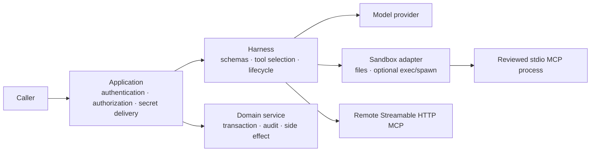

## Start with the boundary, not a command

For a claims-review agent, an evidence file, a policy lookup, and a claim
decision are different security concerns. The sandbox is the session-owned file
and optional process-execution boundary. It is **not** authentication,
authorization, tenant isolation, a secret manager, or automatically a
container or microVM.



The application admits the caller, scopes data to a claim and tenant, stages
only authorized files, selects credentials, and performs domain writes. The
Harness validates declared agent/tool schemas and owns the session lifecycle.
The sandbox adapter and its deployment platform enforce any process,
filesystem, network, identity, or quota isolation that the use case needs. A
model, its tool arguments, tool output, and retrieved content remain untrusted.

## Choose an execution boundary

The four rows below are deliberately not equivalent. Choose the first one that
meets the use case; do not turn a local development helper into a production
isolation claim.

| Option | Files and lifetime | Commands / long-lived processes | Isolation it actually provides | Use for | Do not use for |
| --- | --- | --- | --- | --- | --- |
| `inMemorySandbox()` | Per-session in-memory filesystem; released with the session | No executor, no `spawn` | A Harness filesystem boundary only | Reviewed files, mounted skills, regular TypeScript or HTTP tools | Commands, stdio MCP, persisted workspaces, untrusted-code isolation |
| `bashSandbox()` | Per-session in-memory filesystem | `exec` through optional `just-bash`; no `spawn` | In-process execution helper, **not** a container or VM | Trusted development or narrowly controlled transformations | Untrusted documents/commands, stdio MCP, tenant/process isolation |
| `localDurableExecution({ exec })` | Host-directory workspace; durable when configured | Files-only by default; `exec` starts a host child process when enabled | Realpath and symlink escape protections; **not** a hardened host boundary | Single-host trusted workers and local durability | Untrusted model-directed commands, tenant isolation, trusted Agent Plugin stdio |
| Custom isolating adapter | Adapter- and platform-owned | Declare only capabilities actually enforced, including `spawn` when needed | Whatever the container, microVM, remote runner, filesystem, network and identity policy enforce | Production command execution and stdio MCP | Any control the adapter does not explicitly enforce |

`inMemorySandbox()` is the default for a text-and-tool claims review. It is
the safest built-in choice because it has no executor. `bashSandbox()` supports
`network` and `executionLimits` options passed to `just-bash`, but those are
not a replacement for an operating-system or tenant isolation boundary.
`localDurableExecution({ exec: false })` remains files-only by default.

For a production executor, make isolation visible in the adapter contract and
deployment design: root filesystem/mount policy, network egress, process user,
CPU/memory/PID/time limits, image provenance, per-tenant workspace lifecycle,
and cleanup. Use [Custom Adapters](/handbook/harness/custom-adapters/)
to implement and test that boundary.

## Build the safe path first

This claims-review configuration gives the model one read-only TypeScript tool
over evidence that the application has already authorized and staged. It has no
command execution and no ambient file access.

```ts
import { defineHarness, inMemorySandbox } from '@purista/harness'
import { z } from 'zod'

const harness = defineHarness({ name: 'claims-review' })
  .sandbox(inMemorySandbox())
  .tools({
    read_claim_evidence: {
      description: 'Read one reviewed evidence file already staged for this claim.',
      input: z.object({ filename: z.string().regex(/^[a-z0-9._-]+$/i) }),
      output: z.object({ text: z.string().max(20_000) }),
      handler: async (ctx, { filename }) => ({
        text: await ctx.sandbox.readText(`/workspace/evidence/${filename}`),
      }),
    },
  })
  .build()
```

The tool schema and filename check are still necessary: path normalization is
not authorization, and a model-generated path must not select data. Keep
`builtinTools: false` for tool-only agents. A skill-reading agent normally
needs only a deliberate read-only allowlist such as `['read']`, never `bash`,
`write`, or `edit` by default.

## Shared responsibility: threats and controls

| Risk | Harness control | Required adapter / platform control | Required application control |
| --- | --- | --- | --- |
| Prompt injection asks for an unsafe action | Explicit agent tool list, built-in allowlist, schemas, permissions/governance hooks | None replaces tool policy | Keep domain authorization and mutations outside model control; use approval workflow where required |
| Host files or files from another claim become visible | Session file APIs; local adapter path-jail validation | Read-only mounts and per-session roots where execution is isolated | Stage only authorized data; tenant- and claim-scope every lookup |
| Arbitrary command execution | Files-only sandbox yields `SandboxNoExecutorError`; explicit exec capability | Command/image allowlist, unprivileged identity, immutable root, syscall/runtime policy | Do not expose command-capable tools unless the use case is reviewed |
| Network exfiltration or metadata-service access | None is universally enforced by the core contract | Default-deny egress, DNS/proxy policy, metadata-service block, destination allowlist | Do not give a tool or MCP server credentials broader than its task |
| Secret exposure | Content-free telemetry defaults and normalized errors | Secret injection scoped to the process, short-lived credentials, no host environment inheritance | Keep secrets out of prompts, skills, files, tool results, logs, and unreviewed plugin configuration |
| CPU, memory, process, or disk exhaustion | Cancellation/timeout signals and session close semantics | CPU/memory/PID/disk quotas and an enforced wall-clock kill policy | Set operation budgets and capacity/alert thresholds |
| Cross-tenant state or stale workspace data | Run/session lifecycle and adapter capability declarations | Per-tenant/run workspace allocation, encryption and secure wipe/retention where needed | Authorize every request; state/workspace keys and cleanup policy must include tenant scope |
| MCP or custom-tool overreach | Declared schema, tool exposure, normalized errors | Process isolation for stdio; remote TLS transport | MCP server independently authenticates and authorizes each call; tokens are scoped |
| Sensitive data in diagnostics | Core traces/logs avoid prompt, tool, file and result content | Secure exporter, collector, retention, access control | Keep production content capture off and audit logger/exporter configuration |

Session IDs are identifiers, not an access-control mechanism. Schema validation
is necessary at the tool boundary, but it does not prove a caller is authorized
or make an unsafe implementation safe.

## Remote MCP: prefer a server-side boundary when it fits

Use `mcp_http` when a reviewed policy service already exposes modern Streamable
HTTP. This works with `inMemorySandbox()` because no local process is launched.
The Harness obtains `tools/list`, validates call/result shapes, and normalizes
the response for the agent; the server must still authenticate and authorize
the scoped request itself.

```ts
import { defineHarness, inMemorySandbox } from '@purista/harness'

const harness = defineHarness({ name: 'claims-review' })
  .sandbox(inMemorySandbox())
  .tools({
    claim_policy: {
      kind: 'mcp_http',
      description: 'Look up an insurance-policy clause by policy and topic.',
      url: process.env.CLAIMS_POLICY_MCP_URL!,
      auth: { kind: 'bearer', token: process.env.CLAIMS_POLICY_MCP_TOKEN! },
      redirect: 'error',
      tool: 'policy.lookup',
    },
  })
  .build()
```

Use HTTPS, short-lived scoped credentials, and `redirect: 'error'` for a
credentialed endpoint so a redirect cannot forward a token to another origin.
The endpoint, its authorization, rate limits, residency, and audit trail stay
application/service responsibilities. Legacy stateful MCP and HTTP+SSE are not
the supported transports; use modern Streamable HTTP.

## Stdio MCP: a process is a production boundary

`mcp_stdio` runs a reviewed local command through a spawn-capable sandbox
session. The Harness starts one persistent server, performs the initialization
handshake, multiplexes calls through it, and terminates it on runner/session
cleanup. If the process exits during a call, that call fails as
`McpProtocolError`; a later call creates a new process. Design server operations
to be idempotent.

```ts
.tools({
  extract_evidence: {
    kind: 'mcp_stdio',
    description: 'Extract text from a reviewed claim document in the sandbox workspace.',
    command: '/opt/claims-mcp/bin/server',
    args: ['--workspace', '/workspace'],
    cwd: '/workspace',
    env: { EXTRACTION_MODE: 'text-only' },
    tool: 'evidence.extract',
  },
})
```

`inMemorySandbox()` and `bashSandbox()` cannot run this configuration: neither
can spawn a long-lived process, so the call fails with
`SandboxNoExecutorError`. A local host-directory sandbox with host execution is
also not an isolating production answer. Use a custom adapter backed by a
container, microVM, or remote execution service that owns process lifetime,
mounts, egress, limits, identity, and cleanup.

An optional `install` command bootstraps a stdio server in the sandbox. Keep it
idempotent, source-pinned, and image-reviewed; a model must never choose the
package, command, or install source. Cancellation is passed into sandbox and
MCP operations, and a session close must terminate adapter-owned processes.

### Agent Plugin stdio adds an immutable package requirement

A trusted Agent Plugin is not simply a directory to execute. Its reviewed,
digest-checked package bytes must be mounted immutably, while mutable state uses
an application-owned data directory outside the plugin root. The sandbox must
implement `mountReadOnly(...)` and prevent the spawned process from changing
that mount.

Neither `inMemorySandbox()` nor `localDirectorySandbox()` supplies this
guarantee. Use an isolating custom adapter for trusted Agent Plugin stdio, even
when the plugin is reviewed. Read [Agent Plugins](/handbook/harness/agent-plugins/)
for inspection and binding controls.

## Handle failures at the transport boundary

| Situation | Normalized result | Safe response |
| --- | --- | --- |
| Files-only sandbox asked to execute or start stdio | `SandboxNoExecutorError` | Remove the capability or select a reviewed isolating adapter |
| Stdio server dies, negotiation fails, or an MCP call fails | `McpProtocolError` | Return a safe retryable/non-retryable result; do not expose command lines or stderr |
| Remote MCP rejects credentials | `McpAuthError` | Rotate/re-scope credentials; do not retry blindly |
| MCP tool is absent or input/result misses the schema | `ToolNotFoundError` or `ValidationError` | Treat as configuration/integration failure and alert the owner |
| A command/MCP operation exceeds its budget or caller cancels | Normalized timeout/cancellation error | Propagate cancellation, release the session, and record content-free diagnostics |

Pass the caller's `AbortSignal` when invoking agents and workflows. For a
custom adapter, honor it while opening, executing, and spawning; make
`close()` idempotent and verify that it releases every process and workspace.

## Production baseline and verification

Before enabling a command-capable agent in production:

1. Start files-only and explicitly enable only the built-ins, tools, agents,
   and model aliases that a reviewed task needs.
2. Give each run/tenant a scoped workspace lifecycle. Define retention,
   encryption, quotas, and cleanup in the workspace platform—not only in a
   session ID.
3. Pass only task-scoped, short-lived credentials to a remote service or
   isolated process. Never inherit broad host credentials into the sandbox.
4. Enforce image/package provenance, immutable reviewed plugin mounts,
   unprivileged process identity, default-deny egress, and resource ceilings in
   the adapter platform.
5. Keep logs and OpenTelemetry content-free; record IDs, decisions, durations,
   usage where available, and normalized errors rather than evidence, prompts,
   file contents, or credentials.
6. Test denied paths as rigorously as successful ones: cross-tenant file
   access, forbidden command, blocked egress, missing executor, expired token,
   cancellation, quota/timeout, process cleanup, and stale workspace cleanup.

For a custom adapter, run
`sandboxContract(() => createClaimsSandbox(), { executor: 'available' })` from
`@purista/harness/testing`; add the snapshot contract only when the adapter
truthfully supports snapshot/resume. Add platform integration tests for the
isolation claims that a generic contract cannot prove.

Continue with [Durable Workflows & Queues](/handbook/harness/durable-workflows-and-queues/)
when a claims review must survive a worker restart, or
[Custom Adapters](/handbook/harness/custom-adapters/) to build the
production execution boundary.
