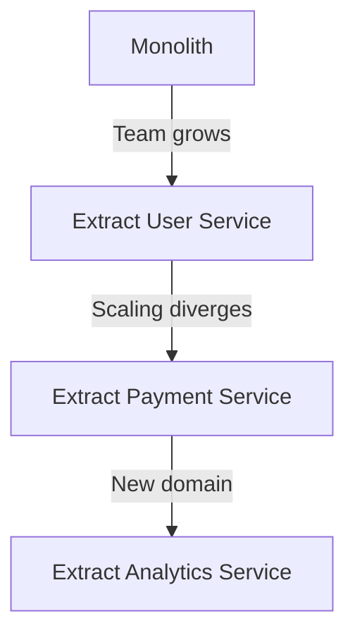

This tutorial guides you through splitting a monolithic PURISTA application into independently deployable microservices. You will learn when to extract services, how they communicate, and how to maintain type safety across service boundaries.

Because PURISTA services communicate through messages rather than direct imports, splitting a monolith is not a rewrite — it is a configuration change. The service code stays the same; only the bootstrap file and the event bridge adapter change. This makes the decision to split a business and operational decision, not a technical one.

## When to split

Start with a monolith. Extract services when:

- **Team size grows** — different teams need independent release cycles
- **Scaling needs diverge** — one service needs 10 instances, another needs 2
- **Failure domains separate** — one service should not take down another
- **Technology differences** — one service needs GPU, another needs high memory



## The extraction process

### Step 1: Identify the boundary

A service boundary should:

- Own a single business capability ("User Management", "Billing")
- Have clear data ownership
- Be independently testable
- Map to a team or sub-team

### Step 2: Move code to a new service

Before:

```typescript [monolith.ts]
// All in one service
const appService = appServiceBuilder
  .addCommandDefinition(userSignUpCommand.getDefinition())
  .addCommandDefinition(processPaymentCommand.getDefinition())
```

After:

```typescript [user-service.ts]
// User Service
export const userService = userServiceBuilder
  .addCommandDefinition(userSignUpCommand.getDefinition())
```

```typescript [payment-service.ts]
// Payment Service
export const paymentService = paymentServiceBuilder
  .addCommandDefinition(processPaymentCommand.getDefinition())
```

### Step 3: Declare cross-service calls

The User Service needs to call the Payment Service. Declare the dependency on the **command builder** that makes the call:

```typescript [createOrderCommandBuilder.ts]
export const createOrderCommandBuilder = userServiceBuilder
  .getCommandBuilder('createOrder', 'Create a new order')
  .canInvoke('PaymentService', '1', 'processPayment')
  .setCommandFunction(async function (context, payload) {
    // context.service.PaymentService['1'].processPayment is now typed
  })
```

### Step 4: Update the event bridge

Switch from `DefaultEventBridge` to a distributed broker:

```typescript [amqp.ts]
import { AmqpBridge } from '@purista/amqpbridge'

const eventBridge = new AmqpBridge({
  url: process.env.AMQP_URL,
  exchangeName: 'purista',
})
```

### Step 5: Deploy independently

```yaml [user-deployment.yaml]
apiVersion: apps/v1
kind: Deployment
metadata:
  name: user-service
spec:
  replicas: 3
  template:
    spec:
      containers:
        - name: user-service
          image: user-service:v1.2.0
```

```yaml [payment-deployment.yaml]
apiVersion: apps/v1
kind: Deployment
metadata:
  name: payment-service
spec:
  replicas: 2
  template:
    spec:
      containers:
        - name: payment-service
          image: payment-service:v1.0.0
```

## Communication patterns

### Synchronous (commands)

Use when the caller needs a response:

```typescript [sync.ts]
.setCommandFunction(async function (context, payload) {
  const payment = await context.service.PaymentService['1'].processPayment({
    amount: payload.amount,
  }, {})

  return { orderId: payload.orderId, paymentId: payment.id }
})
```

### Asynchronous (events)

Use when the caller does not need to wait:

```typescript [async.ts]
.setCommandFunction(async function (context, payload) {
  await context.resources.db.createOrder(payload)
  await context.emit('orderCreated', { orderId: payload.orderId })
  return { orderId: payload.orderId }
})
```

### Background (queues)

Use for long-running work:

```typescript [queue.ts]
.setCommandFunction(async function (context, payload) {
  const job = await context.queue.enqueue.generateReport({
    orderId: payload.orderId,
  })
  return { jobId: job.id }
})
```

## Maintaining type safety

Cross-service calls in PURISTA are type-safe by design. Declare which commands your service can invoke with `.canInvoke()`, then call them through `context.service`:

```typescript [user-service.ts]
// Declare the cross-service dependency
export const userService = userServiceBuilder
  .addCommandDefinition(...commandDefinitions)
  .canInvoke('PaymentService', '1', 'processPayment')
```

```typescript [user-command.ts]
// Call the remote command — fully typed, routed through the event bridge
.setCommandFunction(async function (context, payload) {
  const payment = await context.service.PaymentService['1'].processPayment(
    { amount: payload.amount },
    {},
  )
  return { orderId: payload.orderId, paymentId: payment.id }
})
```

The event bridge routes the call to the correct service instance, whether it is running in the same process or a remote container.

## Common pitfalls

- **Extracting too early.** Start with a monolith. Extract when pain is real.
- **Shared databases.** Each service should own its data. No shared tables.
- **Chatty communication.** Batch operations. Avoid many small cross-service calls.
- **Ignoring failures.** Cross-service calls can fail. Handle timeouts and retries.

## Checklist

- [ ] Service boundary owns a single business capability
- [ ] No shared databases between services
- [ ] Cross-service calls are declared with `canInvoke`
- [ ] Event bridge supports distributed messaging
- [ ] Services deploy independently
- [ ] Type-safe clients are generated from definitions
- [ ] Failures are handled with timeouts and retries
- [ ] Health checks verify all dependencies
