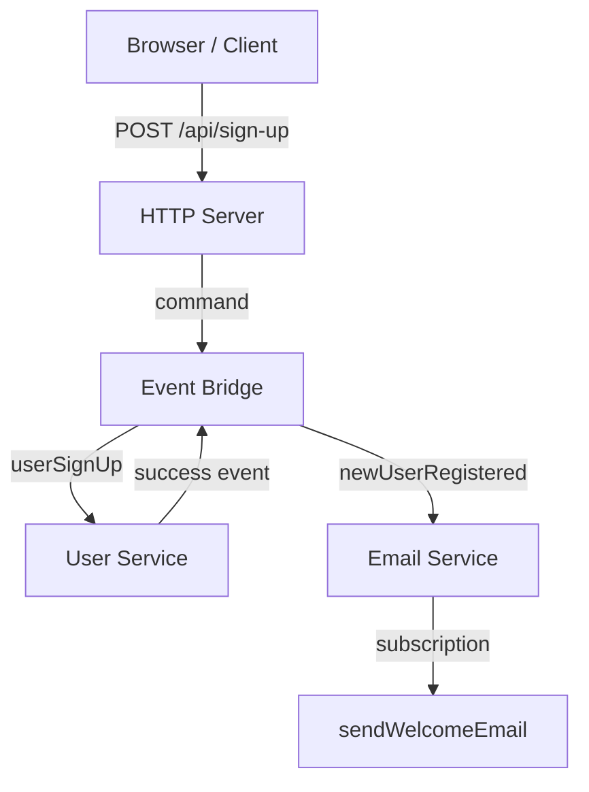

This tutorial takes you from an empty directory to a running PURISTA service with a command and a subscription. By the end, you will understand the core mental model: services, commands, subscriptions, and the event bridge.

## What you will build



| Artifact | What it does | Pattern |
|---|---|---|
| `userSignUp` **command** | Registers a user and returns a user ID | Request/response |
| `sendWelcomeEmail` **subscription** | Sends an email when a user is created | Event-driven |

## Prerequisites

- [Node.js](https://nodejs.org/) LTS (or [Bun](https://bun.sh/))
- A code editor (VS Code, Zed, or similar)
- A terminal
- Recommended for AI-assisted work: [install the PURISTA AI skill](/handbook/install-ai-skill/)

```bash
npx skills add puristajs/purista --skill purista
```

## Step 1: Scaffold the project

Run the PURISTA CLI:

```bash
npm create purista@latest
```

Or for non-interactive setup:

```bash
purista init my-app \
  --runtime node \
  --event-bridge default \
  --webserver \
  --linter biome \
  --type module \
  --non-interactive \
  --defaults
```

This creates:

```text
my-app/
├── src/
│   ├── service/
│   │   └── ping/
│   │       └── v1/
│   │           ├── pingV1ServiceBuilder.ts
│   │           ├── pingV1Service.ts
│   │           └── command/
│   │               └── ping/
│   ├── eventbridge.ts
│   ├── http.ts
│   └── index.ts
├── purista.json
└── package.json
```

## Step 2: Create a service

```bash
cd my-app
purista add service
```

Name it `user`. The CLI generates:

```text
src/service/user/v1/
├── userServiceV1ServiceBuilder.ts
├── userServiceV1Service.ts
└── userServiceV1Service.test.ts
```

## Step 3: Add a command

```bash
purista add command
```

Select the `user` service. Name it `signUp`.

The CLI generates:

```text
src/service/user/v1/command/signUp/
├── schema.ts
├── types.ts
├── signUpCommandBuilder.ts
└── signUpCommandBuilder.test.ts
```

Edit `signUpCommandBuilder.ts`:

```typescript [signUpCommandBuilder.ts]
import { z } from 'zod'
import { userServiceV1ServiceBuilder } from '../../userServiceV1ServiceBuilder.js'

const inputPayloadSchema = z.object({
  email: z.string().email(),
  password: z.string().min(8),
})

const outputSchema = z.object({
  userId: z.string(),
})

export const signUpCommandBuilder = userServiceV1ServiceBuilder
  .getCommandBuilder('signUp', 'Register a new user', 'newUserRegistered')
  .addPayloadSchema(inputPayloadSchema)
  .addOutputSchema(outputSchema)
  .setCommandFunction(async function (context, payload) {
    const userId = crypto.randomUUID()
    context.logger.info({ userId }, 'User created')
    return { userId }
  })
```

## Step 4: Add a subscription

```bash
purista add subscription
```

Select the `user` service. Name it `sendWelcomeEmail`.

Edit the subscription:

```typescript [sendWelcomeEmailSubscriptionBuilder.ts]
import { z } from 'zod'
import { userServiceV1ServiceBuilder } from '../../userServiceV1ServiceBuilder.js'

export const sendWelcomeEmailSubscriptionBuilder = userServiceV1ServiceBuilder
  .getSubscriptionBuilder('sendWelcomeEmail', 'Send welcome email on new user')
  .subscribeToEvent('newUserRegistered')
  .addPayloadSchema(z.object({ userId: z.string() }))
  .setSubscriptionFunction(async function (context, payload) {
    context.logger.info({ userId: payload.userId }, 'Welcome email sent')
    return { status: 'ack' }
  })
```

## Step 5: Wire up and run

Edit `src/service/user/v1/userServiceV1Service.ts`:

```typescript [userServiceV1Service.ts]
import { userServiceV1ServiceBuilder } from './userServiceV1ServiceBuilder.js'
import { signUpCommandBuilder } from './command/signUp/signUpCommandBuilder.js'
import { sendWelcomeEmailSubscriptionBuilder } from './subscription/sendWelcomeEmail/sendWelcomeEmailSubscriptionBuilder.js'

export const userServiceV1Service = userServiceV1ServiceBuilder
  .addCommandDefinition(signUpCommandBuilder.getDefinition())
  .addSubscriptionDefinition(sendWelcomeEmailSubscriptionBuilder.getDefinition())
```

Edit `src/index.ts`:

```typescript [index.ts]
import { DefaultEventBridge } from '@purista/core'
import { userServiceV1Service } from './service/user/v1/userServiceV1Service.js'

const eventBridge = new DefaultEventBridge()
await eventBridge.start()

const userService = await userServiceV1Service.getInstance(eventBridge)
await userService.start()

console.log('Service running. Press Ctrl+C to stop.')
```

Run:

```bash
npm run dev
```

Test the command:

```bash
curl -X POST http://localhost:3000/api/v1/sign-up \
  -H "content-type: application/json" \
  -d '{"email": "test@example.com", "password": "secure123"}'
```

## What you learned

- **Services** are domain containers for commands and subscriptions
- **Commands** are request/response handlers with typed schemas
- **Subscriptions** react to events without blocking the emitter
- **The event bridge** routes messages between services
- **The CLI** scaffolds boilerplate so you focus on business logic

## Next steps

- Learn the [mental model](/handbook/mental-model/philosophy/) behind PURISTA
- Explore [building blocks](/handbook/blocks/command-pattern/) in depth
- Read [From Zero to Production](/handbook/learn/from-zero-to-production/) for the deployment path
