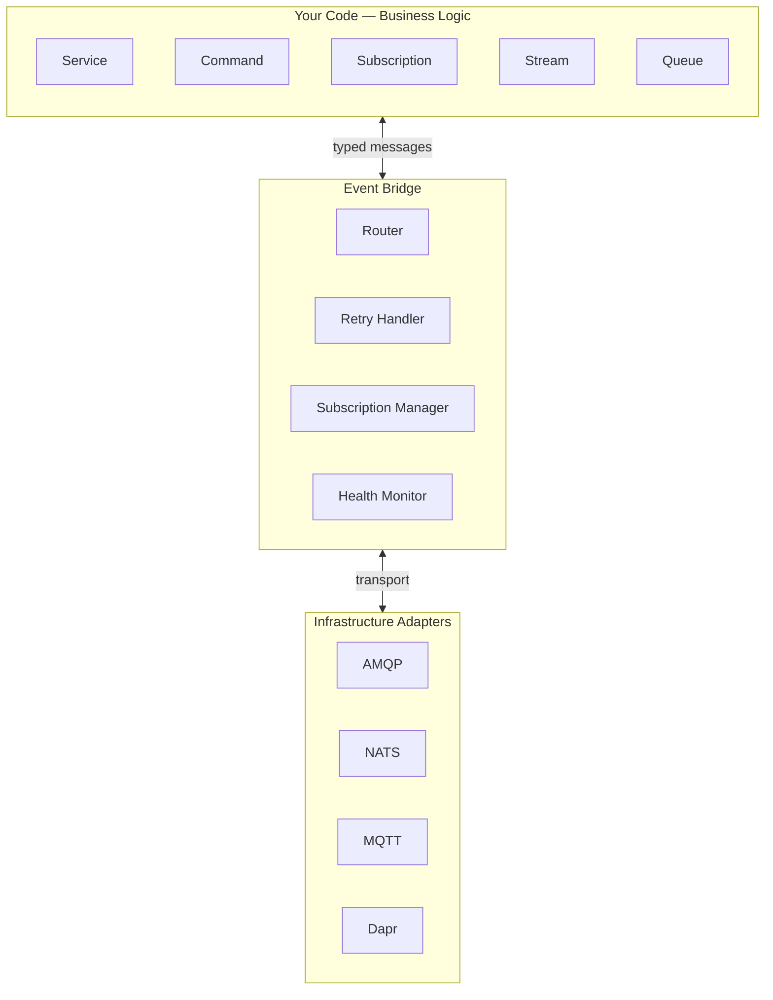
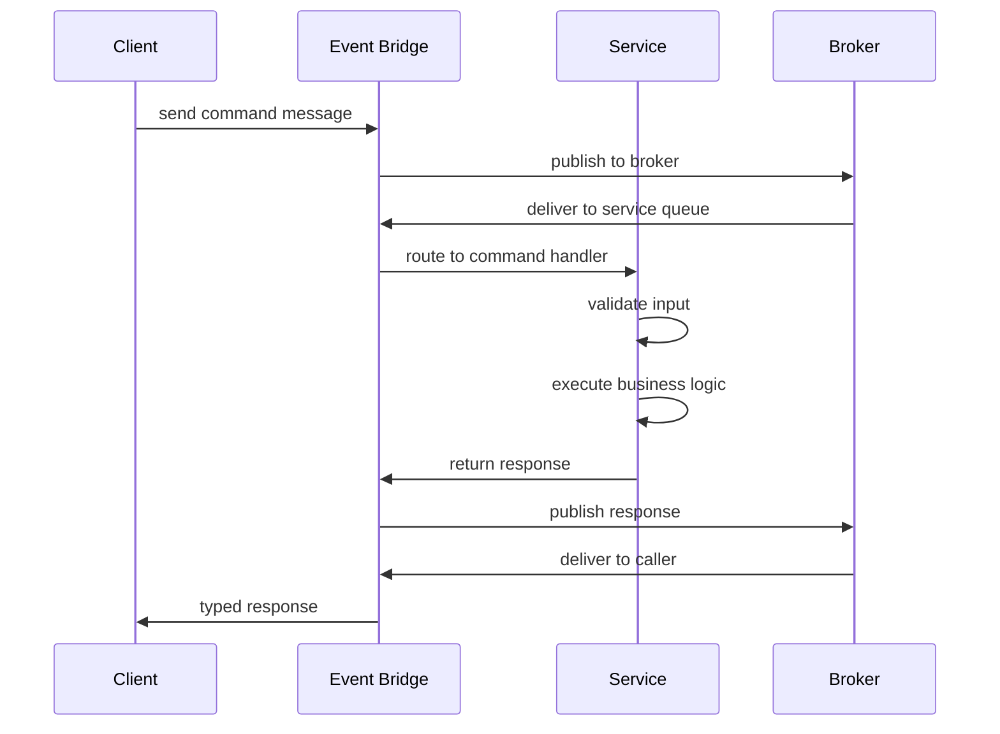

PURISTA's architecture is built on a single idea: **business logic should never know what broker, database, or HTTP server it runs on.** This is achieved through a strict three-layer separation that keeps your code portable, testable, and scalable.

## The three layers



### Layer 1: Business Logic

This is your code — services, commands, subscriptions, streams, and queues. It contains:

- **Domain logic** — what the system does (create user, send email, process payment)
- **Validation rules** — Zod schemas that define acceptable inputs and outputs
- **Business guards** — authorization, preconditions, and side-effect policies

Business logic **never** imports an HTTP client, message broker SDK, or database driver directly. It interacts with the world through well-defined interfaces: resources, stores, and the event bridge.

### Layer 2: Event Bridge

The event bridge is the **nervous system**. It handles:

- **Routing** — directing command messages to the right service instance
- **Retries** — re-delivering failed messages according to policy
- **Subscriptions** — fanning out events to all matching subscribers
- **Health monitoring** — tracking in-flight messages and service state

The bridge is swappable. The same service code runs with:

```typescript [local.ts]
// Local development — no broker needed
import { DefaultEventBridge } from '@purista/core'
const eventBridge = new DefaultEventBridge()
```

```typescript [production.ts]
// Production — swap to NATS
import { NatsBridge } from '@purista/natsbridge'
const eventBridge = new NatsBridge({ /* ... */ })
```

### Layer 3: Infrastructure Adapters

Adapters connect the bridge to specific technologies:

| Adapter | Use case |
|---|---|
| **AMQP** (RabbitMQ) | Durable queues, complex routing, enterprise deployments |
| **NATS** | Low latency, high throughput, cloud-native |
| **MQTT** | IoT, edge, constrained networks |
| **Dapr** | Sidecar pattern, multi-cloud portability |

## Message flow through the layers

When a command is invoked, here is what happens:



At every step:

- The **client** sends a typed message — no raw HTTP or broker SDK
- The **bridge** handles serialization, routing, and retries
- The **service** receives a typed context with payload, resources, and stores
- The **broker** provides durability and distribution — but the service never talks to it directly

## Why this separation matters

### Testability

Because business logic is isolated, you can test it without a running broker:

```typescript [test.ts]
import { createCommandTestHarness } from '@purista/core'

const harness = await createCommandTestHarness(userV1ServiceBuilder, signUpCommandBuilder, {
  resources: {
    db: mockDb,
    mailer: mockMailer,
  },
})

const result = await harness.run({ payload: { email: 'test@example.com', password: 'secret' } })
expect(result.userId).toBeDefined()
```

No Docker, no RabbitMQ, no network calls. Just your logic and mock resources.

### Portability

The same service code runs in multiple environments without modification:

| Environment | Event Bridge | Queue Bridge | Store |
|---|---|---|---|
| Local dev | `DefaultEventBridge` | `DefaultQueueBridge` | `DefaultStateStore` |
| CI / testing | `DefaultEventBridge` | `DefaultQueueBridge` | `DefaultStateStore` |
| Production (containers) | `AmqpBridge` or `NatsBridge` | `RedisQueueBridge` | `RedisStateStore` |
| Serverless | `DefaultEventBridge` | `RedisQueueBridge` | `RedisStateStore` |
| Edge / IoT | `MqttBridge` | MQTT-native | `DaprStateStore` (`@purista/dapr-sdk`) |

### Team autonomy

Because services communicate through messages, not direct calls:

- **Frontend teams** own the HTTP exposure layer
- **Backend teams** own service logic and schemas
- **Platform teams** own broker configuration and monitoring
- **No team blocks another** — services evolve independently as long as message contracts are honored

## When to use this architecture

- You need to run the same code in development, testing, and production
- You want to switch brokers without rewriting business logic
- Your team structure mirrors your service boundaries
- You need horizontal scaling without session affinity
- You want built-in observability at the message layer

## Common pitfalls

- **Bypassing the bridge.** Never call a service method directly — always send a message. Direct calls break testability and scaling.
- **Leaking infrastructure into handlers.** A command function should not import `@purista/amqpbridge` or `axios`. Use resources and stores.
- **Assuming broker guarantees.** At-least-once delivery means duplicates. Design handlers to be idempotent.
- **Ignoring the bridge health API.** Use `eventBridge.getInFlightDiagnostics()` during shutdown to ensure clean drain.

## Checklist

- [ ] Business logic has no direct imports of broker SDKs, HTTP clients, or database drivers
- [ ] The event bridge is created and configured in bootstrap code, not service code
- [ ] Services are tested with `createCommandTestHarness`, subscriptions with `createSubscriptionContextMock`
- [ ] Handlers are idempotent (safe to run multiple times with the same input)
- [ ] Graceful shutdown waits for in-flight messages to complete
- [ ] Health checks verify bridge connectivity, not just service state
