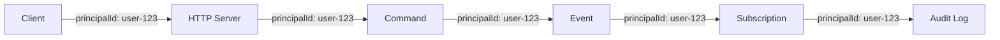

PURISTA treats data control as a first-class concern. Every message carries security metadata, every store enforces access boundaries, and every command can validate who is asking before it answers. This is not an opt-in feature — it is woven into the message model.

## Security metadata in every message

Every PURISTA message carries two optional but strongly-typed security fields:

| Field | Purpose | Example |
|---|---|---|
| **`principalId`** | Identifies the user or system making the request | `user-123`, `service:scheduler` |
| **`tenantId`** | Isolates data by tenant in multi-tenant systems | `tenant-acme`, `org-42` |

These fields propagate automatically through the entire distributed flow. If a command emits an event, the event inherits the same `principalId` and `tenantId`. If a subscription reacts to that event, it receives them too.

```typescript [command.ts]
.setCommandFunction(async function (context, payload, parameter) {
  // context.message.principalId — who made this request
  // context.message.tenantId — which tenant they belong to

  context.logger.info({
    principalId: context.message.principalId,
    tenantId: context.message.tenantId,
  }, 'processing request')

  // Use tenantId to scope database queries
  const user = await context.resources.db.getUser({
    id: payload.userId,
    tenantId: context.message.tenantId,
  })
})
```

## Tenant isolation patterns

### Single-tenant services

Each tenant runs its own service instance with dedicated resources:

```typescript [tenant-a.ts]
const tenantAService = await userServiceV1Service.getInstance(eventBridge, {
  resources: { db: tenantADatabase },
})
```

Simple, but expensive at scale. Best for high-compliance requirements.

### Shared services with tenant scoping

One service handles all tenants, but every query is scoped. The `tenantId` check belongs in a **before guard** — not in the handler. Guards run before the command function and reject the request early if the precondition fails, keeping business logic clean:

```typescript [scoped-command.ts]
.setBeforeGuardHooks({
  requireTenant: async function (context, payload, parameter) {
    const tenantId = context.message.tenantId
    if (!tenantId) {
      throw new HandledError(StatusCode.Unauthorized, 'tenantId is required')
    }
  },
})
.setCommandFunction(async function (context, payload) {
  // tenantId is guaranteed to be present here
  const { tenantId } = context.message

  // Database enforces tenant isolation at the query level
  return context.resources.db.query({
    table: 'users',
    where: { tenantId, id: payload.userId },
  })
})
```

See [Before and after guards](/handbook/blocks/command-pattern/command-builder#before-and-after-guards) for the full guard API.

Cost-efficient, but requires discipline. Every command that touches tenant-scoped data needs the guard.

### Tenant-aware stores

Config, secret, and state stores can be scoped per tenant:

```typescript [tenant-store.ts]
const { darkMode } = await context.configs.getConfig(`features:${tenantId}:darkMode`)
const { stripeKey } = await context.secrets.getSecret(`apiKey:${tenantId}:stripe`)
await context.states.setState(`session:${tenantId}:${userId}`, { cart: [] })
```

## Secret management

Secrets never belong in code, environment variables, or config files. PURISTA provides a **secret store** abstraction:

```typescript [service-builder.ts]
import { ServiceBuilder } from '@purista/core'

export const userServiceV1ServiceBuilder = new ServiceBuilder(myServiceInfo)
```

Pass the secret store at instantiation:

```typescript [main.ts]
import { AWSSecretStore } from '@purista/aws-secret-store'

const userService = await userServiceV1Service.getInstance(eventBridge, {
  secretStore: new AWSSecretStore({ region: 'us-east-1' }),
})
```

Access in commands:

```typescript [command.ts]
.setCommandFunction(async function (context, payload) {
  const { apiKey } = await context.secrets.getSecret('paymentProvider:apiKey')
  const response = await context.resources.paymentApi.charge({
    amount: payload.amount,
    apiKey,
  })
})
```

<div class="callout callout--warning">
  <div class="callout__title">Never log secrets</div>
  <p>The secret store returns values that should never appear in logs. Use <code>context.logger</code> with redaction rules, or explicitly exclude secret fields from log payloads.</p>
</div>

## Data privacy by routing

PURISTA's message model makes privacy boundaries explicit:

- **Commands** know who called them (`principalId`) and can reject unauthorized requests
- **Subscriptions** inherit the caller's identity, so audit trails trace the full flow
- **Events** carry the original `principalId`, enabling downstream privacy checks
- **Stores** can be encrypted at rest, with keys rotated per tenant



## When to use data control features

- **Multi-tenant SaaS** — every request must be scoped to a tenant
- **Healthcare / finance** — audit trails and data isolation are regulatory requirements
- **GDPR / CCPA compliance** — right to deletion, data portability, consent tracking
- **Internal platforms** — different teams have different data access levels

## Common pitfalls

- **Validating `tenantId` in the handler instead of a guard.** Put the check in a `beforeGuard` — it runs before the handler, rejects early, and keeps business logic free of access-control boilerplate.
- **Logging sensitive fields.** Always redact PII, secrets, and tokens from logs.
- **Storing secrets in config stores.** Config stores are for non-sensitive values. Use secret stores for API keys and passwords.
- **Assuming `principalId` is authenticated.** The bridge sets `principalId`, but verify it with guards before trusting it.

## Checklist

- [ ] Every command that accesses tenant-scoped data has a `requireTenant` before guard
- [ ] Secrets are in secret stores, never in code or environment variables
- [ ] Logs redact PII, secrets, and tokens
- [ ] Subscriptions that handle sensitive data audit the `principalId`
- [ ] Stores support encryption at rest where required
- [ ] Guards throw `HandledError` with an appropriate status code — not a plain `Error`
