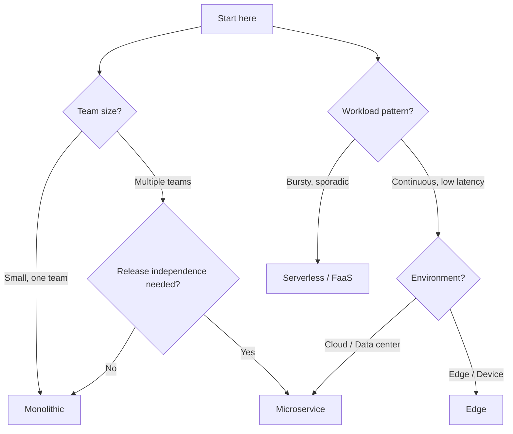
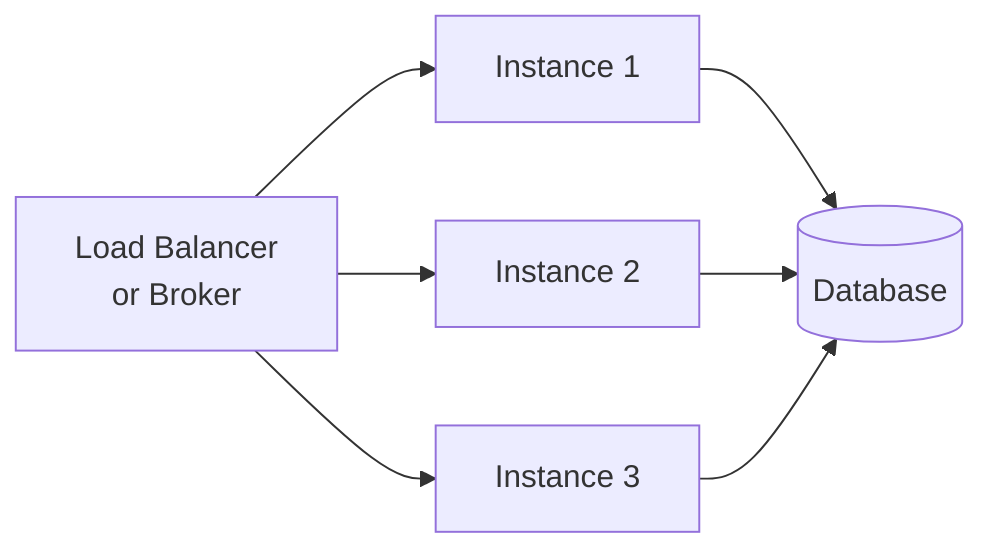

PURISTA services are **infrastructure-agnostic**. The same business logic runs on a laptop, in a Docker container, on Kubernetes, or as a serverless function. The only thing that changes is the event bridge adapter and bootstrap configuration.

This is not a future-proofing trick — it is how you move from a prototype to a production system without rewriting anything. Start with the `DefaultEventBridge` in a single process on day one. When the team grows or scaling demands separate, swap the bridge and deploy independently. Your commands and subscriptions never change.

## Deployment patterns at a glance

| Pattern | Architecture | Best for | Complexity |
|---|---|---|---|
| **Monolith** | All services in one process | Fastest delivery, smallest ops overhead | Low |
| **Microservices** | One service per process/container | Independent release cycles, team autonomy | Medium |
| **Serverless / FaaS** | Function-per-trigger | Bursty workloads, platform-managed scaling | Medium |
| **Edge** | Lightweight single-process | IoT, on-device, constrained environments | Low |

## Deployment decision tree



## Monolith — start here

All services share one process and one in-memory event bridge:

```typescript [bootstrap.ts]
import { DefaultEventBridge } from '@purista/core'
import { userV1Service } from './services/user.js'
import { emailV1Service } from './services/email.js'

const eventBridge = new DefaultEventBridge()
await eventBridge.start()

const userService = await userV1Service.getInstance(eventBridge)
const emailService = await emailV1Service.getInstance(eventBridge)

await userService.start()
await emailService.start()

console.log('All services running. Press Ctrl+C to stop.')
```

**Why start with a monolith?**

- No broker setup required
- Fastest local development and debugging
- Single deploy target
- Easy to refactor service boundaries

## Microservices — split when ready

Each service runs in its own container, connected via a shared broker:

```typescript [user-service.ts]
import { AmqpBridge } from '@purista/amqpbridge'
import { userV1Service } from './service.js'

const eventBridge = new AmqpBridge({
  url: process.env.AMQP_URL,
  exchangeName: 'purista',
})

const userService = await userV1Service.getInstance(eventBridge)
await userService.start()
```

```typescript [email-service.ts]
import { AmqpBridge } from '@purista/amqpbridge'
import { emailV1Service } from './service.js'

const eventBridge = new AmqpBridge({
  url: process.env.AMQP_URL,
  exchangeName: 'purista',
})

const emailService = await emailV1Service.getInstance(eventBridge)
await emailService.start()
```

**The service code does not change.** Only the bootstrap file changes.

## Serverless — function-per-command

Services run in serverless environments using the in-memory `DefaultEventBridge` — no broker connection required per invocation. Expose commands via the HTTP server and let the platform manage scaling:

```typescript [serverless.ts]
import { DefaultEventBridge } from '@purista/core'
import { honoV1Service } from '@purista/hono-http-server'
import { userV1Service } from './service.js'

const eventBridge = new DefaultEventBridge()
await eventBridge.start()

const httpServerService = await honoV1Service.getInstance(eventBridge)
const userService = await userV1Service.getInstance(eventBridge)

await httpServerService.start()
await userService.start()
// The HTTP server handles incoming requests; the event bridge routes them in-process
```

Best for: bursty workloads, sporadic traffic, pay-per-invocation models.

## Edge — lightweight and local

Run services at the edge with minimal infrastructure:

```typescript [edge.ts]
import { MqttBridge } from '@purista/mqttbridge'
import { sensorV1Service } from './service.js'

const eventBridge = new MqttBridge({
  url: process.env.MQTT_URL,
  clientId: 'edge-sensor-001',
})

const sensorService = await sensorV1Service.getInstance(eventBridge)
await sensorService.start()
```

Best for: IoT, on-device processing, constrained environments.

## Scaling model

Because PURISTA services are stateless, scaling is horizontal:



- The **broker distributes messages** across service instances
- **No session affinity** required
- **Instances are interchangeable** — start more, stop some, no data loss
- **Scale per service** — User Service needs 3 instances, Email Service needs 1

## Runtime configuration

| Environment | Event Bridge | Queue Bridge | Store |
|---|---|---|---|
| Local dev | `DefaultEventBridge` | `DefaultQueueBridge` | `DefaultStateStore` |
| CI / testing | `DefaultEventBridge` | `DefaultQueueBridge` | `DefaultStateStore` |
| Staging | `AmqpBridge` or `NatsBridge` | `RedisQueueBridge` | `RedisStateStore` |
| Production | `AmqpBridge` or `NatsBridge` | `RedisQueueBridge` or `NatsQueueBridge` | `RedisStateStore` or `NatsStateStore` |
| Serverless | `DefaultEventBridge` | `RedisQueueBridge` | `RedisStateStore` |
| Edge | `MqttBridge` | MQTT-native | `DaprStateStore` (`@purista/dapr-sdk`) |

## When to migrate between models

| From | To | Signal |
|---|---|---|
| Monolith | Microservices | Multiple teams need independent deploys |
| Monolith | Serverless | Sporadic traffic, cost optimization |
| Microservices | Monolith | Ops overhead exceeds team capacity |
| Any | Edge | Latency requirements demand local processing |

## Common pitfalls

- **Designing for microservices too early.** Start with a monolith. Extract services when boundaries are clear and teams are ready.
- **Hardcoding bridge configuration.** Use environment variables and config stores for broker URLs, credentials, and timeouts.
- **Ignoring cold starts.** Serverless functions have startup latency. Pre-warm critical paths.
- **Assuming shared memory.** Even in a monolith, services should not share state. Use stores.

## Checklist

- [ ] The same service code runs in at least two deployment models
- [ ] Event bridge configuration is externalized (env vars, config stores)
- [ ] Graceful shutdown is implemented for all deployment targets
- [ ] Health checks are exposed and monitored
- [ ] Secrets are in secret stores, not environment variables or code
- [ ] Integration tests pass against the target broker/store setup
- [ ] Scaling strategy is documented (horizontal, per-service, auto-scaling)
