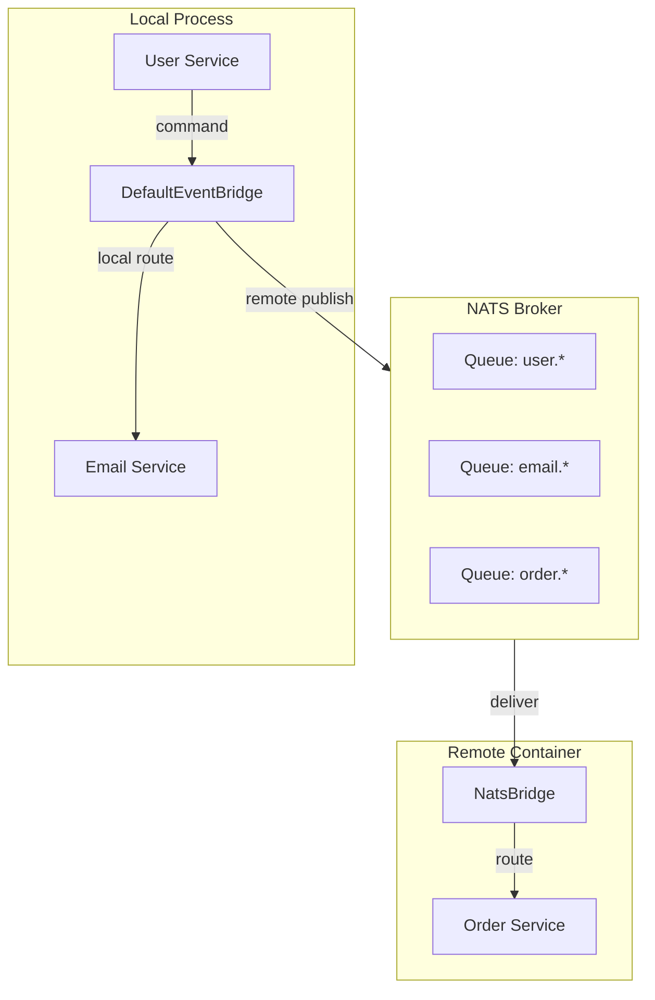

Distribution in PURISTA is a **runtime decision**, not an architectural constraint. The same service code can run in a single process, across multiple containers, or as serverless functions — because distribution is handled by the event bridge, not by your business logic.

## The distribution illusion

In traditional systems, distribution is baked into the code:

```typescript [tightly-coupled.ts]
// ❌ Bad: service imports another service directly
import { emailService } from '../email/service.js'

async function createUser(payload) {
  const user = await db.create(payload)
  await emailService.sendWelcome(user.email) // direct call
  return user
}
```

In PURISTA, services never call each other directly. They send messages:

```typescript [message-driven.ts]
// ✅ Good: service sends a message
.setCommandFunction(async function (context, payload) {
  const user = await context.resources.db.create(payload)
  await context.service.EmailService['1'].sendWelcome({ email: user.email }, {})
  return user
})
```

The `context.service` proxy sends a command message through the event bridge. Whether the Email Service runs in the same process or a different container is invisible to the caller.

## Distribution models

### Monolith — single process

All services share one event bridge and run in a single Node.js process:

```typescript [monolith.ts]
import { DefaultEventBridge } from '@purista/core'
import { userV1Service } from './services/user.js'
import { emailV1Service } from './services/email.js'

const eventBridge = new DefaultEventBridge()
await eventBridge.start()

const userService = await userV1Service.getInstance(eventBridge)
const emailService = await emailV1Service.getInstance(eventBridge)

await userService.start()
await emailService.start()
```

| Pros | Cons |
|---|---|
| Fastest local development | Single failure domain |
| No broker required | Cannot scale services independently |
| Simple debugging | All services share the same memory space |

### Microservices — one service per container

Each service runs in its own container, connected via a shared broker:

```typescript [user-service.ts]
import { AmqpBridge } from '@purista/amqpbridge'
import { userV1Service } from './service.js'

const eventBridge = new AmqpBridge({ url: process.env.AMQP_URL })
const userService = await userV1Service.getInstance(eventBridge)
await userService.start()
```

```typescript [email-service.ts]
import { AmqpBridge } from '@purista/amqpbridge'
import { emailV1Service } from './service.js'

const eventBridge = new AmqpBridge({ url: process.env.AMQP_URL })
const emailService = await emailV1Service.getInstance(eventBridge)
await emailService.start()
```

| Pros | Cons |
|---|---|
| Independent scaling | Operational complexity |
| Independent deployments | Broker required |
| Team autonomy | Network latency between services |

### Serverless — function-per-command

Services run in serverless environments using the in-memory `DefaultEventBridge` — no broker connection required per invocation. Commands are exposed via the HTTP server and the event bridge routes requests in-process:

```typescript [serverless.ts]
import { DefaultEventBridge } from '@purista/core'
import { honoV1Service } from '@purista/hono-http-server'
import { userV1Service } from './service.js'

const eventBridge = new DefaultEventBridge()
await eventBridge.start()

const httpServerService = await honoV1Service.getInstance(eventBridge)
const userService = await userV1Service.getInstance(eventBridge)

await httpServerService.start()
await userService.start()
// All services run in-process; the event bridge routes messages without a broker
```

| Pros | Cons |
|---|---|
| Platform-managed scaling | Cold start latency |
| Pay-per-invocation | Limited execution time |
| Auto-scaling | State must be externalized |

### Edge — lightweight single-process

Run services at the edge with minimal infrastructure:

```typescript [edge.ts]
import { MqttBridge } from '@purista/mqttbridge'
import { sensorV1Service } from './service.js'

const eventBridge = new MqttBridge({
  url: process.env.MQTT_URL,
  clientId: 'edge-sensor-001',
})
const sensorService = await sensorV1Service.getInstance(eventBridge)
await sensorService.start()
```

| Pros | Cons |
|---|---|
| Low latency for IoT | Limited compute resources |
| Works offline with local MQTT broker | Minimal persistence options |
| Small footprint | Fewer store adapters available |

## How the bridge handles distribution

The event bridge is the distribution boundary. It decides:

- **Where** to route a message (same process or remote)
- **How** to deliver it (in-memory queue, broker publish, HTTP call)
- **When** to retry (immediate, exponential backoff, dead-letter)



## When to choose each model

| Model | Choose when... |
|---|---|
| **Monolith** | Small team, fast delivery, single deploy target |
| **Microservices** | Multiple teams, independent release cycles, scaling needs |
| **Serverless** | Bursty workloads, sporadic traffic, platform-managed ops |
| **Edge** | IoT, on-device processing, constrained environments |

## Common pitfalls

- **Designing for microservices too early.** Start with a monolith. Extract services when boundaries are clear.
- **Assuming local calls are free.** Even in a monolith, message serialization and routing have overhead.
- **Ignoring network partitions.** In distributed mode, services can be unreachable. Design for timeouts and retries.
- **Sharing state between services.** Services must be stateless. Use stores for shared data.

## Checklist

- [ ] The same service code runs in at least two deployment models without changes
- [ ] Event bridge configuration is externalized (not hardcoded)
- [ ] Services are stateless — no in-memory caches shared across instances
- [ ] Cross-service calls handle timeouts and retries gracefully
- [ ] Graceful shutdown works in all deployment models
- [ ] Health checks verify bridge connectivity, not just service state
