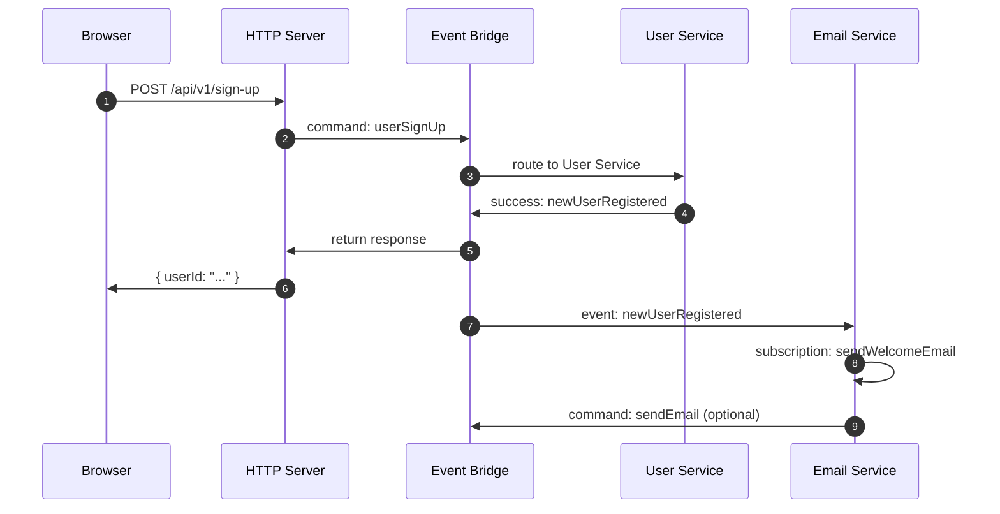
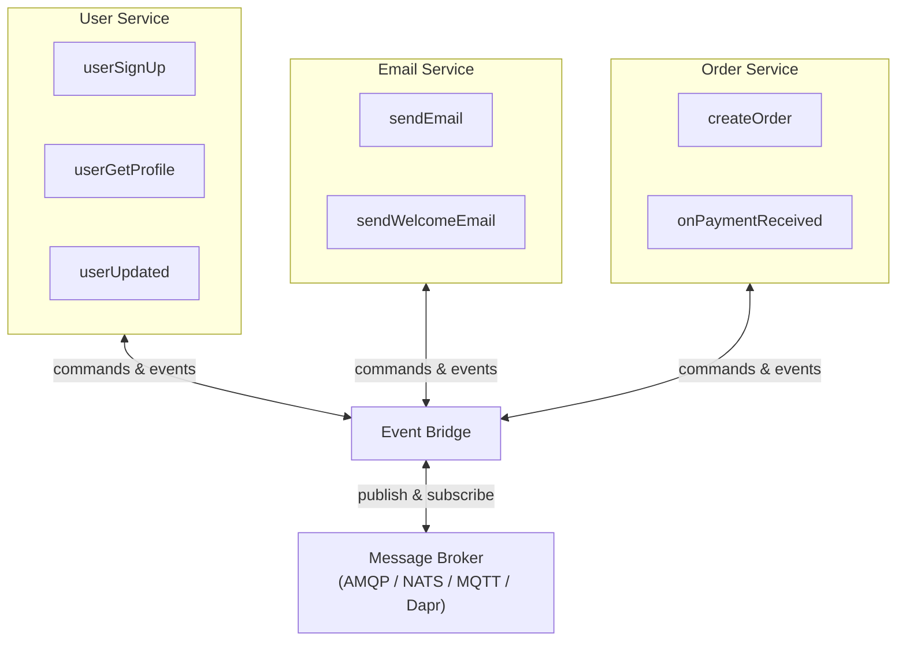

PURISTA is a **message-driven framework**. Every interaction — a user signing up, an order being placed, a payment being processed — flows through messages. Services send and receive these messages through an **event bridge**, which connects to a message broker.

This simple model scales from a single-process prototype to a distributed system spanning multiple regions. The same code runs everywhere; only the runtime wiring changes.

## The four building blocks

| Block | Role | Analogy |
|---|---|---|
| **Service** | A business capability with a clear boundary | "The User team" |
| **Command** | An active operation with request/response | "Create a user" |
| **Subscription** | A passive reaction to an event | "When a user is created, send a welcome email" |
| **Event Bridge** | The transport layer that routes messages | "The postal service" |

These four primitives compose every PURISTA system. There are no controllers, no repositories, no service locators — just services, commands, subscriptions, and the bridge that connects them.

## How a request flows through the system

Here is a typical sign-up flow. The browser sends one HTTP request, but PURISTA turns it into a structured message conversation:



Notice the key properties of this flow:

1. **The HTTP server does not know how `userSignUp` is implemented.** It sends a command message and waits for a response.
2. **The Email service does not know the User service exists.** It subscribes to the `newUserRegistered` event — anyone could produce it.
3. **Each step is a single function** with typed input, output, and error handling.
4. **Every message carries a trace ID.** The entire flow is observable without custom instrumentation.

## Commands vs. Subscriptions

Commands and subscriptions are the two sides of PURISTA's message model. Understanding the difference is the key to designing clean systems.

### Commands (active)

A command is an **explicit request**. The caller knows the command exists, knows its input and output schema, and waits for a response.

```typescript [userSignUpCommandBuilder.ts]
import { z } from 'zod'
import { userServiceV1ServiceBuilder } from '../userServiceV1ServiceBuilder.js'

const inputPayloadSchema = z.object({
  email: z.string().email(),
  password: z.string().min(8),
})

const outputSchema = z.object({
  userId: z.string().uuid(),
})

export const userSignUpCommandBuilder = userServiceV1ServiceBuilder
  .getCommandBuilder('userSignUp', 'register a new user', 'newUserRegistered')
  .addPayloadSchema(inputPayloadSchema)
  .addOutputSchema(outputSchema)
  .setCommandFunction(async function (context, payload) {
    const userId = await context.resources.db.createUser(payload)
    context.logger.info({ userId }, 'user created')
    return { userId }
  })
```

Key properties of commands:

- **Named and typed** — `userSignUp` with explicit input/output schemas
- **Request/response** — the caller receives a success or error response
- **Emit events** — the optional third argument (`'newUserRegistered'`) marks successful responses as events
- **Invocable across services** — any service can invoke `userSignUp` by sending a command message

### Subscriptions (passive)

A subscription is a **reaction**. It listens for events that match its filter and runs when one arrives. The event producer does not know the subscription exists.

```typescript [sendWelcomeEmailSubscriptionBuilder.ts]
import { z } from 'zod'
import { emailServiceV1ServiceBuilder } from '../emailServiceV1ServiceBuilder.js'

const inputPayloadSchema = z.object({
  userId: z.string().uuid(),
})

export const sendWelcomeEmailSubscriptionBuilder = emailServiceV1ServiceBuilder
  .getSubscriptionBuilder('sendWelcomeEmail', 'send welcome email on new user')
  .addPayloadSchema(inputPayloadSchema)
  .setSubscriptionFunction(async function (context, payload) {
    const user = await context.resources.db.getUser(payload.userId)
    await context.resources.mailer.send({
      to: user.email,
      subject: 'Welcome to PURISTA',
    })
    context.logger.info({ userId: payload.userId }, 'welcome email sent')
    return { status: 'ack' }
  })
```

Key properties of subscriptions:

- **Filtered** — listens to specific event names, message types, or sender services
- **No return value** — the producer does not wait for or expect a response
- **Decoupled** — the User service does not know the Email service exists
- **Composable** — multiple subscriptions can react to the same event independently

## Services as business boundaries

A service groups related commands and subscriptions under a single business capability. It is not a technical layer like "controller" or "repository" — it is a **domain boundary**.

```typescript [userServiceV1Service.ts]
import { userServiceV1ServiceBuilder } from './userServiceV1ServiceBuilder.js'
import { userSignUpCommandBuilder } from './command/userSignUp/index.js'
import { userGetProfileCommandBuilder } from './command/userGetProfile/index.js'
import { userUpdatedSubscriptionBuilder } from './subscription/userUpdated/index.js'

const commandDefinitions = [
  userSignUpCommandBuilder.getDefinition(),
  userGetProfileCommandBuilder.getDefinition(),
]

const subscriptionDefinitions = [
  userUpdatedSubscriptionBuilder.getDefinition(),
]

export const userServiceV1Service = userServiceV1ServiceBuilder
  .addCommandDefinition(...commandDefinitions)
  .addSubscriptionDefinition(...subscriptionDefinitions)
```

Services define:

- **Metadata** — name, version, description
- **Configuration** — environment-specific values via config stores
- **Resources** — database clients, SDKs, external API wrappers
- **Commands and subscriptions** — the business logic

## The event bridge

The event bridge is the **only** piece of infrastructure your services interact with. It routes messages, handles retries, and manages subscriptions — but your business logic never knows which broker is underneath.



This abstraction means:

- **Start local** with the in-memory `DefaultEventBridge` — no Docker, no broker
- **Switch to RabbitMQ** for staging by changing one config line
- **Use NATS** in production for low-latency routing
- **Deploy to serverless** (AWS Lambda, etc.) using `DefaultEventBridge` in-process — same code, no broker needed

## PURISTA vs. traditional approaches

| Traditional approach | PURISTA approach |
|---|---|
| HTTP handlers call services directly | HTTP server sends a command message; the service handles it |
| Services import each other | Services send messages; they are decoupled |
| State is shared in memory | State is externalized; services are stateless |
| Scaling means faster code | Scaling means more service instances; the broker handles distribution |
| Observability is added later | Every message is traced, logged, and validated by default |

## When to choose PURISTA

- You need type safety from API to database
- You want the same code to run locally and in production
- Your team values explicit contracts over implicit conventions
- You need built-in observability without custom instrumentation
- You plan to scale from monolith to microservices without rewriting

## Common pitfalls

- **Thinking in HTTP first.** PURISTA is message-driven. HTTP is just one transport. Design messages, then expose them.
- **Tight coupling via shared state.** Services should not share databases or in-memory caches. Pass data through messages.
- **Over-engineering the event schema.** Start with simple events. Evolve schemas as requirements grow.
- **Ignoring the event bridge abstraction.** Your business logic should never reference a specific broker.

## Checklist

- [ ] Every interaction is modeled as a message (command or event)
- [ ] Services represent business boundaries, not technical layers
- [ ] The event bridge is the only infrastructure dependency in business code
- [ ] Commands have explicit input/output schemas
- [ ] Subscriptions are decoupled from event producers
- [ ] State is externalized (stores, not in-memory)
