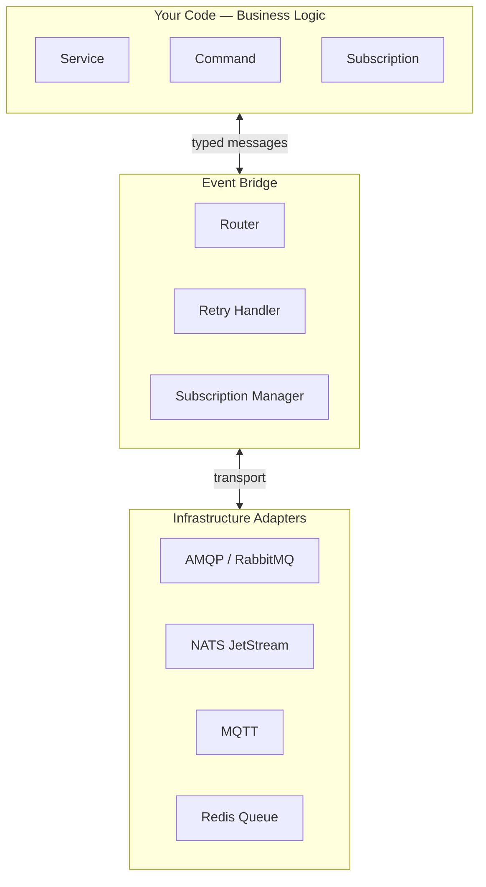

PURISTA enforces a hard boundary between three layers: your business logic, the event bridge, and the infrastructure adapters underneath. None of these layers knows about the others — they communicate through well-defined interfaces.



## The three layers

**Business logic** — commands and subscriptions — knows nothing about brokers, HTTP, or infrastructure. It receives a typed payload, does its work, returns a result (or emits an event). That is all it does.

**The event bridge** sits between your services and the infrastructure. It routes messages, manages subscriptions, handles retries, and carries trace context. Your code interacts with the bridge through a stable interface, regardless of which broker sits underneath.

**Infrastructure adapters** are pluggable. Swap AMQP for NATS, or NATS for Redis queues, by changing a constructor call. Your commands and subscriptions are untouched.

## Why this matters

### 1. Testability without mocks

Because business logic never imports infrastructure directly, you can test it against any event bridge:

```typescript [userSignUp.test.ts]
import { DefaultEventBridge } from '@purista/core'
import { userV1Service } from '../userV1Service.js'

const eventBridge = new DefaultEventBridge()
const userService = await userV1Service.getInstance(eventBridge)

const result = await userService.invoke('userSignUp', {
  email: 'alice@example.com',
  password: 'securepassword',
})

expect(result.userId).toBeDefined()
```

No mocking, no stubs — real message routing in an in-memory bridge.

### 2. Zero-change broker migration

Your team decides to move from RabbitMQ to NATS in production. The change is confined to a single bootstrap file:

```typescript [before.ts]
import { AmqpBridge } from '@purista/amqpbridge'
const eventBridge = new AmqpBridge({ host: 'rabbitmq' })
```

```typescript [after.ts]
import { NatsBridge } from '@purista/natsbridge'
const eventBridge = new NatsBridge({ servers: ['nats://nats:4222'] })
```

Every service, command, and subscription is unchanged.

### 3. Run anywhere

The same separation means the same application code runs in four different environments without modification:

| Environment | Event Bridge | Why |
|---|---|---|
| Local dev | `DefaultEventBridge` (in-memory) | No Docker, no broker, instant startup |
| CI / unit tests | `DefaultEventBridge` | Fast, deterministic, no external deps |
| Staging | `AmqpBridge` or `NatsBridge` | Production-like routing |
| Production | `AmqpBridge` / `NatsBridge` / `MqttBridge` | Chosen transport for scale and ops |

## What "no infrastructure in business logic" means in practice

The rules are simple:

```typescript
// ❌ DO NOT: import infrastructure inside a command
import { createClient } from 'redis'
import amqp from 'amqplib'

// ✅ DO: use context to access what the service provides
.setCommandFunction(async function (context, payload) {
  const value = await context.configs.getConfig('featureFlag')
  const secret = await context.secrets.getSecret('apiKey')
  const state = await context.states.getState('sessionData')
  const otherResult = await context.service.OtherService['1'].someCommand({ ... }, {})
})
```

Everything your command needs — config, secrets, state, cross-service calls — comes through the `context` object. The context is what gives you clean separation and testability.

## Definition, implementation, configuration are separate

PURISTA further separates each command into three distinct things:

- **Definition** — the builder: name, schema, metadata
- **Implementation** — the function: business logic only
- **Configuration** — what the service instance gets at startup: bridges, stores, resources

This is why you can write a command function without ever importing an event bridge. The bridge is wired at startup, not at definition time.

## Next steps

- [Architecture](./architecture.mdx) — how services connect to each other through the event bridge
- [Deployment Flexibility](./deployment-flexibility.mdx) — same code across monolith, microservices, and edge
