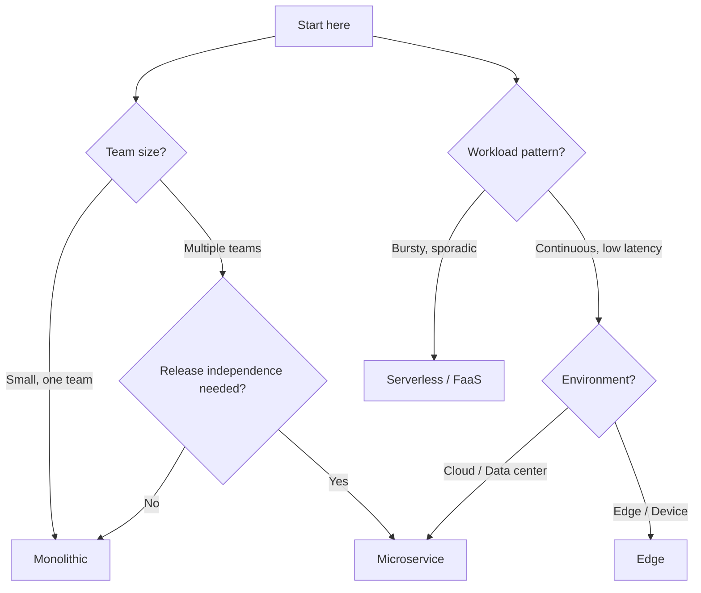

PURISTA services are infrastructure-agnostic. The same business logic runs on a laptop, in a Docker container, on Kubernetes, or as a serverless function. The only thing that changes is the event bridge adapter and bootstrap configuration.

## Deployment patterns

| Pattern | Architecture | Best for | Complexity |
|---|---|---|---|
| **Monolith** | All services in one process | Fastest delivery, smallest ops overhead | Low |
| **Microservices** | One service per container | Independent release cycles, team autonomy | Medium |
| **Serverless / FaaS** | Function-per-trigger | Bursty workloads, platform-managed scaling | Medium |
| **Edge** | Lightweight single-process | IoT, on-device, constrained environments | Low |

## Deployment decision tree



## Monolith — start here

All services share one process and one in-memory event bridge:

```typescript [monolith.ts]
import { DefaultEventBridge } from '@purista/core'
import { userV1Service } from './services/user.js'
import { emailV1Service } from './services/email.js'

const eventBridge = new DefaultEventBridge()
await eventBridge.start()

const userService = await userV1Service.getInstance(eventBridge)
const emailService = await emailV1Service.getInstance(eventBridge)

await userService.start()
await emailService.start()
```

**When to use:** Small team, fast delivery, single deploy target.

## Microservices — split when ready

Each service runs in its own container:

```typescript [microservice.ts]
import { AmqpBridge } from '@purista/amqpbridge'
import { userV1Service } from './service.js'

const eventBridge = new AmqpBridge({ url: process.env.AMQP_URL })
const userService = await userV1Service.getInstance(eventBridge)
await userService.start()
```

**When to use:** Multiple teams, independent releases, different scaling needs.

## Serverless — function-per-command

Individual commands deploy as functions. Serverless functions are short-lived, so use `DefaultEventBridge` (in-memory) with cloud-native stores for state and secrets:

```typescript [serverless.ts]
import { DefaultEventBridge } from '@purista/core'
import { AwsSecretStore } from '@purista/aws-secret-store'
import { RedisStateStore } from '@purista/redis-state-store'
import { userV1Service } from './service.js'

export const handler = async (event) => {
  const eventBridge = new DefaultEventBridge()
  await eventBridge.start()

  const userService = await userV1Service.getInstance(eventBridge, {
    secretStore: new AwsSecretStore({ region: process.env.AWS_REGION }),
    stateStore: new RedisStateStore({ config: { url: process.env.REDIS_URL } }),
  })
  await userService.start()

  const response = await eventBridge.invoke(event)
  await userService.destroy()
  await eventBridge.destroy()
  return response
}
```

**When to use:** Bursty workloads, sporadic traffic, pay-per-invocation.

## Edge — lightweight and local

Run services at the edge with minimal infrastructure:

```typescript [edge.ts]
import { MqttBridge } from '@purista/mqttbridge'
import { sensorV1Service } from './service.js'

const eventBridge = new MqttBridge({
  url: process.env.MQTT_URL,
  clientId: 'edge-sensor-001',
})

const sensorService = await sensorV1Service.getInstance(eventBridge)
await sensorService.start()
```

**When to use:** IoT, on-device processing, constrained environments.

## Runtime configuration

| Environment | Event Bridge | Queue Bridge | Store |
|---|---|---|---|
| Local dev | `DefaultEventBridge` | `DefaultQueueBridge` | `DefaultStateStore` |
| CI / testing | `DefaultEventBridge` | `DefaultQueueBridge` | `DefaultStateStore` |
| Staging | `AmqpBridge` or `NatsBridge` | `RedisQueueBridge` | `RedisStateStore` |
| Production | `AmqpBridge` or `NatsBridge` | `RedisQueueBridge` or `NatsQueueBridge` | `RedisStateStore` or cloud-native |
| Serverless | `DefaultEventBridge` | `RedisQueueBridge` | `RedisStateStore` |
| Edge | `MqttBridge` | MQTT-native | Dapr state store |

## Production checklist

- [ ] Event bridge chosen and configured for durability requirements
- [ ] Queue bridge configured for pull-based workloads
- [ ] Graceful shutdown implemented (`gracefulShutdown(logger, [eventBridge, ...services])`)
- [ ] Health checks exposed
- [ ] OpenTelemetry exporter configured
- [ ] Secrets in secret stores, not environment variables or code
- [ ] Integration tests pass against real broker/store setup
- [ ] Retry policies defined and documented
- [ ] Idempotency implemented for command side effects

## Common pitfalls

- **Designing for microservices too early.** Start with a monolith. Extract when boundaries are clear.
- **Hardcoding bridge configuration.** Use environment variables and config stores.
- **Ignoring cold starts.** Serverless functions have startup latency.
- **Assuming shared memory.** Even in a monolith, services should not share state.

## Checklist

- [ ] Deployment model matches team size and workload pattern
- [ ] Bridge configuration is externalized
- [ ] Graceful shutdown works in all deployment targets
- [ ] Health checks are exposed and monitored
- [ ] Integration tests pass against the target infrastructure
- [ ] Scaling strategy is documented
- [ ] Rollback plan exists for production deployments
