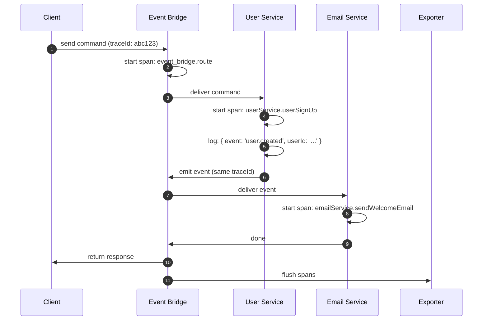

PURISTA has built-in OpenTelemetry support. Every message — command, subscription, stream, or queue job — automatically creates spans, carries trace context, and emits structured logs. You do not instrument your business logic.

## What you get for free

| Observability signal | What PURISTA provides | What you add |
|---|---|---|
| **Traces** | Spans for every message route, command, subscription, stream, and queue job | Configure an exporter |
| **Logs** | Structured JSON logs with trace IDs, service names, and message metadata | None — use the provided logger |
| **Metrics** | Message counts, latency histograms, error rates | Configure a metrics exporter |
| **Error tracking** | Typed errors with stack traces in spans | None |

## How tracing works



Each span includes:

- **Trace ID** — correlates the entire distributed flow
- **Service name and version** — know exactly which service handled the message
- **Command or subscription name** — pinpoint the operation
- **Timing** — how long each hop took
- **Logs** — structured JSON logs attached to the span

## Quick setup

PURISTA instruments traces by accepting a `SpanProcessor` at construction time. Pass it to the event bridge and each service — no changes to commands or subscriptions:

```typescript [tracing.ts]
import { OTLPTraceExporter } from '@opentelemetry/exporter-trace-otlp-http'
import { SimpleSpanProcessor } from '@opentelemetry/sdk-trace-node'
import { DefaultEventBridge } from '@purista/core'

const spanProcessor = new SimpleSpanProcessor(
  new OTLPTraceExporter({ url: 'http://localhost:4318/v1/traces' })
)

const eventBridge = new DefaultEventBridge({ spanProcessor })
const myService = await myV1Service.getInstance(eventBridge, { spanProcessor })
```

For additional auto-instrumentation of Node.js built-ins, you can also initialize `NodeSDK` before starting PURISTA — both approaches are compatible. See [OpenTelemetry Backends](/handbook/ops/opentelemetry) for all supported exporters and backends.

## Supported backends

| Backend | Protocol | Setup |
|---|---|---|
| **Jaeger** | OTLP HTTP | Single Docker container |
| **Grafana Tempo** | OTLP HTTP | Works with existing Grafana stack |
| **Zipkin** | Zipkin wire | Single Docker container |
| **SigNoz** | OTLP HTTP | Full observability platform |
| **AWS X-Ray** | OTLP / ADOT Collector | IAM and ADOT setup |
| **Azure Monitor** | OTLP | Azure resource setup |
| **Google Cloud Trace** | Cloud Trace exporter | GCP project setup |

All backends use `SimpleSpanProcessor` with the appropriate exporter — see the [OpenTelemetry Backends](/handbook/ops/opentelemetry) guide for details on each.

## Structured logging

PURISTA uses pino under the hood. Logs include:

- `serviceName` and `serviceVersion`
- `serviceTarget` (command or subscription name)
- `principalId` and `tenantId`
- `traceId` for correlation
- OpenTelemetry trace context

```typescript [logging.ts]
context.logger.info({ userId: payload.userId }, 'User created')
```

Output:

```json
{
  "level": 30,
  "time": 1700000000000,
  "serviceName": "UserService",
  "serviceVersion": "1",
  "serviceTarget": "userSignUp",
  "traceId": "abc123",
  "principalId": "user-456",
  "msg": "User created",
  "userId": "user-789"
}
```

## Business metrics

For business metrics, emit custom events from commands:

```typescript [metrics.ts]
.setCommandFunction(async function (context, payload) {
  const result = await processOrder(payload)
  await context.emit('orderCompleted', {
    orderId: result.id,
    amount: result.amount,
    currency: result.currency,
  })
  return result
})
```

Subscribe with an analytics service:

```typescript [analytics.ts]
const analyticsSubscription = analyticsServiceBuilder
  .getSubscriptionBuilder('onOrderCompleted', 'Track orders')
  .subscribeToEvent('orderCompleted')
  .setSubscriptionFunction(async function (context, payload) {
    await context.resources.analytics.track('order.completed', payload)
  })
```

## When to add custom instrumentation

- Rarely needed — PURISTA covers the message path
- Add custom spans for complex business logic inside commands
- Add custom metrics for business KPIs (orders, revenue, active users)

## Common pitfalls

- **Not configuring an exporter.** Traces are generated but never sent anywhere.
- **Ignoring log levels.** Production should use `warn` or `info`, not `debug`.
- **Logging sensitive data.** Never log secrets, passwords, or tokens.
- **Missing trace correlation.** Ensure all external HTTP calls include trace headers.

## Checklist

- [ ] OpenTelemetry exporter is configured and receiving traces
- [ ] Log level is appropriate for the environment
- [ ] Logs do not contain sensitive data
- [ ] Business metrics are emitted as custom events
- [ ] Trace correlation works across service boundaries
- [ ] Alerts are configured for error rates and latency
