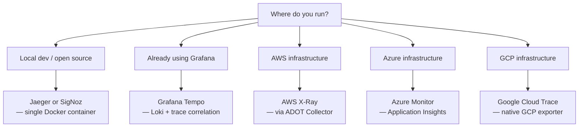

PURISTA emits OpenTelemetry traces, metrics, and logs automatically for every command, subscription, stream, and queue job. You choose where that data goes by wiring a `SpanProcessor` at startup — no changes to business logic, no instrumentation required.

## How it works in PURISTA

PURISTA instruments traces by accepting a `SpanProcessor` at construction time. You create a `SpanProcessor` wrapping your chosen exporter and pass it directly to the event bridge and each service — no global tracer registration required:

```typescript [main.ts]
import { OTLPTraceExporter } from '@opentelemetry/exporter-trace-otlp-http'
import { SimpleSpanProcessor } from '@opentelemetry/sdk-trace-node'
import { AmqpBridge } from '@purista/amqpbridge'

const spanProcessor = new SimpleSpanProcessor(
  new OTLPTraceExporter({ url: 'http://localhost:4318/v1/traces' })
)

const eventBridge = new AmqpBridge({ spanProcessor })
const myService = await myV1Service.getInstance(eventBridge, { spanProcessor })
```

If you also want auto-instrumentation for Node.js built-ins (HTTP, fetch, database drivers), initialize `NodeSDK` before starting PURISTA:

```typescript [sdk.ts]
import { NodeSDK } from '@opentelemetry/sdk-node'
import { OTLPTraceExporter } from '@opentelemetry/exporter-trace-otlp-http'

const sdk = new NodeSDK({
  traceExporter: new OTLPTraceExporter({ url: 'http://localhost:4318/v1/traces' }),
})
sdk.start()
// Then start your PURISTA event bridge and services
```

Both approaches are compatible — use `NodeSDK` for broad auto-instrumentation and the `SpanProcessor` injection for PURISTA-specific span control.

## Supported backends

Choose the backend that fits your stack. Every one uses the same `SpanProcessor` pattern above — only the exporter changes.

| Backend | Protocol | Self-hosted | Managed |
|---|---|---|---|
| [CloudGrid](https://cloudgrid.dev/) | OTLP HTTP / gRPC | ✅ | ❌ |
| [Jaeger](/handbook/4_open_telemetry/jaeger) | OTLP HTTP | ✅ | ❌ |
| [Zipkin](/handbook/4_open_telemetry/zipkin) | Zipkin wire | ✅ | ❌ |
| [Grafana Tempo](/handbook/4_open_telemetry/grafana) | OTLP HTTP | ✅ | Grafana Cloud |
| [SigNoz](/handbook/4_open_telemetry/signoz) | OTLP HTTP | ✅ | SigNoz Cloud |
| [Uptrace](/handbook/4_open_telemetry/uptrace) | OTLP HTTP | ✅ | Uptrace Cloud |
| [Teletrace](/handbook/4_open_telemetry/teletrace) | OTLP HTTP | ✅ | ❌ |
| [AWS X-Ray](/handbook/4_open_telemetry/aws) | OTLP / ADOT | Via ADOT | AWS managed |
| [Azure Monitor](/handbook/4_open_telemetry/azure_monitor) | OTLP | ❌ | Azure managed |
| [Google Cloud Trace](/handbook/4_open_telemetry/google_cloud_trace) | Cloud Trace exporter | ❌ | GCP managed |

For PURISTA AI Harness systems, [CloudGrid AI Evaluation](https://cloudgrid.dev/features/ai-evaluation/) is the product layer around the harness eval helpers: datasets, experiment runs, per-item score records, comparisons, optimization candidates, and trace-backed evidence live beside the telemetry they depend on.

## Choosing a backend



## Graceful shutdown

Always flush spans before your process exits:

```typescript [shutdown.ts]
gracefulShutdown(logger, [
  eventBridge,
  myService,
  {
    name: 'OTSpanProcessor',
    destroy: () => spanProcessor.shutdown(),
  },
])
```

## Next steps

Pick a backend from the list in the left sidebar, or start with [Jaeger](/handbook/4_open_telemetry/jaeger) for the fastest local setup.
