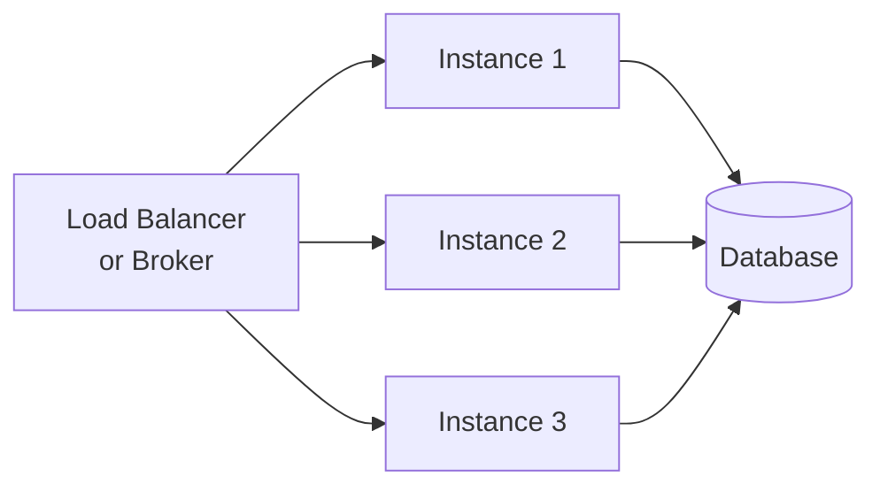

Performance in PURISTA comes from horizontal scaling, not faster code. Because services are stateless and communicate through messages, you scale by adding instances — not by optimizing algorithms.

## The scaling model



- The **broker distributes messages** across service instances
- **No session affinity** required
- **Instances are interchangeable** — start more, stop some, no data loss
- **Scale per service** — User Service needs 3 instances, Email Service needs 1

## Measuring performance

### Latency

Measure end-to-end latency with OpenTelemetry traces:

```typescript [trace.ts]
// Every message is automatically traced
// Check your Jaeger/Tempo/Zipkin dashboard for:
// - event_bridge.route duration
// - command execution duration
// - subscription processing duration
```

### Throughput

Monitor message rates:

```typescript [metrics.ts]
// Messages per second per command/subscription
// Queue backlog depth
// Subscription consumer lag
```

### Resource usage

- CPU per service instance
- Memory per service instance
- Database connection pool utilization
- Broker queue depth

## Common bottlenecks

| Bottleneck | Symptom | Solution |
|---|---|---|
| **Slow database queries** | High command latency | Add indexes, optimize queries, use connection pooling |
| **Single hot command** | One instance overloaded | Scale that service independently |
| **Large payloads** | High serialization cost | Split into smaller messages, use references |
| **Synchronous external calls** | Command blocks for seconds | Use queues for async work |
| **Missing indexes** | Database scans | Add indexes for query patterns |
| **In-memory caching** | State lost on restart | Use Redis state store |

## Optimization strategies

### 1. Scale horizontally

Add instances for the service that needs more capacity:

```yaml [k8s.yaml]
# Scale User Service to 5 replicas
apiVersion: apps/v1
kind: Deployment
metadata:
  name: user-service
spec:
  replicas: 5
```

### 2. Use queues for long work

Don't block commands with slow operations. Declare `.canEnqueue(queueId, payloadSchema)` on the builder to get the typed `context.queue.enqueue.queueId(payload)` helper:

```typescript [queue.ts]
// ❌ Bad: command blocks for minutes
.setCommandFunction(async function (context, payload) {
  await processLargeFile(payload.fileId) // blocks for 5 minutes
})

// ✅ Good: declare enqueue access, then enqueue and return immediately
.canEnqueue('processFile', z.object({ fileId: z.string() }))
.setCommandFunction(async function (context, payload) {
  const job = await context.queue.enqueue.processFile({ fileId: payload.fileId })
  return { jobId: job.id, status: 'queued' }
})
```

### 3. Batch operations

Process multiple items in one command:

```typescript [batch.ts]
.addPayloadSchema(z.object({
  items: z.array(z.object({ id: z.string() })).max(100),
}))
.setCommandFunction(async function (context, payload) {
  const results = await Promise.all(
    payload.items.map(item => processItem(item))
  )
  return { processed: results.length }
})
```

### 4. Cache with state stores

```typescript [cache.ts]
.setCommandFunction(async function (context, payload) {
  const cacheKey = `user:${payload.userId}`
  const cached = await context.states.getState(cacheKey)

  if (cached[cacheKey]) {
    return cached[cacheKey]
  }

  const user = await context.resources.db.getUser(payload.userId)
  await context.states.setState(cacheKey, user)
  return user
})
```

### 5. Tune queue bridge settings

Queue bridges have their own configuration for batch sizes and recovery behavior. Tuning these affects how quickly jobs are claimed and retried after a worker crash.

`RedisQueueBridge` exposes `scheduleBatchSize` (how many scheduled-but-not-yet-due jobs to promote per poll cycle) and `recoveryBatchSize` (how many expired leases to reclaim per cycle):

```typescript [queue-bridge.ts]
import { RedisQueueBridge } from '@purista/redis-queue-bridge'

const queueBridge = new RedisQueueBridge({
  config: { url: process.env.REDIS_URL },
  keyPrefix: 'myapp:queue:',
  scheduleBatchSize: 50,   // jobs promoted from scheduled→pending per poll
  recoveryBatchSize: 20,   // expired leases reclaimed per poll cycle
})
```

`NatsQueueBridge` uses a NATS JetStream KV store. To maximize throughput, run more worker instances rather than tuning the bridge — NATS handles distribution automatically:

```typescript [nats-queue-bridge.ts]
import { NatsQueueBridge } from '@purista/nats-queue-bridge'

const queueBridge = new NatsQueueBridge({
  connectionOptions: { servers: process.env.NATS_URL },
  subjectPrefix: 'myapp',
  releaseBatchSize: 20,  // expired leases released back to pending per cycle
})
```

### 6. Connection pooling

Database and external API connection pools are not managed by PURISTA — configure them in your `resources`. A common pattern is to share a pool across all commands in a service:

```typescript [service-resources.ts]
const pool = new Pool({ connectionString: process.env.DATABASE_URL, max: 20 })

const myService = await myV1Service.getInstance(eventBridge, {
  resources: { db: pool },
})
```

Keep `max` pool size proportional to the number of concurrent jobs per instance — a worker instance handling 10 parallel jobs typically needs 10–20 database connections.

## When to optimize

- Latency exceeds SLA
- Throughput cannot keep up with demand
- Resource costs are too high
- User experience degrades

## When NOT to optimize

- Premature optimization before measuring
- Micro-optimizations that hurt readability
- Optimizing the wrong layer (code vs. infrastructure)

## Common pitfalls

- **Optimizing before measuring.** Profile first. Optimize the bottleneck.
- **Ignoring the broker.** A slow broker affects all services.
- **Over-caching.** Stale cache causes bugs. Use TTL.
- **Blocking the event loop.** Use queues for CPU-intensive work.

## Checklist

- [ ] Latency is measured end-to-end with traces
- [ ] Throughput is monitored per command/subscription
- [ ] Bottlenecks are identified before optimizing
- [ ] Long work uses queues, not blocking commands
- [ ] Caching uses state stores with TTL
- [ ] Scaling is horizontal (more instances) before vertical (bigger instances)
- [ ] Load tests verify performance under realistic conditions
