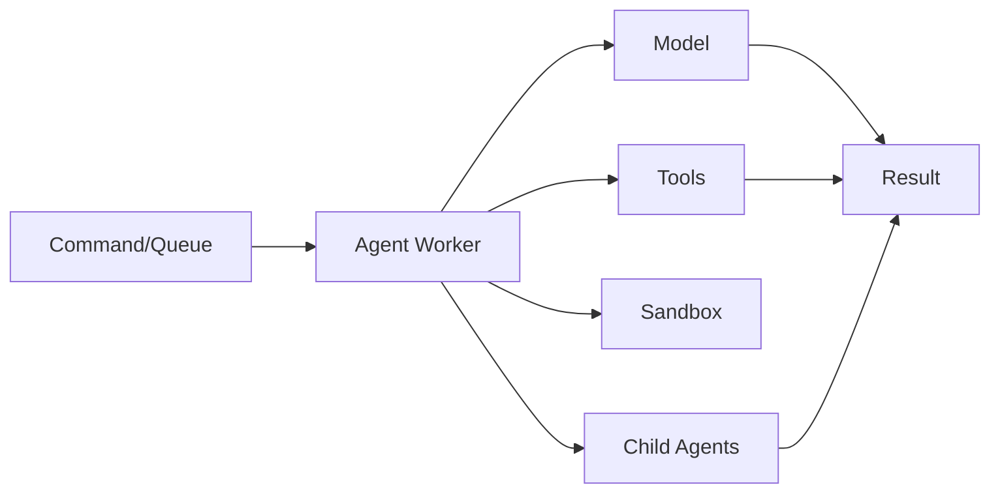

PURISTA AI agents are not chatbots. They are typed, sandboxed, queue-driven workflows that use language models to reason, decide, and act. This guide covers the patterns for building reliable agent systems in production.

## The agent architecture



An agent receives input through a command or queue, reasons with a model, calls tools or child agents, and returns a structured result.

## Pattern 1: Classification agent

The simplest pattern: classify input into categories.

```typescript [classify.ts]
const triageAgent = supportV1ServiceBuilder
  .getAgentQueueBuilder('triage', 'Classify support tickets')
  .addPayloadSchema(z.object({ text: z.string() }))
  .addOutputSchema(z.object({
    priority: z.enum(['low', 'normal', 'high']),
    reason: z.string(),
  }))
  .addModel('primary', {
    capabilities: ['object'],
    defaults: { temperature: 0 },
  })
  .setRunFunction(async context => {
    const result = await context.harness.models.primary.object({
      messages: [{ role: 'user', content: context.payload.text }],
      schema: {
        type: 'object',
        properties: {
          priority: { enum: ['low', 'normal', 'high'] },
          reason: { type: 'string' },
        },
        required: ['priority', 'reason'],
      },
    }, context.signal)

    return result.object
  })
```

## Pattern 2: Tool-use agent

Agents call allowlisted PURISTA commands as tools.

```typescript [tools.ts]
const refundAgent = billingV1ServiceBuilder
  .getAgentQueueBuilder('refund', 'Process refund requests')
  .canInvoke('customer', '1', 'getProfile', {
    payloadSchema: z.object({ customerId: z.string() }),
    outputSchema: z.object({ tier: z.enum(['standard', 'enterprise']) }),
  })
  .canInvoke('billing', '1', 'getOrder', {
    payloadSchema: z.object({ orderId: z.string() }),
    outputSchema: z.object({ amount: z.number(), status: z.string() }),
  })
  .addModel('primary', {
    capabilities: ['object'],
    defaults: { temperature: 0 },
  })
  .setRunFunction(async context => {
    const profile = await context.invoke.tools['customer.1.getProfile'].call({
      customerId: context.payload.customerId,
    })

    const order = await context.invoke.tools['billing.1.getOrder'].call({
      orderId: context.payload.orderId,
    })

    // Model reasoning with tool results
    const result = await context.harness.models.primary.object({
      messages: [{
        role: 'user',
        content: `Customer tier: ${profile.tier}, Order amount: ${order.amount}, Status: ${order.status}. Should we refund?`,
      }],
      schema: {
        type: 'object',
        properties: {
          approved: { type: 'boolean' },
          amount: { type: 'number' },
          reason: { type: 'string' },
        },
        required: ['approved', 'amount', 'reason'],
      },
    }, context.signal)

    return result.object
  })
```

## Pattern 3: Child agent orchestration

Complex workflows use child agents for sub-tasks.

```typescript [child.ts]
const reviewAgent = securityV1ServiceBuilder
  .getAgentQueueBuilder('securityReview', 'Review changes for security risks')
  .addOutputSchema(z.object({
    risk: z.enum(['low', 'medium', 'high']),
    notes: z.array(z.string()),
  }))

const deployAgent = opsV1ServiceBuilder
  .getAgentQueueBuilder('deploy', 'Approve and deploy changes')
  .canInvokeAgent('securityReview', '1', {
    payloadSchema: z.object({ changeSet: z.string() }),
    outputSchema: z.object({ risk: z.enum(['low', 'medium', 'high']) }),
  })
  .setRunFunction(async context => {
    const security = await context.invoke.agents['securityReview.1'].run({
      changeSet: context.payload.changeSet,
    })

    if (security.risk === 'high') {
      return { approved: false, reason: 'High security risk' }
    }

    // Proceed with deployment
    await context.resources.deploy.deploy(context.payload.changeSet)
    return { approved: true, risk: security.risk }
  })
```

## Pattern 4: Sandboxed execution

Choose the agent's sharing policy; select the one service-owned sandbox adapter
at runtime. `private` is the safe per-agent default.

```typescript [sandbox.ts]
.setSandboxPolicy({ sharing: 'private' })
.useBuiltInTools(['read', 'list', 'grep'])
.setRunFunction(async context => {
  // Agent can read files in the sandbox
  const result = await context.harness.models.primary.text({
    messages: [{
      role: 'user',
      content: 'Analyze the codebase in /workspace for security issues',
    }],
  }, context.signal)
})
```

At runtime:

```typescript [runtime.ts]
const supportService = await supportV1Service.getInstance(eventBridge, {
  queueBridge,
  ai: {
    sandbox: inMemorySandbox(),
    models: { primary: { provider, model: 'gpt-4.1', capabilities: ['text'] } },
  },
})
```

Use `ai.sandboxOptions` to declare allowed named groups and to authorize an
explicit shared owner. An agent cannot choose another adapter. A terminal
ephemeral result keeps its idempotent receipt but releases owned compute;
durable workspace files, not a live sandbox process, are the recovery source.

## Pattern 5: Long-running with async response

For slow or expensive agent work:

```typescript [long-running.ts]
.setExecutionProfile('longRunning', {
  maxRuntimeMs: 30 * 60_000,
  strict: true,
})
.setResponseMode('accepted', {
  resultPolicy: 'state-and-event',
  statusUrl: '/jobs/{jobId}',
})
```

Clients receive `202 Accepted` with a job ID. They poll the status URL or subscribe to completion events.

## When to use AI agents

- Classification and triage (support tickets, content moderation)
- Extraction and summarization (documents, logs, conversations)
- Decision support (approvals, risk assessment)
- Code generation and review
- Multi-step reasoning with tool use

## Common pitfalls

- **Broad tool access.** Only allowlist specific commands with typed schemas.
- **No sandbox for untrusted input.** Always sandbox when the model accesses files or executes code.
- **Ignoring cancellation.** Pass `context.signal` to all model calls.
- **Not validating outputs.** Always use `object()` with schemas or validate `text()` outputs.
- **Mixing jobId and runId.** They serve different purposes.

## Checklist

- [ ] Tools and child agents are explicitly allowlisted
- [ ] Sandbox is enabled for file/code access
- [ ] `context.signal` is passed to all model calls
- [ ] Outputs are validated against schemas
- [ ] Long-running work has queue and response policy
- [ ] Agent failures are handled with retries and DLQ
- [ ] Costs and latency are monitored
