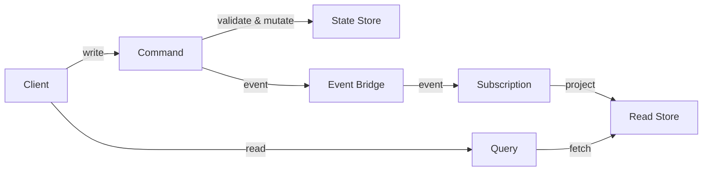

**CQRS** (Command Query Responsibility Segregation) separates the models for reading and writing data. In PURISTA, this is a natural pattern: commands handle writes, and subscriptions build read models from events.

## The separation

| | Commands (Write) | Queries (Read) |
|---|---|---|
| **Model** | Domain model with validation | Optimized read model |
| **Storage** | State store / event store | Search index / cache / materialized view |
| **Consistency** | Strong (within command) | Eventual (via subscription) |
| **Scaling** | Scale command handlers | Scale read replicas independently |



## Example: order system

### Write side (command)

```typescript [write.ts]
const createOrderCommand = orderServiceBuilder
  .getCommandBuilder('createOrder', 'Create a new order')
  .addPayloadSchema(z.object({
    customerId: z.string(),
    items: z.array(z.object({ sku: z.string(), qty: z.number() })),
  }))
  .addOutputSchema(z.object({ orderId: z.string() }))
  .setCommandFunction(async function (context, payload) {
    const orderId = crypto.randomUUID()

    await context.states.setState(`order:${orderId}`, {
      customerId: payload.customerId,
      items: payload.items,
      status: 'created',
    })

    await context.emit('orderCreated', { orderId, customerId: payload.customerId })

    return { orderId }
  })
```

### Read side (subscription + query)

```typescript [read.ts]
// Subscription builds the read model
const orderProjection = queryServiceBuilder
  .getSubscriptionBuilder('orderProjection', 'Build order search index')
  .subscribeToEvent('orderCreated')
  .setSubscriptionFunction(async function (context, payload) {
    await context.resources.searchIndex.index({
      orderId: payload.orderId,
      customerId: payload.customerId,
      status: 'created',
    })
    return { status: 'ack' }
  })

// Query command returns from the read model
const searchOrdersCommand = queryServiceBuilder
  .getCommandBuilder('searchOrders', 'Search orders')
  .addParameterSchema(z.object({ customerId: z.string().optional(), status: z.string().optional() }))
  .setCommandFunction(async function (context, _payload, parameter) {
    return context.resources.searchIndex.search({
      customerId: parameter.customerId,
      status: parameter.status,
    })
  })
```

## When to use CQRS

- Read and write patterns differ significantly
- Read models need to be optimized (search, aggregation, denormalized)
- Different teams own reads vs. writes
- Read scaling needs exceed write scaling
- Event sourcing is already in use

## When NOT to use CQRS

- Simple CRUD with similar read/write patterns
- Small systems where complexity exceeds benefit
- Teams unfamiliar with eventual consistency
- When strong consistency is required for all reads

## Common pitfalls

- **Premature optimization.** Start with a single model. Split when reads and writes genuinely diverge.
- **Ignoring eventual consistency.** Read models may be stale. Design for it.
- **Over-complicating projections.** Not every read needs a separate model.
- **Tight coupling between write and read.** Read models should be rebuildable from events.

## Checklist

- [ ] Write and read models are genuinely different
- [ ] Read models are optimized for query patterns
- [ ] Eventual consistency is acceptable for reads
- [ ] Read models can be rebuilt from events
- [ ] Projection lag is monitored
- [ ] Write and read sides scale independently
