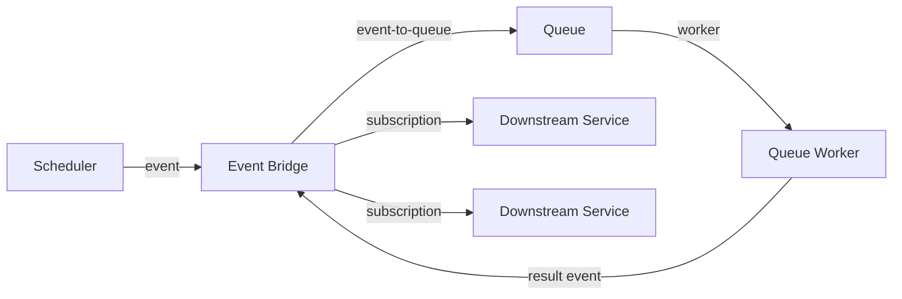
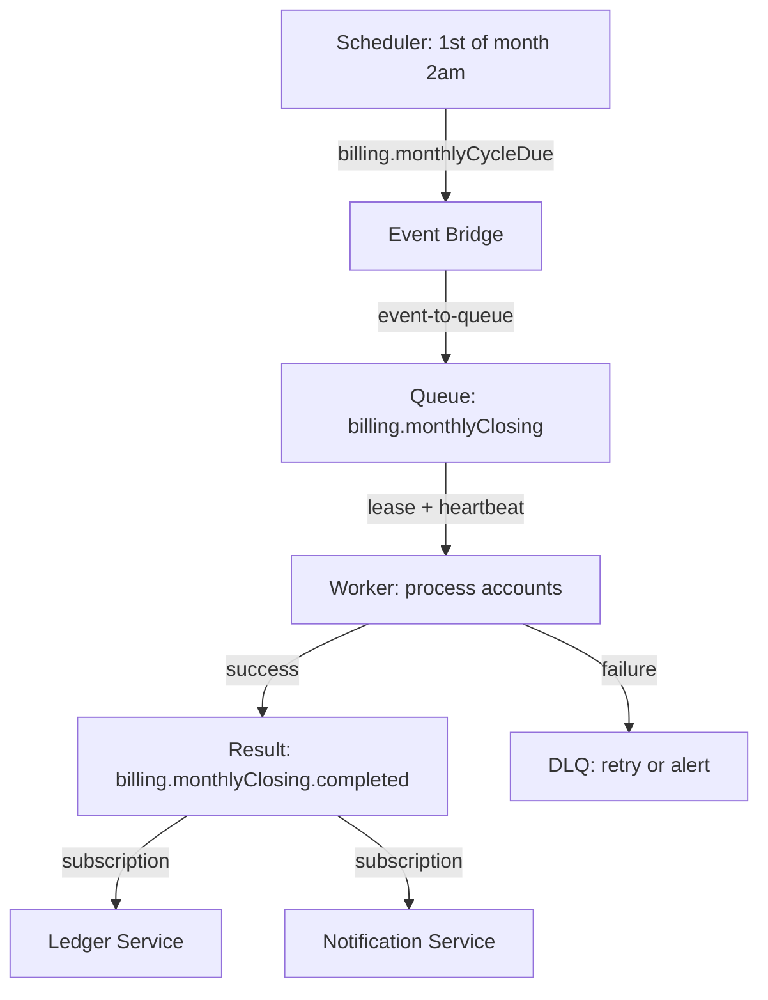

This is the foundational enterprise pattern in PURISTA: a scheduler triggers an event, the event hands off to a queue, a worker processes the job, and a result event notifies downstream services. Each component has a single responsibility and can be replaced independently.



## The flow

| Step | Component | Responsibility |
|---|---|---|
| 1. **Schedule** | External scheduler | Declares when something should happen |
| 2. **Event** | Event bridge | Broadcasts the business fact |
| 3. **Queue** | Queue bridge | Owns lease, retry, heartbeat, DLQ |
| 4. **Worker** | PURISTA queue worker | Executes business logic |
| 5. **Result** | Event bridge | Publishes completion to subscribers |

## Example: monthly billing cycle



### 1. Declare the schedule

```typescript [schedule.ts]
const monthlyBillingSchedule = billingServiceBuilder
  .getScheduleBuilder('monthlyBillingCycle', 'Trigger monthly billing')
  .emitEvent('billing.monthlyCycleDue', {
    expression: { kind: 'cron', value: '0 2 1 * *' },
    timezone: 'Europe/Berlin',
    concurrencyPolicy: 'forbid',
    payloadSchema: z.object({ cycleId: z.string() }),
  })
```

### 2. Subscribe the queue worker to the event

A command bridges the event to the queue — it receives the trigger event, validates the payload, and enqueues the job. The subscription listens for the event and invokes the enqueue command:

```typescript [binding.ts]
// Command that accepts the enqueue request
const enqueueMonthlyClosing = billingServiceBuilder
  .getCommandBuilder('enqueueMonthlyClosing', 'Enqueue monthly closing job')
  .addPayloadSchema(z.object({ cycleId: z.string() }))
  .addOutputSchema(z.object({ jobId: z.string() }))
  .canEnqueue('monthlyClosing', z.object({ cycleId: z.string() }))
  .setCommandFunction(async function (context, payload) {
    const job = await context.queue.enqueue.monthlyClosing(payload)
    return { jobId: job.jobId }
  })

// Subscription reacts to the event and invokes the command
const billingCycleEnqueue = billingServiceBuilder
  .getSubscriptionBuilder('onMonthlyCycleDue', 'React to billing cycle due event')
  .subscribeToEvent('billing.monthlyCycleDue')
  .addPayloadSchema(z.object({ cycleId: z.string() }))
  .canInvoke('BillingService', '1', 'enqueueMonthlyClosing')
  .setSubscriptionFunction(async function (context, payload) {
    await context.service.BillingService['1'].enqueueMonthlyClosing(payload, {})
    return { status: 'ack' }
  })
```

### 3. Queue definition

```typescript [queue.ts]
const monthlyClosingQueue = billingServiceBuilder
  .getQueueBuilder('monthlyClosing', 'Process monthly account closing')
  .addPayloadSchema(z.object({ cycleId: z.string() }))
  .setLifecycleConfig({
    visibilityTimeoutMs: 300_000,
    maxAttempts: 5,
    heartbeatIntervalMs: 60_000,
  })
```

### 4. Queue worker

```typescript [worker.ts]
const monthlyClosingWorker = billingServiceBuilder
  .getQueueWorkerBuilder('monthlyClosing', 'Process monthly closing')
  .setHandler(async function (context, message) {
    const { cycleId } = message.payload

    const accounts = await context.resources.db.getAccountsForCycle(cycleId)

    for (const account of accounts) {
      await processAccount(account)
      await context.job.extendLease(60_000) // extend lease for long-running work
    }

    // Emit result event
    await context.emit('billing.monthlyClosing.completed', {
      cycleId,
      processedCount: accounts.length,
    })

    await context.job.complete()
  })
```

### 5. Downstream subscriptions

```typescript [subscription.ts]
const ledgerSubscription = ledgerServiceBuilder
  .getSubscriptionBuilder('onMonthlyClosing', 'Update ledger')
  .subscribeToEvent('billing.monthlyClosing.completed')
  .setSubscriptionFunction(async function (context, payload) {
    await context.resources.ledger.update(payload.cycleId)
  })
```

## Why this pattern works

- **Decoupled** — scheduler, worker, and subscribers evolve independently
- **Reliable** — queue provides leases, retries, and dead-letter routing
- **Observable** — each step emits traces and structured logs
- **Operator-friendly** — backlogs, retries, and DLQs are visible and manageable
- **Replaceable** — swap the scheduler, broker, or queue backend without code changes

## When to use this pattern

- Scheduled background jobs (billing, reporting, cleanup)
- Multi-step workflows with durability requirements
- Work that needs operator visibility and control
- Processes that span minutes, hours, or days

## Common pitfalls

- **Skipping the queue.** Events alone lack leases and retries. Always use a queue for work that must complete.
- **Not extending leases.** Long jobs fail when leases expire.
- **Missing result events.** Downstream services cannot react if completion is not broadcast.
- **Tight coupling in workers.** Workers should emit events, not call services directly.

## Checklist

- [ ] Schedule is declarative (intent, not implementation)
- [ ] Event-to-queue binding is durable
- [ ] Queue has lifecycle config (lease, retry, DLQ)
- [ ] Worker extends lease for long operations
- [ ] Result event is emitted on completion
- [ ] Downstream subscriptions are decoupled from the worker
- [ ] All steps are traced and logged
