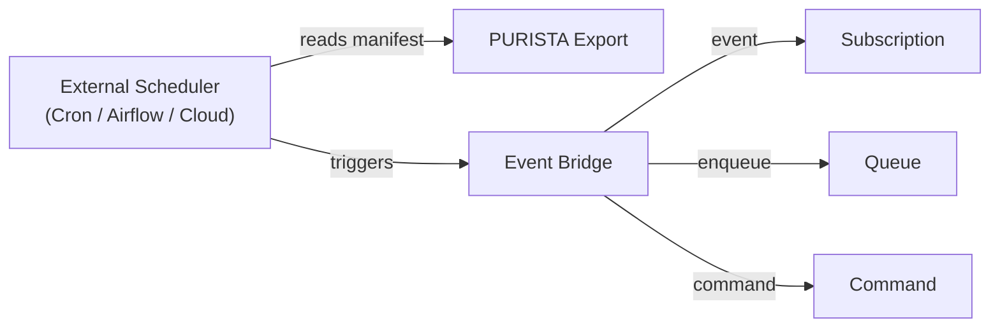

Schedules in PURISTA are **trigger contracts**, not a runtime scheduler. You declare when something should happen. Production scheduling, state management, and missed-run recovery stay with external schedulers (Cron, Airflow, cloud schedulers, or Temporal).

## Declaring a schedule

Use the schedule builder to define when and what to trigger:

```typescript [billingSchedule.ts]
const monthlyBillingSchedule = userServiceV1ServiceBuilder
  .getScheduleBuilder('monthlyBillingCycle', 'Trigger monthly billing on the 1st')
  .emitEvent('billing.monthlyCycleDue', {
    expression: { kind: 'cron', value: '0 2 1 * *' },
    timezone: 'Europe/Berlin',
    concurrencyPolicy: 'forbid',
    missedRunPolicy: 'runOnce',
    idempotencyKey: 'payload.cycleId',
    payloadSchema: z.object({ cycleId: z.string() }),
  })

userServiceV1ServiceBuilder.addScheduleDefinition(monthlyBillingSchedule)
```

## Schedule targets

| Target | Use when | Example |
|---|---|---|
| **Event** | Multiple consumers may react | `billing.monthlyCycleDue` |
| **Queue** | Exactly one durable background task | Monthly report generation |
| **Command** | Short, idempotent logic | Cleanup routine |

Prefer events for business facts — they allow multiple subscribers without coupling.

## Schedule options

| Option | Description | Example |
|---|---|---|
| `expression` | When to trigger (cron or interval) | `{ kind: 'cron', value: '0 2 1 * *' }` |
| `timezone` | Timezone for cron evaluation | `Europe/Berlin` |
| `concurrencyPolicy` | What to do if previous run hasn't finished | `forbid`, `allow`, `replace` |
| `missedRunPolicy` | How to handle missed triggers | `runOnce`, `skip`, `backfill` |
| `idempotencyKey` | Field used for deduplication | `payload.cycleId` |

## Architecture



The scheduler reads the PURISTA schedule manifest (registered automatically at service start) and configures itself. At trigger time, it sends the appropriate message to the event bridge.

## Registering schedules

Schedule registration happens automatically when the service starts. No runtime CLI command is needed. When the service instance starts, it registers all declared schedules with the event bridge, which in turn configures the appropriate external scheduler.

Configure your external scheduler to send the appropriate message to the event bridge at trigger time:

- **AWS EventBridge** — scheduled rules with Lambda targets
- **Google Cloud Scheduler** — cron jobs with Pub/Sub targets
- **Temporal** — scheduled workflows
- **Airflow** — DAGs with HTTP or message triggers

## Local development

For local testing, use the `DefaultEventBridge` with a local runner:

```typescript [local.ts]
import { DefaultEventBridge } from '@purista/core'

const eventBridge = new DefaultEventBridge()
await eventBridge.start()

const userService = await userServiceV1Service.getInstance(eventBridge)
await userService.start()
```

## Design guidelines

- **Keep schedules declarative** — they describe intent, not implementation
- **Use events for business facts** — `billing.cycleDue` not `runBillingJob`
- **Make payloads idempotent** — the same trigger may fire more than once
- **Handle missed runs explicitly** — choose `runOnce` or `backfill` based on business rules

## When to use scheduling

- Periodic background jobs (billing, reporting, cleanup)
- Time-based business rules (promotions, maintenance windows)
- Delayed actions (send reminder after 24 hours)
- Recurring data imports or exports

## Common pitfalls

- **Implementing a scheduler inside PURISTA.** Use external schedulers for production.
- **Non-idempotent payloads.** The same trigger may fire twice. Design for it.
- **Ignoring timezone.** Cron expressions without timezone are ambiguous.
- **Missing concurrency policy.** Without `forbid`, overlapping runs corrupt state.

## Checklist

- [ ] Schedule is declarative (intent, not implementation)
- [ ] Payload is idempotent
- [ ] Timezone is explicit
- [ ] Concurrency policy matches business needs
- [ ] Missed run policy is defined
- [ ] Schedules are registered and verified at service startup
- [ ] External scheduler is configured and monitored
