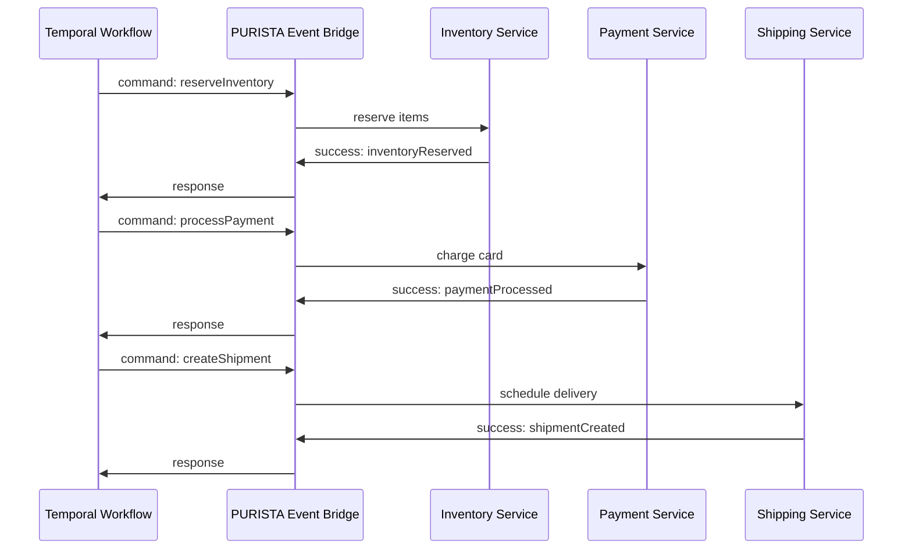
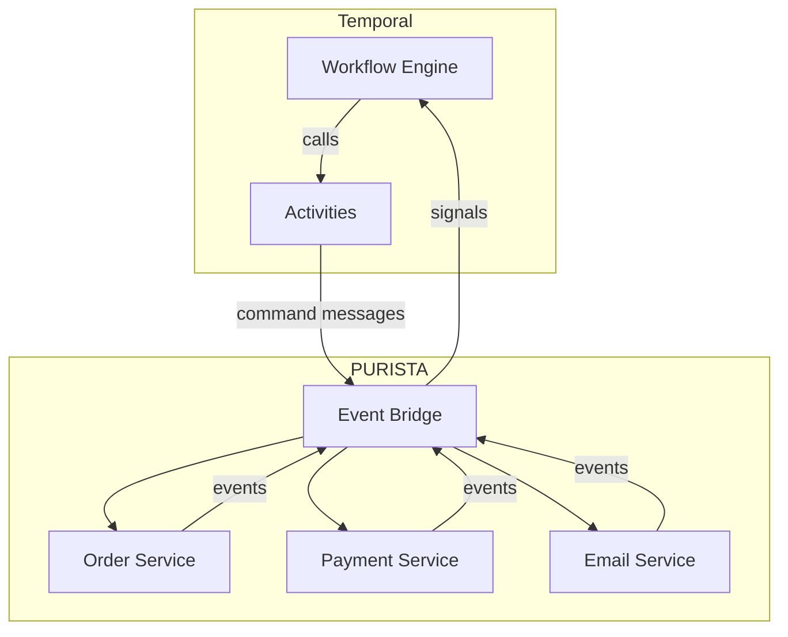

PURISTA excels at building isolated, message-driven business capabilities. Temporal excels at orchestrating long-running, failure-prone processes across those capabilities. Together, they handle the full spectrum from simple commands to complex sagas.

## What each layer does

| Layer | Responsibility | Example |
|---|---|---|
| **PURISTA** | Business logic, type safety, message routing | `createOrder`, `processPayment`, `reserveInventory` |
| **Temporal** | Workflow orchestration, retries, timeouts, compensation | "Reserve inventory, then charge payment, then ship — and undo if anything fails" |



## Why combine them

PURISTA handles immediate request/response and event-driven reactions well. But some business processes span minutes, hours, or days:

- **Order fulfillment** — reserve stock, charge payment, ship, confirm delivery
- **User onboarding** — send email, wait for verification, provision account
- **Billing cycles** — generate invoices, retry failed charges, escalate
- **Approval workflows** — submit request, wait for human approval, execute or reject

Temporal manages the orchestration layer:

- **Retries with backoff** — retry failed activities automatically
- **Timeouts** — fail or compensate when steps take too long
- **Sagas** — undo completed steps when later steps fail
- **Human-in-the-loop** — pause workflows until external signals arrive
- **Observability** — see the full workflow state, history, and pending actions

## Architecture



Temporal activities send PURISTA command messages. PURISTA subscriptions can signal Temporal workflows when events occur.

## When to use Temporal

| Use case | PURISTA alone | PURISTA + Temporal |
|---|---|---|
| Simple CRUD | ✅ | Overkill |
| Event-driven reactions | ✅ | Overkill |
| Multi-step process with retries | ⚠️ | ✅ |
| Human approval required | ❌ | ✅ |
| Saga/compensation pattern | ❌ | ✅ |
| Long-running (hours/days) | ❌ | ✅ |

## Integration pattern

### Temporal activity → PURISTA command

Activities are plain async functions registered with the Temporal worker. Each activity uses the PURISTA event bridge client to invoke a PURISTA command:

```typescript [activities.ts]
// activities.ts — registered with the Temporal Worker
// puristaClient is your event bridge or HTTP client that invokes PURISTA commands
// (e.g., an AmqpBridge or NatsBridge instance, or an HTTP client talking to a PURISTA HTTP endpoint)

export async function reserveInventory(orderId: string): Promise<void> {
  await puristaClient.invoke('InventoryService', '1', 'reserveInventory', { orderId })
}

export async function processPayment(orderId: string): Promise<void> {
  await puristaClient.invoke('PaymentService', '1', 'processPayment', { orderId })
}

export async function createShipment(orderId: string): Promise<void> {
  await puristaClient.invoke('ShippingService', '1', 'createShipment', { orderId })
}
```

```typescript [workflow.ts]
// workflow.ts — Temporal workflow definition
import { proxyActivities } from '@temporalio/workflow'

const { reserveInventory, processPayment, createShipment } = proxyActivities<
  typeof import('./activities')
>({ startToCloseTimeout: '30s' })

export async function orderWorkflow(orderId: string): Promise<void> {
  await reserveInventory(orderId)
  await processPayment(orderId)
  await createShipment(orderId)
}
```

```typescript [worker.ts]
// worker.ts — start the Temporal worker
import { Worker } from '@temporalio/worker'
import * as activities from './activities.js'

const worker = await Worker.create({
  workflowsPath: require.resolve('./workflow'),
  activities,
  taskQueue: 'order-fulfillment',
})
await worker.run()
```

### PURISTA subscription → Temporal signal

A PURISTA subscription can signal a running Temporal workflow using `@temporalio/client`:

```typescript [signal.ts]
import { Client as TemporalClient } from '@temporalio/client'

const temporalClient = new TemporalClient()

const paymentProcessedSub = notificationServiceBuilder
  .getSubscriptionBuilder('onPaymentProcessed', 'Signal Temporal')
  .subscribeToEvent('paymentProcessed')
  .setSubscriptionFunction(async function (context, payload) {
    const handle = temporalClient.workflow.getHandle(payload.orderId)
    await handle.signal('paymentCompleted', { orderId: payload.orderId })
    return { status: 'ack' }
  })
```

## Common pitfalls

- **Using Temporal for simple flows.** PURISTA queues and events handle most workflows.
- **Tight coupling between Temporal and PURISTA.** Use events and commands as the boundary.
- **Ignoring idempotency.** Temporal retries activities. Commands must be idempotent.
- **Not handling signals.** Temporal workflows may need signals from PURISTA events.

## Checklist

- [ ] Workflow is genuinely long-running or complex
- [ ] Temporal activities invoke idempotent PURISTA commands
- [ ] PURISTA events signal Temporal workflows where needed
- [ ] Compensation logic is defined for saga patterns
- [ ] Workflow state is observable in Temporal UI
- [ ] Timeouts and retries are configured per activity
