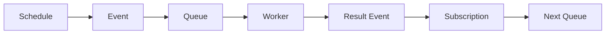
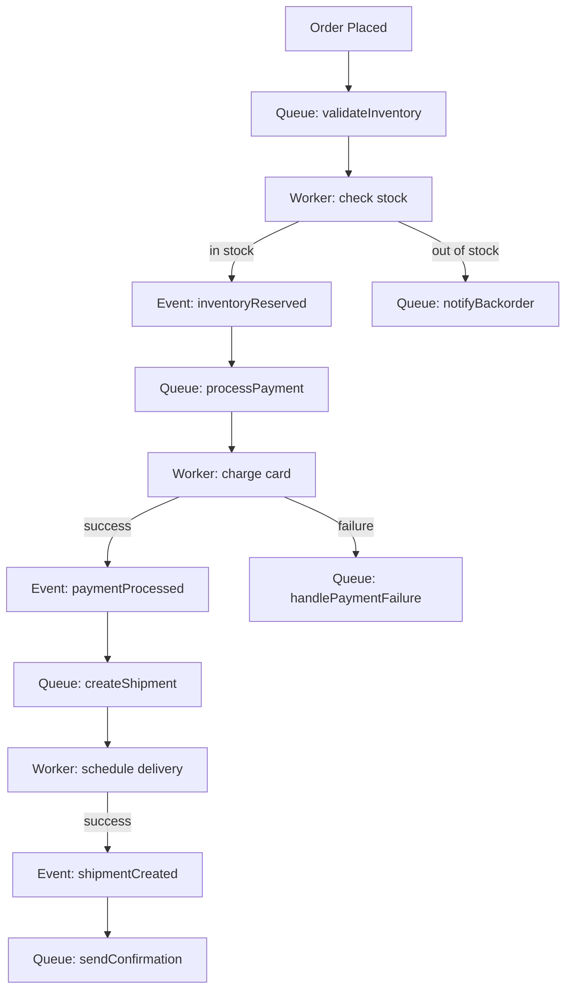

Long-running workflows span minutes, hours, or days. They involve multiple services, human approvals, external callbacks, and failure recovery. PURISTA provides the building blocks; you compose them into workflows that match your business process.

## The workflow building blocks



| Block | Purpose |
|---|---|
| **Schedule** | Trigger the workflow at the right time |
| **Event** | Broadcast that work is needed |
| **Queue** | Own the job with lease, retry, DLQ |
| **Worker** | Execute one step of the workflow |
| **Result event** | Signal completion to next steps |
| **Subscription** | React to result and trigger next step |

## Example: order fulfillment



Each step is a queue worker that:
1. Receives a job
2. Performs one business operation
3. Emits a result event
4. The next step subscribes to that event and enqueues the next job

## Implementing a workflow step

```typescript [validateInventory.ts]
const validateInventoryWorker = orderServiceBuilder
  .getQueueWorkerBuilder('validateInventory', 'Check stock availability')
  .addPayloadSchema(z.object({ orderId: z.string(), items: z.array(z.object({ sku: z.string(), qty: z.number() })) }))
  .setHandler(async function (context, message) {
    const available = await context.resources.inventory.check(message.payload.items)

    if (available) {
      await context.resources.inventory.reserve(message.payload.items)
      await context.emit('inventoryReserved', { orderId: message.payload.orderId })
    } else {
      await context.emit('inventoryUnavailable', { orderId: message.payload.orderId, items: message.payload.items })
    }
  })
```

## State management across steps

Use the state store to track workflow progress:

```typescript [state.ts]
await context.states.setState(`workflow:${payload.orderId}`, {
  step: 'paymentProcessed',
  paymentId: result.id,
  timestamp: Date.now(),
})
```

Query workflow status:

```typescript [status.ts]
const status = await context.states.getState(`workflow:${orderId}`)
```

## Handling failures

Each queue worker has its own retry policy:

```typescript [retry.ts]
.setLifecycleConfig({
  visibilityTimeoutMs: 60_000,
  maxAttempts: 5,
  retryStrategy: {
    initialDelayMs: 5000,
    maxDelayMs: 60_000,
    multiplier: 2,
    jitterFactor: 0.1,
  },
})
```

For saga-style compensation, emit a compensation event:

```typescript [compensation.ts]
.setHandler(async function (context, message) {
  try {
    await processPayment(message.payload)
  } catch (error) {
    // Emit compensation event to undo previous steps
    await context.emit('paymentFailed', { orderId: message.payload.orderId })
    throw error // still go to DLQ for monitoring
  }
})
```

## When to use workflows

- Multi-step business processes (order fulfillment, onboarding)
- Processes with human approval gates
- Long-running operations with external dependencies
- Processes that need audit trails and status tracking

## When NOT to use workflows

- Simple CRUD operations — use commands
- Real-time reactions — use subscriptions
- Background tasks without steps — use a single queue

## Common pitfalls

- **Tight coupling between steps.** Each step should emit events, not call the next step directly.
- **Missing state management.** Without state, you cannot query workflow progress.
- **Not handling timeouts.** External dependencies can hang. Set explicit timeouts.
- **Ignoring compensation.** Failed workflows may need to undo previous steps.

## Checklist

- [ ] Each step is a independent queue worker
- [ ] Steps communicate via events, not direct calls
- [ ] Workflow state is tracked in a state store
- [ ] Each step has retry and DLQ configuration
- [ ] Compensation events are defined for rollback
- [ ] Workflow status can be queried
- [ ] All steps are traced and logged
