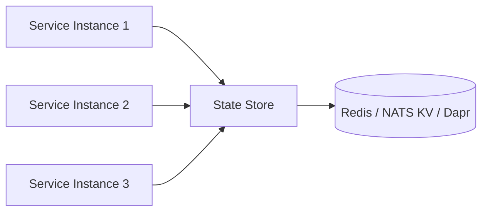

The **state store** is PURISTA's abstraction for business state that must persist across restarts and be shared across service instances. Sessions, counters, job status, rate-limit windows, and cached computations all belong here — never in memory, never on the service instance.

## State store vs. config store vs. secret store

PURISTA ships three distinct store abstractions. Use this table to pick the right one:

| | State store | Config store | Secret store |
|---|---|---|---|
| **Purpose** | Runtime business state | Non-sensitive configuration | Sensitive credentials |
| **Examples** | Sessions, counters, job status | Feature flags, API URLs | Passwords, tokens, certificates |
| **Confidential** | Sometimes | No | Yes |
| **Changed by handlers** | Yes | Yes | Rarely |
| **Set at startup** | No | No | No (fetched on demand) |
| **Persistent** | Yes (with Redis/NATS) | Yes (external store) | Yes (managed by provider) |

If the data is a credential → use a [secret store](/handbook/stores/secret-store/).  
If the data is configuration that operators tune → use a [config store](/handbook/stores/config-store/).  
If the data is business state your handlers read and write → use a state store.

## Why externalize state

PURISTA services are stateless. This means:

- Any instance can handle any request
- Scaling is horizontal (add instances, not faster code)
- Restarting a service does not lose data
- Failover is instant — no session affinity needed



## Usage

Pass a state store when creating the service instance:

```typescript [main.ts]
import { RedisStateStore } from '@purista/redis-state-store'

const stateStore = new RedisStateStore({ url: process.env.REDIS_URL })

const userService = await userServiceV1Service.getInstance(eventBridge, {
  stateStore,
})
await userService.start()
```

Access from commands and subscriptions:

```typescript [command.ts]
.setCommandFunction(async function (context, payload) {
  // Get one or more state values
  const state = await context.states.getState('session:abc123', 'counter:requests')

  // state['session:abc123'] — any JSON-serializable value
  // state['counter:requests'] — any JSON-serializable value

  // Set a state value
  await context.states.setState('session:abc123', { userId: 'user-456', cart: [] })

  // Increment a counter
  const current = await context.states.getState('counter:requests')
  await context.states.setState('counter:requests', (current['counter:requests'] || 0) + 1)

  // Remove a state value
  await context.states.removeState('session:abc123')
})
```

## Validate state reads

State stores return `unknown` values. Validate them for type safety:

```typescript [validated.ts]
import { z } from 'zod'

const sessionSchema = z.object({
  userId: z.string(),
  cart: z.array(z.object({ productId: z.string(), qty: z.number() })),
})

.setCommandFunction(async function (context, payload) {
  const raw = await context.states.getState(`session:${payload.sessionId}`)
  const session = sessionSchema.parse(raw[`session:${payload.sessionId}`])

  // session is now fully typed
  const itemCount = session.cart.reduce((sum, item) => sum + item.qty, 0)
})
```

## Official adapters

| Package | Backend | Best for |
|---|---|---|
| `@purista/core` | In-memory | Development, testing |
| `@purista/redis-state-store` | Redis | Production sessions, counters, caches |
| `@purista/nats-state-store` | NATS KV | NATS-first platforms |
| `@purista/dapr-sdk` | Dapr state store | Polyglot, service-mesh environments |

## Default state store

For local development:

```typescript [default.ts]
import { DefaultStateStore } from '@purista/core'

const stateStore = new DefaultStateStore({
  enableGet: true,
  enableSet: true,
  enableRemove: true,
})
```

## Custom state store

Extend `StateStoreBaseClass` to build your own:

```typescript [custom.ts]
import { StateStoreBaseClass, StoreBaseConfig } from '@purista/core'

type MyStateConfig = { url: string }

export class MyStateStore extends StateStoreBaseClass<MyStateConfig> {
  private client

  constructor(config: StoreBaseConfig<MyStateConfig>) {
    super('MyStateStore', config)
    this.client = customClient.connect(this.config.config.url)
  }

  protected async getStateImpl<Names extends string[]>(...names: Names) {
    const result: Record<string, unknown> = {}
    for (const name of names) {
      const value = await this.client.get(name)
      result[name] = value ? JSON.parse(value) : undefined
    }
    return result as any
  }

  protected async setStateImpl(name: string, value: unknown) {
    await this.client.set(name, JSON.stringify(value))
  }

  protected async removeStateImpl(name: string) {
    await this.client.del(name)
  }

  async destroy() {
    await this.client.disconnect()
    super.destroy()
  }
}
```

## State patterns

### Sessions

```typescript [session.ts]
await context.states.setState(`session:${sessionId}`, {
  userId,
  createdAt: Date.now(),
})

const session = await context.states.getState(`session:${sessionId}`)
```

### Rate limiting

```typescript [rate-limit.ts]
const key = `rateLimit:${context.message.principalId}:${commandName}`
const current = await context.states.getState(key)
const count = (current[key]?.count || 0) + 1

if (count > 100) {
  throw new HandledError(StatusCode.TooManyRequests, 'Rate limit exceeded')
}

await context.states.setState(key, { count, windowStart: Date.now() })
```

### Job status

```typescript [job-status.ts]
await context.states.setState(`job:${jobId}`, {
  status: 'processing',
  startedAt: Date.now(),
  workerId: context.message.instanceId,
})
```

## When to use state stores

- User sessions that persist across requests
- Rate-limit counters
- Job status and progress tracking
- Distributed locks and leader election
- Cached computations shared across instances
- Any data that must survive service restarts

## Common pitfalls

- **In-memory state in production.** `DefaultStateStore` is in-memory and loses data on restart. Use Redis or NATS in production.
- **Not validating reads.** State stores return `unknown`. Always parse and validate.
- **Large state values.** State stores are key-value, not document databases. Keep values small and JSON-serializable.
- **Ignoring TTL.** Many backends support TTL. Use it for sessions and rate limits to prevent unbounded growth.
- **Using state for cross-service communication.** State stores are for persistence, not messaging. Use commands and events for communication.

## Checklist

- [ ] Production uses a persistent state store (Redis, NATS KV, Dapr)
- [ ] State reads are validated with Zod schemas
- [ ] Values are JSON-serializable and reasonably sized
- [ ] TTL is configured for ephemeral data (sessions, rate limits)
- [ ] No business logic depends on in-memory state
- [ ] Integration tests cover the concrete provider behavior
