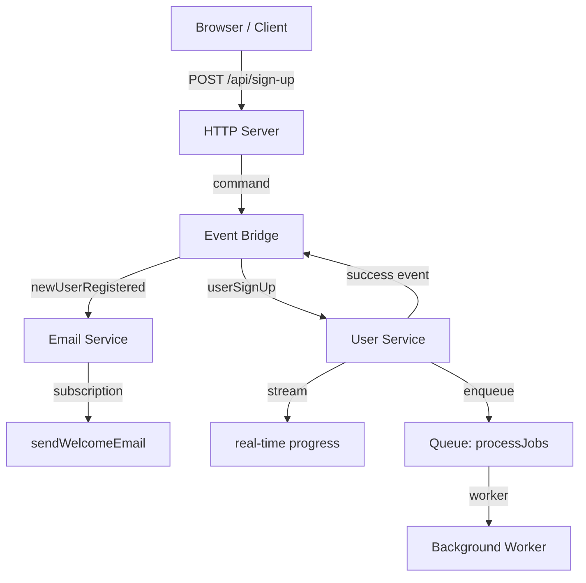

# PURISTA Quickstart

In this guide you will scaffold a project, create a service, and build synchronous and asynchronous business flows. By the end you will have a running application with a command, a subscription, a stream, and a queue-powered background worker.

## What you will build

| Artifact | What it does | Pattern |
|---|---|---|
| `userSignUp` **command** | Registers a user and returns a user ID | Request/response |
| `sendWelcomeEmail` **subscription** | Sends an email when a user is created | Event-driven |
| `userSearch` **stream** | Returns incremental results over SSE | Live updates |
| `processJobs` **queue + worker** | Handles background tasks asynchronously | Pull-based async |

## Requirements

- [Node.js](https://nodejs.org/) LTS (or [Bun](https://bun.sh/))
- A code editor (VS Code, Zed, or similar)
- A terminal
- Optional for existing projects: [install the PURISTA AI skill](../install-ai-skill.md). New projects include agent guidance and PURISTA skill links by default.

## The steps

| Step | Action | Time |
|---|---|---|
| 1 | [Set up the project](./setup-the-purista-project.md) | 2 min |
| 2 | [Create a service](./create-a-service.md) | 2 min |
| 3 | [Add your first command](./add-the-first-command.md) | 3 min |
| 4 | [Add your first subscription](./add-the-first-subscription.md) | 3 min |

After the core flow, explore streams, queues, and HTTP exposure in the [Building Business Logic](../2_building_business-logic/index.md) section.

## Recommended reading order

1. **Quickstart** (this section) — get something running
2. **[Concept](../concept.md)** — understand the mental model
3. **[Building Business Logic](../2_building_business-logic/index.md)** — deep dive into builders, schemas, and patterns
4. **[From Zero to Production](../from-zero-to-production.md)** — plan your deployment path

## Before you start

PURISTA is a message-driven framework. If you are coming from Express, Fastify, or NestJS, the mental shift is:

| Traditional | PURISTA |
|---|---|
| HTTP handler calls service directly | HTTP server sends a **command message** |
| Services import each other | Services are **decoupled**; they send messages |
| State in memory | State in **external stores** |
| Scaling means faster code | Scaling means **more instances** |

This pays off in observability, testability, and deployment flexibility. Let's build something.
