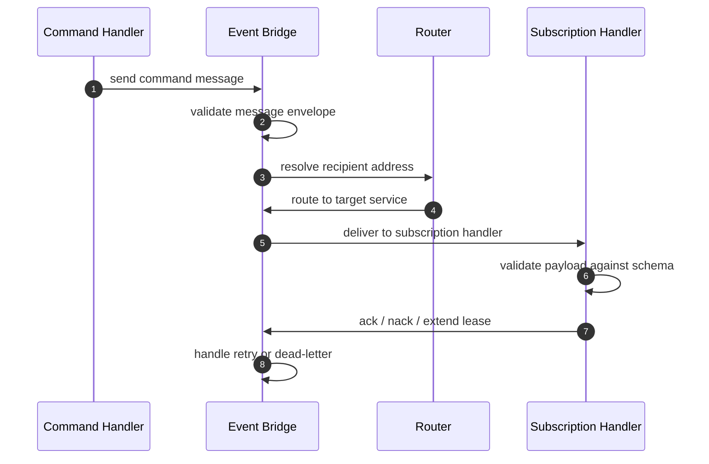

# Advanced Topics

This section covers how PURISTA works under the hood. Read this when you need to debug cross-service routing, configure production delivery guarantees, or understand message protocol internals.

## Topics

| Topic | What it covers | When you need it |
|---|---|---|
| [Structure of a Message](./structure_of_a_message.md) | Fields, headers, addressing, and metadata in every PURISTA message | Debugging routing, building custom bridges, or inspecting traces |
| [Queue Internals & Delivery Tuning](./queues.md) | Leases, heartbeats, retries, dead-letter queues, lifecycle config | Running production queue workers with bounded retries |
| [Delivery Semantics & Reliability](./delivery-semantics-and-reliability.md) | At-most-once vs at-least-once, idempotency, strict mode | Defining production delivery expectations and failure handling |

## Message flow internals

Understanding this flow helps when:

- Messages are not arriving at expected subscriptions
- Retry behavior differs from expectations
- You need to build custom event bridge adapters

## Production operating patterns

### Delivery semantics

| Guarantee | Behavior | When to use |
|---|---|---|
| At-most-once | Message may be lost on failure | Telemetry, metrics, non-critical events |
| At-least-once | Message delivered one or more times | Business events, commands, most use cases |
| Exactly-once | Not guaranteed end-to-end; design for idempotency | Financial transactions, inventory changes |

### Idempotency checklist

- [ ] Command handlers produce the same result for the same input
- [ ] Subscription handlers tolerate duplicate events
- [ ] Side effects (DB writes, API calls) use idempotency keys
- [ ] Queue workers check job state before processing

### Strict mode

Enable `strict: true` on commands and subscriptions to fail startup when the active bridge cannot honor requested delivery semantics. This prevents silent degradation in production.

## When to read this section

- You debug cross-service routing and message metadata
- You define production delivery/retry expectations
- You need stronger observability and operational safety controls
- You build custom event bridge or queue bridge adapters

Next: [Structure of a Message](./structure_of_a_message.md) to understand the message envelope.
