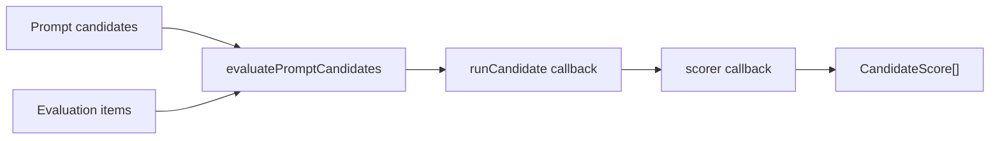

# Evaluating prompts

Use the harness eval helpers when you need a small, local, provider-neutral way to compare prompt variants against the same input set. The helpers run inside your process. They do not create a service, persist datasets, manage prompt versions, run optimizers, or provide an experiment UI.

## When to use it

Use `evaluatePromptCandidates(...)` for:

- comparing two or more prompt strings against a fixed set of examples
- running deterministic checks in unit or CI tests
- building an application-owned workflow that records eval results elsewhere
- validating scorer definitions before wiring a product-specific eval layer

Do not use it as a full eval platform. Dataset storage, experiment runs, prompt versioning, annotation queues, optimization loops, dashboards, and regression gate CLIs belong in your application or product layer.

If you want that product layer, use [CloudGrid AI Evaluation](https://cloudgrid.dev/features/ai-evaluation/). CloudGrid keeps datasets, evaluation runs, row-level score records, comparisons, optimization candidates, and trace-backed evidence in the same observability project while the Harness helpers stay the local inner loop.

## Execution model



The helper evaluates candidates in input order, then items in input order. It passes each candidate/item pair to your `runCandidate` callback, passes the returned output to your `scorer`, aggregates the scores, and returns sorted candidate summaries.

Sorting is deterministic:

1. `meanScore` descending
2. `passRate` descending
3. `candidateId` ascending

## Minimal example

```ts
import {
  evaluateDeterministicScorer,
  evaluatePromptCandidates
} from '@purista/ai-harness'

const abort = new AbortController()

async function runYourAgentOrModel(
  prompt: string,
  input: unknown
): Promise<{ answer: string }> {
  return { answer: `${prompt} ${JSON.stringify(input)} change freeze` }
}

const scores = await evaluatePromptCandidates({
  candidates: [
    { id: 'brief', prompt: 'Answer in one short paragraph.' },
    { id: 'detailed', prompt: 'Answer with details and citations.' }
  ],
  items: [
    {
      id: 'policy-1',
      input: { question: 'Can I deploy on Friday?' },
      expected: 'change freeze'
    }
  ],
  signal: abort.signal,
  runCandidate: async (candidate, item, signal) => {
    signal.throwIfAborted()
    return runYourAgentOrModel(candidate.prompt, item.input)
  },
  scorer: async (target) => evaluateDeterministicScorer({
    type: 'contains',
    path: '/answer',
    value: String(target.expected),
    caseInsensitive: true
  }, target)
})
```

`runCandidate` is application code. It can call a harness session, a model handle, a fake provider, or a fixture. The eval helper does not know about model providers or sessions by itself.

## Candidate and item shape

```ts
interface PromptCandidate<I = unknown> {
  id: string
  prompt: string
  metadata?: Record<string, JsonValue>
}

interface EvaluationItem<I = unknown> {
  id: string
  input: I
  expected?: unknown
  context?: unknown[]
}
```

Use stable `id` values. They are part of deterministic sorting and are what you will store in your own result records if you persist scores.

## Scoring

A scorer receives:

```ts
interface ScorerTarget {
  input: unknown
  output: unknown
  expected?: unknown
  context?: unknown[]
}
```

It returns:

```ts
interface ScorerResult {
  score: number
  passed: boolean
  evidence?: JsonValue
}
```

The built-in deterministic scorer helper supports these definitions:

| Type | What it checks |
| --- | --- |
| `contains` | JSON Pointer selected output contains a string. |
| `regex` | JSON Pointer selected output matches a regular expression. |
| `attribute-equality` | Two JSON Pointer selected output values are deeply equal. |
| `json-schema` | Output matches the supported JSON Schema subset. |

Pointers are JSON Pointer paths, not JSONPath. For example, `/answer` selects `output.answer`, and `/items/0/title` selects the first item title.

When a pointer is missing, the helper returns a failed score with `evidence.reason = 'missing_pointer'`; it does not throw.

## JSON Schema subset

The `json-schema` scorer is intentionally small and deterministic. It supports:

- `type`: `object`, `array`, `string`, `number`, `integer`, `boolean`, `null`
- `const`
- `enum`
- object `properties`
- object `required`
- `additionalProperties: false`

Unsupported JSON Schema keywords are ignored. Do not rely on `$ref`, `oneOf`, `anyOf`, `allOf`, `format`, numeric bounds, string patterns, array item schemas, or draft-specific behavior.

## Cancellation

`evaluatePromptCandidates(...)` requires an `AbortSignal`. It checks the signal before scheduling each candidate/item pair and passes the same signal into both callbacks. Your callbacks should call `signal.throwIfAborted()` before expensive work and pass the signal into any model/tool calls they make.

## Privacy and persistence

The eval helpers do not persist anything. They return aggregate scores only. They do not emit prompt, input, expected output, context, or model output content to telemetry in v1 core.

If you need per-item score records, datasets, prompt versions, human labels, or experiment history, store those in your application layer.

## Testing scorers

Use the testing subpath to validate deterministic scorer definitions before running expensive prompt comparisons:

```ts
import { evaluateDeterministicScorer } from '@purista/ai-harness/testing'

await expect(evaluateDeterministicScorer({
  type: 'contains',
  path: '/answer',
  value: 'policy'
}, {
  candidateId: 'candidate-a',
  itemId: 'item-1',
  output: { answer: 'The policy allows it.' }
})).resolves.toMatchObject({ score: 1, passed: true })
```

## Common pitfalls

- Do not expect multiple scorers per candidate from `evaluatePromptCandidates`. Compose multiple checks inside your `scorer` callback if you need that shape.
- Do not pass unstable random ids if you want reproducible sorting.
- Do not treat `json-schema` as a full JSON Schema validator.
- Do not put product-specific experiment state into the harness core; keep it in your product adapter or application workflow.

## Checklist

- candidates and items have stable ids
- `runCandidate` handles cancellation via `signal`
- scorer returns `{ score, passed }` for every target
- JSON Pointer paths are correct for your output shape
- eval results are persisted in your application layer if needed
- scorer behavior is validated with `@purista/ai-harness/testing` before use
