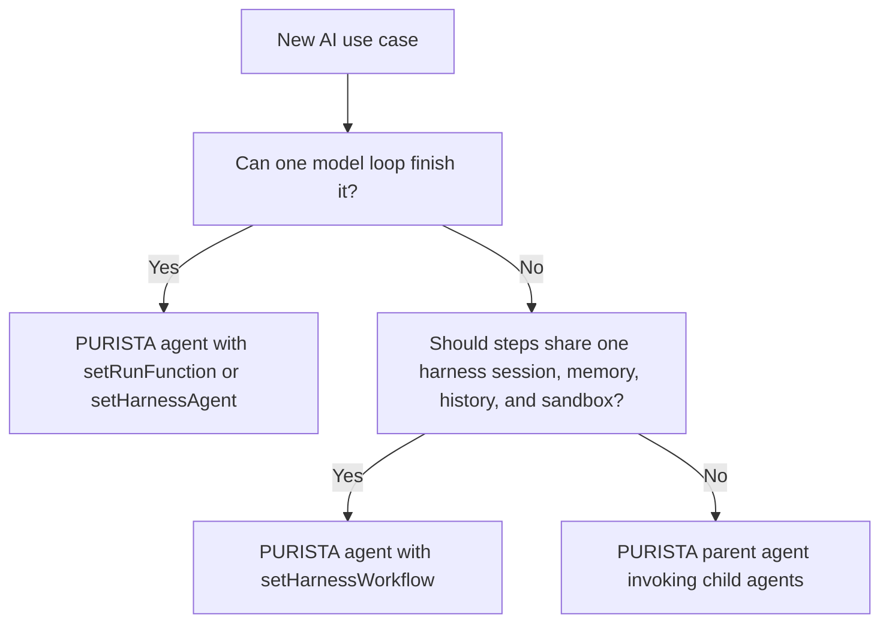
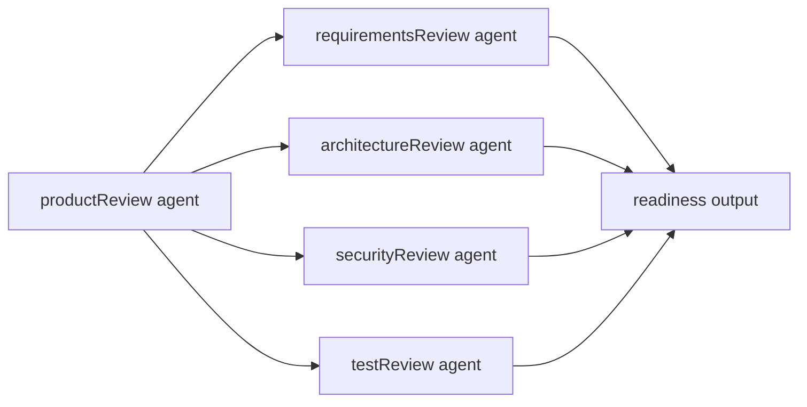

# Harness agents and workflows

`@purista/harness` integrates behind a PURISTA service boundary through `@purista/core`. The harness provides lower-level agent loops, workflows, model providers, tools, skills, memory, history, state, sandboxing, telemetry, and streaming events.

The PURISTA package exposes those capabilities as queue-backed business logic.

## Choose the orchestration level



| Pattern | Best for | Tradeoff |
| --- | --- | --- |
| `setRunFunction(...)` | Most PURISTA application agents. You need typed access to PURISTA resources, command tools, child agents, model aliases, and events. | You own the orchestration code directly. |
| `setHarnessAgent(...)` | Reusing one harness agent loop with instructions, tools, skills, and output schema. | One harness agent is exposed as one PURISTA agent. |
| `setHarnessWorkflow(...)` | Several tightly coupled harness agents should run inside one session and sandbox instance. | Inner agents are harness-local, not independent PURISTA queue-backed agents. |
| Parent PURISTA agent + `canInvokeAgent(...)` | Larger workflows where each agent needs its own queue, model binding, sandbox, retry policy, stream, or service owner. | More explicit service contracts and operational boundaries. |

## Harness agent

A harness agent is one typed model conversation loop. It prepares instructions, calls a model, handles tool calls, feeds results back into the model, validates output, and emits run events.

```ts
import { z } from 'zod'

const ticketClassifier = {
  model: 'primary',
  input: z.object({
    ticketId: z.string(),
    text: z.string(),
  }),
  output: z.object({
    priority: z.enum(['low', 'normal', 'high']),
    reason: z.string(),
  }),
  builtinTools: false,
  instructions: 'Classify the ticket. Return a structured result only.',
}

const triageAgent = await supportV1ServiceBuilder
  .getAgentQueueBuilder('triage', 'Classifies tickets')
  .addPayloadSchema(ticketClassifier.input)
  .addOutputSchema(ticketClassifier.output)
  .addModel('primary', {
    model: 'support-fast',
    capabilities: ['object'],
  })
  .setHarnessAgent(ticketClassifier)
  .getDefinition()
```

Use this shape when the harness loop is exactly the behavior you want and the agent does not need custom PURISTA orchestration code.

## Harness workflow

A harness workflow coordinates one or more harness agents inside the same harness session and sandbox instance.

This is useful when the steps are one tightly coupled AI run:

- research, then synthesize, then judge using the same mounted workspace
- extract facts, assess risk, and draft a report from the same incident bundle
- call several specialized harness agents that should share memory/history
- run a review loop where all steps belong to one AI session

```ts
const factExtractor = {
  model: 'primary',
  input: z.object({ text: z.string() }),
  output: z.object({ facts: z.array(z.string()) }),
  builtinTools: false,
  instructions: 'Extract factual statements.',
}

const riskAssessor = {
  model: 'primary',
  input: z.object({ facts: z.array(z.string()) }),
  output: z.object({
    risk: z.enum(['low', 'medium', 'high']),
    reasons: z.array(z.string()),
  }),
  builtinTools: false,
  instructions: 'Assess operational risk from the facts.',
}

const incidentReviewWorkflow = {
  input: z.object({ text: z.string() }),
  output: z.object({
    facts: z.array(z.string()),
    risk: z.enum(['low', 'medium', 'high']),
    reasons: z.array(z.string()),
  }),
  handler: async ctx => {
    const facts = await ctx.agents.factExtractor({ text: ctx.input.text })
    const risk = await ctx.agents.riskAssessor({ facts: facts.facts })

    return {
      facts: facts.facts,
      risk: risk.risk,
      reasons: risk.reasons,
    }
  },
}

const reviewAgent = await incidentService
  .getAgentQueueBuilder('incidentReview', 'Reviews an incident bundle')
  .addPayloadSchema(incidentReviewWorkflow.input)
  .addOutputSchema(incidentReviewWorkflow.output)
  .addModel('primary', {
    model: 'incident-reasoning',
    capabilities: ['object', 'tool_use'],
  })
  .setHarnessWorkflow(incidentReviewWorkflow, {
    agents: {
      factExtractor,
      riskAssessor,
    },
  })
  .getDefinition()
```

All inner harness agents passed to `setHarnessWorkflow(..., { agents })` share the harness runtime for that attached PURISTA agent. That means shared session identity, memory, history, sandbox adapter, state store, logger, telemetry, durable runtime, workspace store, governance config, and model bindings.

Local durable execution is a harness runtime concern. When enabled, the runtime writes checkpoint and lease records for the workflow inside your application boundary, so a restarted process can resume from the last committed step instead of replaying the whole run from scratch.

When durable workspace replay is enabled on the attached PURISTA agent, the
inner harness workflow also shares one durable workspace boundary. Use this
when retrying the parent run should resume from committed workspace state for
all inner harness agents.

For local-first deployments, start with the harness local durable execution
bundle. It keeps the service code small while still using the same adapter
ports you can later replace with Postgres, object storage, containers, or
remote workers.

```ts
import { localDurableExecution } from '@purista/harness'

const local = localDurableExecution({
  root: './.purista-harness',
  exec: false,
  policy: {
    retention: { cleanupMode: 'manual_only' },
  },
})

const harness = defineHarness({ name: 'incident-review' })
  .state(local.state)
  .runtime(local.runtime)
  .sandbox(local.sandbox)
  .workspaceStore(local.workspaceStore)
  .checkpoints(local.checkpoints)
  .build()
```

Inside a harness workflow, use `ctx.checkpoints` for application-level JSON
snapshots such as extracted facts, cursor positions, and reviewed decisions.
Use durable workspace checkpoints for files. Keep external writes idempotent
and checkpoint after the write result is safely recorded.

Model retry stays on the harness model alias, not inside the workflow handler.
Use `retry: true` for the default short active retry policy, a policy object
for tighter budgets, or `retry: false` for strict paths and tests.

```ts
models: {
  primary: {
    provider,
    model: 'gpt-4.1-mini',
    capabilities: ['object', 'tool_use'],
    retry: {
      maxAttempts: 3,
      maxActiveElapsedMs: 60_000,
      maxActiveDelayMs: 20_000,
    },
  },
}
```

The harness normalizes provider rate limits and transient outages into
`ModelError` metadata. Short waits are retried within the active model call
budget. Long provider `Retry-After` windows are returned as deferred retry
metadata so the PURISTA queue, worker, or workflow policy can decide whether
to schedule a later run instead of blocking a handler for minutes or hours.

Harness governance also stays on the shared harness runtime. Configure
`ai.governance` at service instantiation when the workflow needs policy-driven
tool exposure, approval, or audit across its inner harness agents. Keep
business authorization at the PURISTA service boundary.

## PURISTA-level orchestration

Use PURISTA orchestration when the agents are independent business capabilities.



```ts
const productReviewAgent = await reviewService
  .getAgentQueueBuilder('productReview', 'Combines specialized review agents')
  .addPayloadSchema(z.object({
    specMarkdown: z.string(),
    architectureMarkdown: z.string(),
    diffSummary: z.string(),
  }))
  .addOutputSchema(z.object({
    ready: z.boolean(),
    blockers: z.array(z.string()),
    reviews: z.object({
      requirements: z.unknown(),
      architecture: z.unknown(),
      security: z.unknown(),
      tests: z.unknown(),
    }),
  }))
  .canInvokeAgent('requirementsReview', '1')
  .canInvokeAgent('architectureReview', '1')
  .canInvokeAgent('securityReview', '1')
  .canInvokeAgent('testReview', '1')
  .setRunFunction(async context => {
    const [requirements, architecture, security, tests] = await Promise.all([
      context.invoke.agents['requirementsReview.1'].run({
        specMarkdown: context.payload.specMarkdown,
      }),
      context.invoke.agents['architectureReview.1'].run({
        architectureMarkdown: context.payload.architectureMarkdown,
      }),
      context.invoke.agents['securityReview.1'].run({
        diffSummary: context.payload.diffSummary,
      }),
      context.invoke.agents['testReview.1'].run({
        diffSummary: context.payload.diffSummary,
      }),
    ])

    const blockers = [
      ...extractBlockers(requirements),
      ...extractBlockers(architecture),
      ...extractBlockers(security),
      ...extractBlockers(tests),
    ]

    return {
      ready: blockers.length === 0,
      blockers,
      reviews: { requirements, architecture, security, tests },
    }
  })
  .getDefinition()
```

Each child agent is a real PURISTA command/queue/stream capability. It can run with a different model provider, queue bridge behavior, sandbox adapter, timeout, retry policy, and HTTP exposure.

## Same sandbox or independent sandbox?

Use the same harness workflow sandbox when:

- several inner harness agents need the same temporary files or mounted skills
- the work is one user run and should share memory/history
- intermediate state should not become a public service contract
- retrying the whole run is acceptable
- durable replay should restore one shared workspace for the whole harness
  workflow

Use independent PURISTA agents when:

- each step has a business owner
- each step needs separate retry or dead-letter behavior
- each step should be observable as its own queue-backed capability
- a child result should be reusable by other services
- sandbox isolation matters because one step can mutate or execute code
- parallel execution should not contend on one harness session
- each step needs independent durable workspace retention, cleanup, quota, or
  encryption policy

## Real-world pattern: research report

1. A `researchReport` PURISTA agent receives the request and creates a run.
2. It invokes independent `sourceDiscovery`, `evidenceExtraction`, and `riskReview` PURISTA agents in parallel.
3. Each child agent uses its own queue and sandbox because each may call different tools or providers.
4. The parent agent validates child outputs and runs deterministic policy checks.
5. The parent invokes one wrapped harness workflow for final writing and self-review inside one shared sandbox.
6. The generated command returns a final report or a queued `jobId`, depending on response mode.

This combination is the full power of the stack: harness workflows for tightly coupled AI reasoning, PURISTA orchestration for independent service capabilities.

## Checklist

- choose harness workflow only when shared session/sandbox is intentional
- choose PURISTA child agents when operational independence matters
- keep every boundary schema explicit
- keep deterministic writes behind PURISTA commands
- keep model/provider/sandbox/runtime bindings outside service definitions
