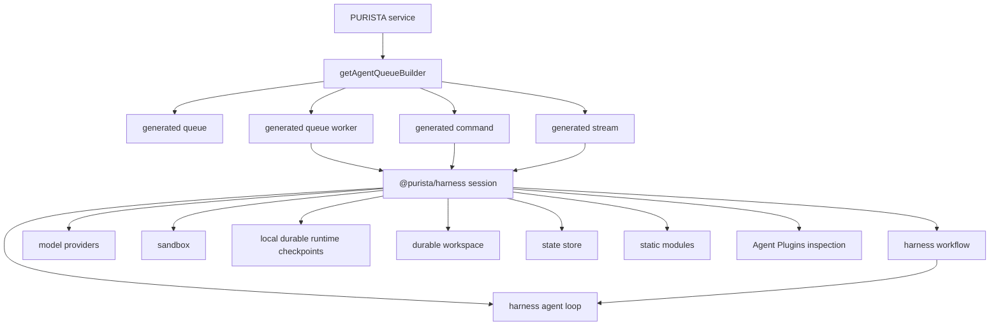

# AI agents

AI agent capabilities are part of `@purista/core`. Use `getAgentQueueBuilder` on `ServiceBuilder` to attach a queue-backed agent, and install the concrete model provider packages your application needs.

Use an AI agent when a service capability is model-driven, conversational, tool-loop oriented, or needs provider operations such as structured generation, embeddings, reranking, or multimodal input.

An attached PURISTA agent expands into normal PURISTA business-logic artifacts:

- a [queue](../queue/index.md) for controlled execution, retry, leases, and dead-letter behavior
- a queue worker that runs the agent
- a [command](../command/index.md) for aggregate request/response calls
- a [stream](../stream/index.md) for live run events

This is the most important design point: AI is not a separate application lane. It is declared as business logic and then operated through the same service, queue, command, stream, logging, OpenTelemetry, and HTTP exposure model as the rest of PURISTA.

## Model provider packages

The core package includes the agent builder and depends on the provider-neutral harness runtime. Install the desired provider only in applications that need it:

::: code-group

```bash [npm]
npm install @purista/harness-openai
```

```bash [bun]
bun add @purista/harness-openai
```

```bash [yarn]
yarn add @purista/harness-openai
```

```bash [pnpm]
pnpm add @purista/harness-openai
```

:::

## Mental model



There are two orchestration levels:

| Level | What runs there | Isolation boundary |
| --- | --- | --- |
| Harness level | One harness agent loop or one harness workflow. A workflow can combine multiple harness agents inside the same harness session and sandbox instance. | One harness session and sandbox for that attached PURISTA agent run. |
| PURISTA level | Queue-backed agents, commands, streams, and other services invoke each other through declared boundaries. | Each attached agent is its own PURISTA runtime capability and can have its own queue, lifecycle, model bindings, state store, and sandbox. |

Use the harness level for tightly coupled reasoning steps that should share one session, memory, history, and sandbox. Use the PURISTA level for larger business workflows where independent agents need their own queue lifecycle, retries, ownership boundaries, and operational isolation.

## Composition and interoperability

Use a **static module** when local, imported TypeScript configuration should be
reused across harnesses. A module contributes typed definitions such as model,
tool, skill, or agent configuration, but it does not discover code, download
packages, hot-reload, or own your application workflow. The application keeps
ownership of tenant state, authorization, integration bindings, and orchestration.

Use the Agent Plugins integration when a team wants to inspect the open Agent
Plugins format and deliberately project approved skills and MCP servers into its
own harness. Plugin files are data, not executable extensions; no plugin hook or
JavaScript is loaded. See [Agent Plugins](/harness/agent-plugins/) for the trust
and sandbox boundary.

## When to use

- You need structured AI output validated by Zod schemas.
- A user-facing or background workflow needs a model conversation loop.
- The model should call allowlisted PURISTA commands or child agents.
- You need retrieval flows with embeddings and reranking.
- You need streaming progress or model/tool lifecycle events.
- Work is slow or expensive and should run through queue leases, retries, and dead-letter handling.
- Different AI steps need separate service ownership, queue policies, model bindings, or sandbox isolation.
- A long-running harness workflow should checkpoint progress locally and resume after process restart.
- A retry must resume from committed workspace state instead of restarting in a fresh sandbox.
- Agent tool calls need opt-in harness governance for policy, approval, or audit.

Keep deterministic business truth in commands, subscriptions, queues, stores, and resources. Agent output should become canonical only after deterministic service logic validates and applies it.

## Execution shapes

Each attached agent uses exactly one execution definition:

| Method | Use when |
| --- | --- |
| `setRunFunction(...)` | You want a typed PURISTA handler that calls harness model operations, PURISTA command tools, child agents, resources, queues, streams, and stores directly. |
| `setHarnessAgent(...)` | You already have one reusable `@purista/harness` agent definition and want PURISTA to expose it as a queue-backed service capability. |
| `setHarnessWorkflow(...)` | You already have one reusable `@purista/harness` workflow. Pass `{ agents }` when that workflow coordinates harness-local agents inside one session and sandbox. |

Start with `setRunFunction(...)` when you are building normal PURISTA application code. Use harness agent/workflow definitions when you want the lower-level harness loop or workflow semantics directly.

## Typical implementation order

1. Create the service with `ServiceBuilder` from `@purista/core`.
2. Add an agent builder with `getAgentQueueBuilder(agentName, description)`.
3. Add payload, parameter, and output schemas.
4. Declare model aliases with the smallest required capabilities.
5. Declare command tools, child agents, skills, built-in tools, session policy, and sandbox policy as needed.
6. Declare workspace policy when the run must resume from durable workspace state.
7. Choose one execution definition: `setRunFunction`, `setHarnessAgent`, or `setHarnessWorkflow`.
8. Add HTTP exposure, streaming mode, execution policy, or long-running response mode when the agent exposes those surfaces.
9. Add the attached agent definition to the service.
10. Instantiate the service with `queueBridge`, `ai.models`, and optional `ai.governance` when tool policy, approval, or audit is required.
11. Test with `@purista/core` fake providers before any live-provider smoke test.

## Smallest useful agent

```ts
import { ServiceBuilder } from '@purista/core'
import { z } from 'zod'

export const supportV1ServiceBuilder = new ServiceBuilder({
  serviceName: 'support',
  serviceVersion: '1',
  serviceDescription: 'Support workflows',
})

const triageAgent = await supportV1ServiceBuilder
  .getAgentQueueBuilder('triage', 'Classifies incoming support tickets')
  .addPayloadSchema(z.object({
    ticketId: z.string(),
    text: z.string(),
  }))
  .addOutputSchema(z.object({
    priority: z.enum(['low', 'normal', 'high']),
    reason: z.string(),
  }))
  .addModel('primary', {
    model: 'support-fast',
    capabilities: ['object'],
    defaults: { temperature: 0 },
  })
  .setRunFunction(async context => {
    const result = await context.harness.models.primary.object(
      {
        messages: [{
          role: 'user',
          content: `Classify ticket ${context.payload.ticketId}: ${context.payload.text}`,
        }],
        schema: {
          type: 'object',
          properties: {
            priority: { enum: ['low', 'normal', 'high'] },
            reason: { type: 'string' },
          },
          required: ['priority', 'reason'],
        },
      },
      context.signal,
    )

    return result.object
  })
  .getDefinition()

supportV1ServiceBuilder.addAgentDefinition(triageAgent)
```

## Runtime wiring

Agents require a `queueBridge` and runtime model bindings:

```ts
const supportService = await supportV1ServiceBuilder.getInstance(eventBridge, {
  queueBridge,
  logger,
  ai: {
    models: {
      primary: {
        provider,
        model: 'gpt-4.1-mini',
        capabilities: ['object'],
      },
    },
    telemetry: {
      contentCaptureMode: 'NO_CONTENT',
    },
    sandbox,
    runtime,
    workspaceStore,
  },
})

await supportService.start()
```

Startup fails when:

- `queueBridge` is missing for a service with attached agents
- `ai.models` is missing
- a declared model alias is not bound at runtime
- runtime model capabilities do not satisfy declared alias capabilities
- durable workspace policy declares `required !== false` and `ai.runtime`,
  `ai.workspaceStore`, or a required harness capability is missing

This fail-fast behavior prevents a production service from silently degrading to a weaker model or transport guarantee.

Attached agents automatically use the service's normal `stateStore` for
Harness sessions, conversation history, run records, and replayable events.
Configure the store once through `service.getInstance(..., { stateStore })`;
this shares the application's standard persistence. Harness records are
namespaced by service, version, and agent. The application owns the injected
store lifecycle; services do not close a shared store.

`ai.stateStore` remains available as an explicit Harness-native override. Use
it when agent data deliberately needs a separate backend, retention policy, or
isolation boundary. When configured, it takes precedence over the service
store.

The default state store is intended for local development and tests. For
durable production conversations, configure a persistent PURISTA `StateStore`
or an explicit Harness-native `ai.stateStore` that meets the Harness state
contract. Persistence is not a conversation scheduler: your application owns
whether same-conversation turns serialize, receive a busy response, or become
independent sessions.

### Bounded conversation storage

Add retention to the conversation declaration when a conversation should not grow without
bound. The service-state adapter applies `idleTtlMs` to agent artifacts,
retains only complete recent history turns, and can cap run summaries and
replay events. The history byte limit is storage accounting, not a model-token
estimate.

`history` also works with an explicit `ai.stateStore` when that Harness-native
store supports atomic message replacement. `idleTtlMs`, `runs`, and `events`
remain service-store policies and are rejected with `ai.stateStore`, because
they reuse Core's native-expiry and bounded-record guarantees.

For these agent records, `idleTtlMs` is more specific than the service's
general `stateRetention` default. An explicit business-state write is more
specific still. If no policy matches, the existing permanent-state behavior is
preserved.

```ts
agent.setConversation(['conversation', 'id'], {
  retention: {
    idleTtlMs: 30 * 24 * 60 * 60_000,
    history: { maxTurns: 50, maxBytes: 256_000 },
    runs: { maxPerSession: 20 },
    events: { maxPerRun: 500 },
  },
})
```

Model context is selected separately using the provider/model's token limits.
It may use fewer retained turns for a smaller model, but it never deletes the
durable history. PURISTA deliberately does not pretend bytes can reliably be
converted to tokens.

## Conversation isolation

Agents are ephemeral by default. `setConversation(...)` opts into persistent
history. Its safe default is tenant isolation; Core never invents a tenant
identity or silently falls back to a shared namespace.

```ts
// Multi-tenant service: authenticated message tenant is required by default.
agent.setConversation(['conversation', 'id'])

// Single-tenant service: no tenant is required or synthesized.
agent.setConversation(['conversation', 'id'], { scope: 'service' })
```

The default `tenant` scope uses authenticated `message.tenantId` and fails
when it is missing. Explicit `service` scope remains namespaced by service,
version, agent, and conversation id,
but deliberately does not partition by tenant. Do not derive tenant identity
from payload data, conversation ids, prompts, or unverified headers.

If you are upgrading from PURISTA 3.2, replace
`setSessionPolicy({ mode: 'conversation', payloadPath })` with
`setConversation(...)`. The new declaration type-checks the conversation field
and prevents two tenants with the same logical id from sharing history. The
[4.0 migration guide](/article/2026-08-20-purista-version-4-0/) shows the exact
before-and-after code.

## Sandbox and durable workspaces

Local durable execution, sandbox state, and durable workspace guarantees are related but separate. A harness durable runtime records checkpoints and leases for workflow progress inside your application boundary. The workspace store persists the files or workspace state that those checkpoints need in order to resume.

| Surface | What it means |
| --- | --- |
| in-memory sandbox | File-only workspace for local/test runs. No shell execution. |
| bash sandbox | File workspace plus command execution through the harness sandbox adapter. |
| sandbox snapshot/resume | Low-level adapter support for capturing and reopening one sandbox session. |
| durable runtime checkpoints | Local checkpoint and lease records for resuming workflow progress after restart. |
| durable workspace replay | Production replay contract linking harness runtime checkpoints to persisted workspace state, cleanup, retention, encryption, and quotas. |

Use `setSandboxPolicy(...)` when an agent needs mounted skills, filesystem
built-ins, MCP stdio tools, or code execution. Use `setWorkspacePolicy(...)`
when a queued or long-running agent must resume from committed workspace state
after retry or restart.

The sandbox and durable workspace store stay separate even when one
infrastructure package constructs both. PURISTA validates the store through
`ai.workspaceStore` and harness `workspace_store.*` capabilities; command
execution, live filesystem access, and MCP process handling remain sandbox
responsibilities.

Sandbox file content, prompts, completions, tool inputs, tool outputs,
workspace references, credentials, tokens, and raw headers must not appear in
logs, metrics, traces, queue metadata, or generated examples.

## Real-world use cases

### Support triage

Use one queue-backed agent to classify tickets, enrich them through command tools, and emit a validated result.

- Agent shape: `setRunFunction(...)`
- Model capabilities: `object`
- PURISTA tools: `canInvoke('crm', '1', 'getCustomer')`, `canInvoke('ticketing', '1', 'updatePriority')`
- Production behavior: short queue lease, low retry budget, final success/failure events

### Source-grounded answer service

Use embeddings and rerank operations to retrieve evidence, then pass selected passages to an answer agent.

- Agent shape: `setRunFunction(...)` or `setHarnessWorkflow(..., { agents })`
- Model capabilities: `embeddings`, `rerank`, `object`
- Business boundary: vector index is an application resource; the model provider only creates vectors and ranking scores
- Output: answer, citations, confidence, missing-context notes

### Incident report workflow

Use a harness workflow when one run should keep a shared sandbox and memory while several inner agents collaborate on the same evidence set.

- Inner harness agents: timeline extractor, impact assessor, remediation writer
- One harness workflow: calls those inner agents in sequence or parallel inside the same session
- PURISTA wrapper: one queue-backed `incidentReport` agent
- Output: report draft plus explicit follow-up actions

### Multi-agent product review

Use PURISTA-level orchestration when agents need independent runtime boundaries.

- Parent PURISTA agent: `productReview`
- Child PURISTA agents: `requirementsReview`, `architectureReview`, `securityReview`, `testReview`
- Each child has its own queue, model binding, sandbox, retry policy, and stream
- Parent combines validated child outputs and applies deterministic readiness rules

## What to read next

- [The agent builder](./the-agent-builder.md)
- [Harness agents and workflows](./harness-agents-and-workflows.md)
- [Model capabilities](./model-capabilities.md)
- [Test an agent](./test-an-agent.md)
- [Evaluating prompts](./evaluating-prompts.md)
- [Queues](../queue/index.md)
- [Streams](../stream/index.md)

## Common pitfalls

- Treating a model response as canonical state without deterministic validation.
- Putting broad service clients directly into prompts instead of allowlisting command tools.
- Declaring model capabilities the concrete provider or model does not support.
- Using one huge agent for work that needs independent queues, retries, ownership, or sandboxes.
- Using PURISTA child-agent orchestration for tiny inner reasoning steps that should share one harness session.
- Reusing `correlationId` as an AI conversation id.
- Hitting real model providers from unit tests.

## Checklist

- payload, parameter, and output schemas are defined
- one execution definition is selected
- model aliases declare only required capabilities
- runtime `ai.models` bindings satisfy those capabilities
- `queueBridge` is supplied at service instantiation
- command tools and child agents are explicitly allowlisted
- session identity is deliberate (`ephemeral` or `conversation`)
- long-running work uses queue execution profile and response mode
- unit tests use fake providers from `@purista/core/testing`
